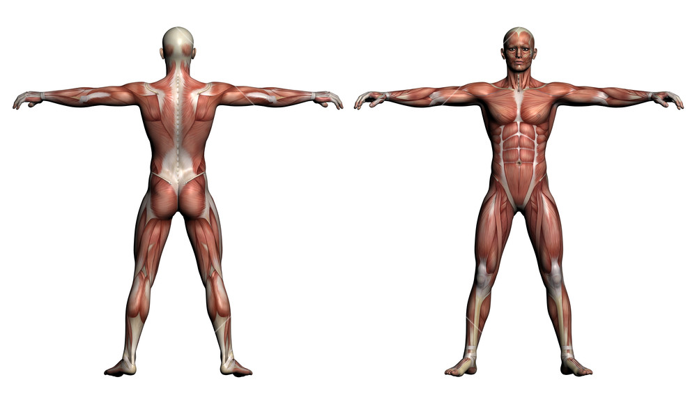

```{r setup, include=FALSE}
knitr::opts_chunk$set(echo = FALSE, message = FALSE, warning = FALSE)

library(dplyr)
library(ggplot2)
library(readxl)
library(gridExtra)
library(scales)
library(MLmetrics)
C1_J_hours <- read_excel("~/Desktop/Electronegatividad.xlsx", sheet = "Jim",
                         col_types = c("date", "numeric", "numeric", "numeric",
                                       "numeric", "numeric", "numeric", "numeric"), skip = 2)

C1_J_dates <- read_excel("~/Desktop/PATIENT_DATA.xlsx", sheet = "Jim",
                         col_types = c("date", "numeric", "numeric"))


#Dataframe code

C1_J_first_hours <- C1_J_hours[1:18, c(1,2,8)]
C1_J_second_hours <- C1_J_hours[20:32, c(1,2,8)]
C1_J_third_hours <- C1_J_hours[34:45, c(1,2,8)]
C1_J_fourth_hours <- C1_J_hours[47:62, c(1,2,8)]
C1_J_fifth_hours <- C1_J_hours[64:75, c(1,2,8)]
C1_J_sixth_hours <- C1_J_hours[77:90, c(1,2,8)]

start1 <- C1_J_first_hours[C1_J_first_hours[,3] > 0, 1][1,1]
end1 <- tail(C1_J_first_hours[C1_J_first_hours[,3] > 0, 1], n = 1)
start2 <- C1_J_second_hours[C1_J_second_hours[,3] > 0, 1][1,1]
end2 <- tail(C1_J_second_hours[C1_J_second_hours[,3] > 0, 1], n = 1)
start3 <- C1_J_third_hours[C1_J_third_hours[,3] > 0, 1][1,1]
end3 <- tail(C1_J_third_hours[C1_J_third_hours[,3] > 0, 1], n = 1)
start4 <- C1_J_fourth_hours[C1_J_fourth_hours[,3] > 0, 1][1,1]
end4 <- tail(C1_J_fourth_hours[C1_J_fourth_hours[,3] > 0, 1], n = 1)
start5 <- C1_J_fifth_hours[C1_J_fifth_hours[,3] > 0, 1][1,1]
end5 <- tail(C1_J_fifth_hours[C1_J_fifth_hours[,3] > 0, 1], n = 1)
start6 <- C1_J_sixth_hours[C1_J_sixth_hours[,3] > 0, 1][1,1]
end6 <- tail(C1_J_sixth_hours[C1_J_sixth_hours[,3] > 0, 1], n = 1)

C1J_dates1 <- sum(C1_J_first_hours[,3] > 0)
C1J_dates2 <- sum(C1_J_second_hours[,3] > 0)
C1J_dates3 <- sum(C1_J_third_hours[,3] > 0)
C1J_dates4 <- sum(C1_J_fourth_hours[,3] > 0)
C1J_dates5 <- sum(C1_J_fifth_hours[,3] > 0)
C1J_dates6 <- sum(C1_J_sixth_hours[,3] > 0)

C1_J_first_hours[,3] <- cumsum(C1_J_first_hours[,3])
C1_J_second_hours[,3] <- cumsum(C1_J_second_hours[,3])
C1_J_third_hours[,3] <- cumsum(C1_J_third_hours[,3])
C1_J_fourth_hours[,3] <- cumsum(C1_J_fourth_hours[,3])
C1_J_fifth_hours[,3] <- cumsum(C1_J_fifth_hours[,3])
C1_J_sixth_hours[,3] <- cumsum(C1_J_sixth_hours[,3])

maxP1 <- max(C1_J_first_hours$`Polarity level`, na.rm = T)
minP1 <- min(C1_J_first_hours$`Polarity level`, na.rm = T)
maxP2 <- max(C1_J_second_hours$`Polarity level`, na.rm = T)
minP2 <- min(C1_J_second_hours$`Polarity level`, na.rm = T)
maxP3 <- max(C1_J_third_hours$`Polarity level`, na.rm = T)
minP3 <- min(C1_J_third_hours$`Polarity level`, na.rm = T)
maxP4 <- max(C1_J_fourth_hours$`Polarity level`, na.rm = T)
minP4 <- min(C1_J_fourth_hours$`Polarity level`, na.rm = T)
maxP5 <- max(C1_J_fifth_hours$`Polarity level`, na.rm = T)
minP5 <- min(C1_J_fifth_hours$`Polarity level`, na.rm = T)
maxP6 <- max(C1_J_sixth_hours$`Polarity level`, na.rm = T)
minP6 <- min(C1_J_sixth_hours$`Polarity level`, na.rm = T)

totalC1JHours <- c(max(C1_J_first_hours$`Total therapy duration (Hrs)`, na.rm = T),
                   max(C1_J_second_hours$`Total therapy duration (Hrs)`, na.rm = T),
                   max(C1_J_third_hours$`Total therapy duration (Hrs)`, na.rm = T),
                   max(C1_J_fourth_hours$`Total therapy duration (Hrs)`, na.rm = T),
                   max(C1_J_fifth_hours$`Total therapy duration (Hrs)`, na.rm = T),
                   max(C1_J_sixth_hours$`Total therapy duration (Hrs)`, na.rm = T))

totalC1JDays <- c(C1J_dates1, 
                  (start2 - end1)$Day,
                  C1J_dates2,
                  (start3 - end2)$Day,
                  C1J_dates3,
                  (start4 - end3)$Day,
                  C1J_dates4,
                  (start5 - end4)$Day,
                  C1J_dates5,
                  (start6 - end5)$Day,
                  C1J_dates6)


C1J_df_sessions <- data.frame(Interval = c("1st", "2nd", "3rd", "4th", "5th", "6th"),
                          start_date = mapply(format, c(start1, start2, start3, start4, start5, start6), format = "%b %d %Y"),
                          end_date = mapply(format, c(end1, end2, end3, end4, end5, end6), format = "%b %d %Y"),
                          Hours = totalC1JHours,
                          Days = totalC1JDays[seq(1, length(totalC1JDays), 2)],
                          Starting_Polarity = c(maxP1,maxP2,maxP3,maxP4,maxP5,maxP6),
                          Final_Polarity = c(minP1,minP2,minP3,minP4,minP5,minP6),
                          Change = c(minP1-maxP1, minP2-maxP2, minP3-maxP3, minP4-maxP4, minP5-maxP5, minP6-maxP6))

C1J_df_sessions <- C1J_df_sessions %>% mutate(Change_per_hr = round(Change/Hours, digits = 3))

C1J_df_breaks <- data.frame(Interval = c("1st", "2nd", "3rd", "4th", "5th"),
                        Days = totalC1JDays[seq(2, length(totalC1JDays), 2)],
                        Increase_in_Polarity = c(maxP2-minP1, maxP3-minP2, maxP4-minP3, maxP5-minP4, maxP6-minP5))

C1J_df_breaks <- C1J_df_breaks %>% mutate(Increase_per_day = round(Increase_in_Polarity/Days, digits = 3))

#Hour plot code

first_C1_J <- C1_J_hours[1:18,] %>% mutate(days_after = 0:17)
second_C1_J <- C1_J_hours[20:32,] %>% mutate(days_after = 0:12)
third_C1_J <- C1_J_hours[34:45,] %>% mutate(days_after = 0:11)
fourth_C1_J <- C1_J_hours[47:62,] %>% mutate(days_after = 0:15)
fifth_C1_J <- C1_J_hours[64:75,] %>% mutate(days_after = 0:11)
sixth_C1_J <- C1_J_hours[77:90,] %>% mutate(days_after = 0:13)

C1J_first_day <- as.POSIXct(first_C1_J$Day[which(first_C1_J$`Total therapy duration (Hrs)`>0)][1],
           origin = '1970-01-01')
C1J_last_day <- as.POSIXct(tail(fifth_C1_J$Day[which(fifth_C1_J$`Total therapy duration (Hrs)`>0)],1),
           origin = '1970-01-01')

y_max1 <- max(first_C1_J$`Polarity level`, na.rm = T)

f1 <- max(first_C1_J[complete.cases(first_C1_J[,2]),]$days_after) + 1
s1 <- max(second_C1_J[complete.cases(second_C1_J[,2]),]$days_after) + 1
t1 <- max(third_C1_J[complete.cases(third_C1_J[,2]),]$days_after) + 1
fo1 <- max(fourth_C1_J[complete.cases(fourth_C1_J[,2]),]$days_after) + 1
fi1 <- max(fifth_C1_J[complete.cases(fifth_C1_J[,2]),]$days_after) + 1
si1 <- max(sixth_C1_J[complete.cases(sixth_C1_J[,2]),]$days_after) + 1

first_C1_J[,8] <- cumsum(first_C1_J[,8])
second_C1_J[,8] <- cumsum(second_C1_J[,8])
third_C1_J[,8] <- cumsum(third_C1_J[,8])
fourth_C1_J[,8] <- cumsum(fourth_C1_J[,8])
fifth_C1_J[,8] <- cumsum(fifth_C1_J[,8])
sixth_C1_J[,8] <- cumsum(sixth_C1_J[,8])

first_graph_C1_J <- first_C1_J %>% select(`Total therapy duration (Hrs)`, `Polarity level`) %>%
  ggplot(aes(x=`Total therapy duration (Hrs)`, y= `Polarity level`)) + geom_point() + 
  scale_x_continuous(breaks = pretty_breaks()) +
  scale_y_continuous(limits = c(0, y_max1)) +
  labs(subtitle = "First Session Results", x = "", y = "") +
  geom_smooth(method = "lm", size = 0.5) +
  geom_text(data = first_C1_J[1,c(8,2)],
            label = first_C1_J$`Polarity level`[1],
            nudge_y = -20,
            nudge_x = -5,
            size = 3,
            hjust = "inward") +
  geom_text(data = first_C1_J[f1,c(8,2)],
            label = first_C1_J$`Polarity level`[f1],
            nudge_y = -18,
            nudge_x = -2,
            size = 3)

second_graph_C1_J <- second_C1_J %>% select(`Total therapy duration (Hrs)`, `Polarity level`) %>%
  ggplot(aes(x=`Total therapy duration (Hrs)`, y= `Polarity level`)) + geom_point() + 
  scale_x_continuous(breaks = pretty_breaks()) +
  scale_y_continuous(limits = c(0, y_max1)) +
  labs(subtitle = "Second Session Results", x = "", y = "") +
  geom_smooth(method = "lm", size = 0.5) +
  geom_text(data = second_C1_J[c(2,s1),c(8,2)],
            label = second_C1_J$`Polarity level`[c(2, s1)],
            nudge_y = -16,
            size = 3)

third_graph_C1_J <- third_C1_J %>% select(`Total therapy duration (Hrs)`, `Polarity level`) %>%
  ggplot(aes(x=`Total therapy duration (Hrs)`, y= `Polarity level`)) + geom_point() + 
  scale_x_continuous(breaks = pretty_breaks()) +
  scale_y_continuous(limits = c(0, y_max1)) +
  labs(subtitle = "Third Session Results", x = "", y = "") +
  geom_smooth(method = "lm", size = 0.5) +
  geom_text(data = third_C1_J[c(2,t1),c(8,2)],
            label = third_C1_J$`Polarity level`[c(2, t1)],
            nudge_y = 18,
            size = 3)

fourth_graph_C1_J <- fourth_C1_J %>% select(`Total therapy duration (Hrs)`, `Polarity level`) %>%
  ggplot(aes(x=`Total therapy duration (Hrs)`, y= `Polarity level`)) + geom_point() + 
  scale_x_continuous(breaks = pretty_breaks()) +
  scale_y_continuous(limits = c(0, y_max1)) +
  labs(subtitle = "Fourth Session Results", x = "", y = "") +
  geom_smooth(method = "lm", size = 0.5) +
  geom_text(data = fourth_C1_J[c(4,fo1),c(8,2)],
            label = fourth_C1_J$`Polarity level`[c(4, fo1)],
            nudge_y = 16,
            size = 3)

fifth_graph_C1_J <- fifth_C1_J %>% select(`Total therapy duration (Hrs)`, `Polarity level`) %>%
  ggplot(aes(x=`Total therapy duration (Hrs)`, y= `Polarity level`)) + geom_point() + 
  scale_x_continuous(breaks = pretty_breaks()) +
  scale_y_continuous(limits = c(0, y_max1)) +
  labs(subtitle = "Fifth Session Results", x = "", y = "") +
  geom_smooth(method = "lm", size = 0.5) +
  geom_text(data = fifth_C1_J[c(2,fi1),c(8,2)],
            label = fifth_C1_J$`Polarity level`[c(2, fi1)],
            nudge_y = 16,
            size = 3)

sixth_graph_C1_J <- sixth_C1_J %>% select(`Total therapy duration (Hrs)`, `Polarity level`) %>%
  ggplot(aes(x=`Total therapy duration (Hrs)`, y= `Polarity level`)) + geom_point() + 
  scale_x_continuous(breaks = pretty_breaks()) +
  scale_y_continuous(limits = c(0, y_max1)) +
  labs(subtitle = "Sixth Session Results", x = "Total Therapy Duration (Hrs)", y = "Polarity Level") +
  geom_smooth(method = "lm", size = 0.5) +
  geom_text(data = sixth_C1_J[c(2,si1),c(8,2)],
            label = sixth_C1_J$`Polarity level`[c(2, si1)],
            nudge_y = 18,
            size = 3)

#Date plot code

first_C1_J_dates <- C1_J_dates[1:20,]
second_C1_J_dates <- C1_J_dates[30:42,]
third_C1_J_dates <- C1_J_dates[52:63,]
fourth_C1_J_dates <- C1_J_dates[74:88,]
fifth_C1_J_dates <- C1_J_dates[135:145,]
sixth_C1_J_dates <- C1_J_dates[170:182,]

lims_C1J <- as.POSIXct(strptime(c("2018-09-15 01:00","2019-04-20 01:00"), format = "%Y-%m-%d %H:%M"))

C1J_dates <- C1_J_dates[,c(1,3)]


C1J_max <- max(C1_J_dates$p_level, na.rm = T)

#C1-J DATE GRAPH 

C1J_dategraph <- C1J_dates %>%
  ggplot(aes(x=date, y= p_level)) + geom_point() + 
  scale_x_datetime(date_breaks = "1 month", date_labels =  "%b %Y", limits = lims_C1J) +
  scale_y_continuous(limits = c(0, C1J_max)) +
  labs(x = "Date",  y = "Polarity")

C1J_segment1 <- list(x1 = first_C1_J_dates$date[which.min(first_C1_J_dates$p_level)], 
                     y1 = first_C1_J_dates$p_level[which.min(first_C1_J_dates$p_level)],
                     x2 = second_C1_J_dates$date[which.max(second_C1_J_dates$p_level)],
                     y2 = second_C1_J_dates$p_level[which.max(second_C1_J_dates$p_level)])

C1J_segment2 <- list(x1 = second_C1_J_dates$date[which.min(second_C1_J_dates$p_level)], 
                     y1 = second_C1_J_dates$p_level[which.min(second_C1_J_dates$p_level)],
                     x2 = third_C1_J_dates$date[which.max(third_C1_J_dates$p_level)],
                     y2 = third_C1_J_dates$p_level[which.max(third_C1_J_dates$p_level)])

C1J_segment3 <- list(x1 = third_C1_J_dates$date[which.min(third_C1_J_dates$p_level)], 
                     y1 = third_C1_J_dates$p_level[which.min(third_C1_J_dates$p_level)],
                     x2 = fourth_C1_J_dates$date[which.max(fourth_C1_J_dates$p_level)],
                     y2 = fourth_C1_J_dates$p_level[which.max(fourth_C1_J_dates$p_level)]) 

C1J_segment4 <- list(x1 = fourth_C1_J_dates$date[which.min(fourth_C1_J_dates$p_level)], 
                     y1 = fourth_C1_J_dates$p_level[which.min(fourth_C1_J_dates$p_level)],
                     x2 = fifth_C1_J_dates$date[which.max(fifth_C1_J_dates$p_level)],
                     y2 = fifth_C1_J_dates$p_level[which.max(fifth_C1_J_dates$p_level)]) 

C1J_segment5 <- list(x1 = fifth_C1_J_dates$date[which.min(fifth_C1_J_dates$p_level)], 
                     y1 = fifth_C1_J_dates$p_level[which.min(fifth_C1_J_dates$p_level)],
                     x2 = sixth_C1_J_dates$date[which.max(sixth_C1_J_dates$p_level)],
                     y2 = sixth_C1_J_dates$p_level[which.max(sixth_C1_J_dates$p_level)])

C1J_final_date_graph <- C1J_dategraph + 
  
  geom_segment(aes(x = C1J_segment1$x1, y = C1J_segment1$y1,
                                 xend = C1J_segment1$x2, yend = C1J_segment1$y2, color = "9"),
                             linetype = "dashed") +
  geom_segment(aes(x = C1J_segment2$x1, y = C1J_segment2$y1,
                   xend = C1J_segment2$x2, yend = C1J_segment2$y2, color = "9 "),
               linetype = "dashed") +
  geom_segment(aes(x = C1J_segment3$x1, y = C1J_segment3$y1,
                   xend = C1J_segment3$x2, yend = C1J_segment3$y2, color = "10"),
               linetype = "dashed") +
  geom_segment(aes(x = C1J_segment4$x1, y = C1J_segment4$y1,
                   xend = C1J_segment4$x2, yend = C1J_segment4$y2, color = "46"),
               linetype = "dashed") + 
  geom_segment(aes(x = C1J_segment5$x1, y = C1J_segment5$y1,
                   xend = C1J_segment5$x2, yend = C1J_segment5$y2, color = "24"),
               linetype = "dashed") + labs(color = "Days Without\nTreatment") + theme(legend.position = "none", axis.title.x = element_text(margin = margin(t = 15, r = 0, b = 0, l = 0)), axis.title.y = element_text(margin = margin(t = 0, r = 15, b = 0, l = 0)))


B1_S_hours <- read_excel("~/Desktop/Electronegatividad.xlsx", sheet = "Stephanie",
                                col_types = c("date", "numeric", "numeric", 
                                "numeric", "numeric", "numeric", "numeric"), skip = 2)

B1_S_dates <- read_excel("~/Desktop/PATIENT_DATA.xlsx", sheet = "Stephanie",
                         col_types = c("date", "numeric", "numeric"))


B1_S_first_hours <- B1_S_hours[1:17, c(1,2,7)]
B1_S_second_hours <- B1_S_hours[19:30, c(1,2,7)]
B1_S_third_hours <- B1_S_hours[32:37, c(1,2,7)]

start1 <- B1_S_first_hours[B1_S_first_hours[,3] > 0, 1][1,1]
end1 <- tail(B1_S_first_hours[B1_S_first_hours[,3] > 0, 1], n = 1)
start2 <- B1_S_second_hours[B1_S_second_hours[,3] > 0, 1][1,1]
end2 <- tail(B1_S_second_hours[B1_S_second_hours[,3] > 0, 1], n = 1)
start3 <- B1_S_third_hours[B1_S_third_hours[,3] > 0, 1][1,1]
end3 <- tail(B1_S_third_hours[B1_S_third_hours[,3] > 0, 1], n = 1)

B1S_dates1 <- sum(B1_S_first_hours[,3] > 0)
B1S_dates2 <- sum(B1_S_second_hours[,3] > 0)
B1S_dates3 <- sum(B1_S_third_hours[,3] > 0)

B1_S_first_hours[,3] <- cumsum(B1_S_first_hours[,3])
B1_S_second_hours[,3] <- cumsum(B1_S_second_hours[,3])
B1_S_third_hours[,3] <- cumsum(B1_S_third_hours[,3])

maxP1 <- max(B1_S_first_hours$`Polarity level`, na.rm = T)
minP1 <- min(B1_S_first_hours$`Polarity level`, na.rm = T)
maxP2 <- max(B1_S_second_hours$`Polarity level`, na.rm = T)
minP2 <- min(B1_S_second_hours$`Polarity level`, na.rm = T)
maxP3 <- max(B1_S_third_hours$`Polarity level`, na.rm = T)
minP3 <- min(B1_S_third_hours$`Polarity level`, na.rm = T)

totalB1SHours <- c(max(B1_S_first_hours$`Total therapy duration (Hrs)`, na.rm = T),
                   max(B1_S_second_hours$`Total therapy duration (Hrs)`, na.rm = T),
                   max(B1_S_third_hours$`Total therapy duration (Hrs)`, na.rm = T))

totalB1SDays <- c(B1S_dates1, 
                  (start2 - end1)$Day,
                  B1S_dates2,
                  (start3 - end2)$Day,
                  B1S_dates3)

B1S_df_sessions <- data.frame(Interval = c("1st", "2nd", "3rd"),
                              start_date = mapply(format, c(start1, start2, start3), format = "%b %d %Y"),
                              end_date = mapply(format, c(end1, end2, end3), format = "%b %d %Y"),
                              Hours = totalB1SHours,
                              Days = totalB1SDays[seq(1, length(totalB1SDays), 2)],
                              Starting_Polarity = c(maxP1,maxP2,maxP3),
                              Final_Polarity = c(minP1,minP2,minP3),
                              Change = c(minP1-maxP1, minP2-maxP2, minP3-maxP3))

B1S_df_sessions <- B1S_df_sessions %>% mutate(Change_per_hr = round(Change/Hours, digits = 3))

B1S_df_breaks <- data.frame(Interval = c("1st", "2nd"),
                            Days = totalB1SDays[seq(2, length(totalB1SDays), 2)],
                            Increase_in_Polarity = c(maxP2-minP1, maxP3-minP2))

B1S_df_breaks <- B1S_df_breaks %>% mutate(Increase_per_day = round(Increase_in_Polarity/Days, digits = 3))


first_B1_S <- B1_S_hours[1:17,] %>% mutate(days_after = 0:16)
second_B1_S <- B1_S_hours[19:30,] %>% mutate(days_after = 0:11)
third_B1_S <- B1_S_hours[32:37,] %>% mutate(days_after = 0:5)

B1S_first_day <- as.POSIXct(first_B1_S$Day[which(first_B1_S$`Total therapy duration (Hrs)`>0)][1],
                            origin = '1970-01-01')
B1S_last_day <- as.POSIXct(tail(third_B1_S$Day[which(third_B1_S$`Total therapy duration (Hrs)`>0)],1),
                           origin = '1970-01-01')

y_max1 <- max(first_B1_S$`Polarity level`, na.rm = T)

f1 <- max(first_B1_S[complete.cases(first_B1_S[,2]),]$days_after) + 1
s1 <- max(second_B1_S[complete.cases(second_B1_S[,2]),]$days_after) + 1
t1 <- max(third_B1_S[complete.cases(third_B1_S[,2]),]$days_after) + 1

first_B1_S[,7] <- cumsum(first_B1_S[,7])
second_B1_S[,7] <- cumsum(second_B1_S[,7])
third_B1_S[,7] <- cumsum(third_B1_S[,7])

B1_S_first_progress <- first_B1_S %>% select(`Total therapy duration (Hrs)`, `Polarity level`) %>%
  ggplot(aes(x=`Total therapy duration (Hrs)`, y= `Polarity level`)) + geom_point() + 
  scale_x_continuous(breaks = pretty_breaks()) +
  scale_y_continuous(limits = c(0, y_max1)) +
  labs(subtitle = "First Session Results", x = "", y = "") +
  geom_smooth(method = "lm", size = 0.5) +
  geom_text(data = first_B1_S[1,c(7,2)],
            label = first_B1_S$`Polarity level`[1],
            size = 3,
            nudge_y = -20,
            nudge_x = 1) +
  geom_text(data = first_B1_S[f1,c(7,2)],
            label = first_B1_S$`Polarity level`[f1],
            size = 3,
            nudge_y = -20,
            nudge_x = -1)

B1_S_second_progress <- second_B1_S %>% select(`Total therapy duration (Hrs)`, `Polarity level`) %>%
  ggplot(aes(x=`Total therapy duration (Hrs)`, y= `Polarity level`)) + geom_point() + 
  scale_x_continuous(breaks = pretty_breaks()) +
  scale_y_continuous(limits = c(0, y_max1)) +
  labs(subtitle = "Second Session Results", x = "", y = "") +
  geom_smooth(method = "lm", size = 0.5) +
  geom_text(data = second_B1_S[1, c(7,2)],
            label = second_B1_S$`Polarity level`[1],
            size = 3,
            nudge_y = 20,
            nudge_x = 1) +
  geom_text(data = second_B1_S[s1, c(7,2)],
            label = second_B1_S$`Polarity level`[s1],
            size = 3,
            nudge_y = 20,
            nudge_x = -0.5)

B1_S_third_progress <- third_B1_S %>% select(`Total therapy duration (Hrs)`, `Polarity level`) %>%
  ggplot(aes(x=`Total therapy duration (Hrs)`, y= `Polarity level`)) + geom_point() + 
  scale_x_continuous(breaks = pretty_breaks()) +
  scale_y_continuous(limits = c(0, y_max1)) +
  labs(subtitle = "Third Session Results", x = "", y = "") +
  geom_smooth(method = "lm", size = 0.5) +
  geom_text(data = third_B1_S[c(2,t1),c(7,2)],
            label = third_B1_S$`Polarity level`[c(2, t1)],
            size = 3,
            nudge_y = -20)


first_B1_S_dates <- B1_S_dates[1:20,]
second_B1_S_dates <- B1_S_dates[35:47,]
third_B1_S_dates <- B1_S_dates[86:89,]


lims_B1S <- as.POSIXct(strptime(c("2018-08-15 01:00","2018-12-20 01:00"), format = "%Y-%m-%d %H:%M"))

B1S_dates <- B1_S_dates[,c(1,3)]

B1S_max <- max(B1_S_dates$p_level, na.rm = T)

#B1-S DATE GRAPH
B1S_dategraph <- B1S_dates %>%
  ggplot(aes(x=date, y= p_level)) + geom_point() + 
  scale_x_datetime(date_breaks = "1 month", date_labels =  "%b %Y", limits = lims_B1S) +
  scale_y_continuous(limits = c(0, B1S_max)) +
  labs(x = "Date",  y = "Polarity")

B1S_segment1 <- list(x1 = first_B1_S_dates$date[which.min(first_B1_S_dates$p_level)], 
                     y1 = first_B1_S_dates$p_level[which.min(first_B1_S_dates$p_level)],
                     x2 = second_B1_S_dates$date[which.max(second_B1_S_dates$p_level)],
                     y2 = second_B1_S_dates$p_level[which.max(second_B1_S_dates$p_level)]) 

B1S_segment2 <- list(x1 = second_B1_S_dates$date[which.min(second_B1_S_dates$p_level)], 
                     y1 = second_B1_S_dates$p_level[which.min(second_B1_S_dates$p_level)],
                     x2 = third_B1_S_dates$date[which.max(third_B1_S_dates$p_level)],
                     y2 = third_B1_S_dates$p_level[which.max(third_B1_S_dates$p_level)]) 

B1S_final_date_graph <- B1S_dategraph +
  geom_segment(aes(x = B1S_segment1$x1, y = B1S_segment1$y1,
                                 xend = B1S_segment1$x2, yend = B1S_segment1$y2, color = "14"),
                             linetype = "dashed") +
  geom_segment(aes(x = B1S_segment2$x1, y = B1S_segment2$y1,
                   xend = B1S_segment2$x2, yend = B1S_segment2$y2, color = "38"),
               linetype = "dashed") + labs(color = "Days Without\nTreatment") + theme(legend.position = "none", 
                                                                                           axis.title.x = element_text(margin = margin(t = 15, r = 0, b = 0, l = 0)),
                                                                                           axis.title.y = element_text(margin = margin(t = 0, r = 15, b = 0, l = 0)))


L2_E_hours <- read_excel("~/Desktop/Electronegatividad.xlsx", sheet = "Eric",
                         col_types = c("date", "numeric", "numeric", "numeric",
                                       "numeric", "numeric", "numeric"), skip = 2)

L2_E_dates <- read_excel("~/Desktop/PATIENT_DATA.xlsx", sheet = "Eric",
                         col_types = c("date", "numeric", "numeric"))


L2_E_first_hours <- L2_E_hours[1:11, c(1,2,7)]
L2_E_second_hours <- L2_E_hours[13:25, c(1,2,7)]
L2_E_third_hours <- L2_E_hours[27:39, c(1,2,7)]
L2_E_fourth_hours <- L2_E_hours[41:52, c(1,2,7)]
L2_E_fifth_hours <- L2_E_hours[54:65, c(1,2,7)]
L2_E_sixth_hours <- L2_E_hours[67:71, c(1,2,7)]

start1 <- L2_E_first_hours[L2_E_first_hours[,3] > 0, 1][1,1]
end1 <- tail(L2_E_first_hours[L2_E_first_hours[,3] > 0, 1], n = 1)
start2 <- L2_E_second_hours[L2_E_second_hours[,3] > 0, 1][1,1]
end2 <- tail(L2_E_second_hours[L2_E_second_hours[,3] > 0, 1], n = 1)
start3 <- L2_E_third_hours[L2_E_third_hours[,3] > 0, 1][1,1]
end3 <- tail(L2_E_third_hours[L2_E_third_hours[,3] > 0, 1], n = 1)
start4 <- L2_E_fourth_hours[L2_E_fourth_hours[,3] > 0, 1][1,1]
end4 <- tail(L2_E_fourth_hours[L2_E_fourth_hours[,3] > 0, 1], n = 1)
start5 <- L2_E_fifth_hours[L2_E_fifth_hours[,3] > 0, 1][1,1]
end5 <- tail(L2_E_fifth_hours[L2_E_fifth_hours[,3] > 0, 1], n = 1)
start6 <- L2_E_sixth_hours[L2_E_sixth_hours[,3] > 0, 1][1,1]
end6 <- tail(L2_E_sixth_hours[L2_E_sixth_hours[,3] > 0, 1], n = 1)

L2E_dates1 <- sum(L2_E_first_hours[,3] > 0)
L2E_dates2 <- sum(L2_E_second_hours[,3] > 0)
L2E_dates3 <- sum(L2_E_third_hours[,3] > 0)
L2E_dates4 <- sum(L2_E_fourth_hours[,3] > 0)
L2E_dates5 <- sum(L2_E_fifth_hours[,3] > 0)
L2E_dates6 <- sum(L2_E_sixth_hours[,3] > 0)

L2_E_first_hours[,3] <- cumsum(L2_E_first_hours[,3])
L2_E_second_hours[,3] <- cumsum(L2_E_second_hours[,3])
L2_E_third_hours[,3] <- cumsum(L2_E_third_hours[,3])
L2_E_fourth_hours[,3] <- cumsum(L2_E_fourth_hours[,3])
L2_E_fifth_hours[,3] <- cumsum(L2_E_fifth_hours[,3])
L2_E_sixth_hours[,3] <- cumsum(L2_E_sixth_hours[,3])

maxP1 <- max(L2_E_first_hours$`Polarity level`, na.rm = T)
minP1 <- min(L2_E_first_hours$`Polarity level`, na.rm = T)
maxP2 <- max(L2_E_second_hours$`Polarity level`, na.rm = T)
minP2 <- min(L2_E_second_hours$`Polarity level`, na.rm = T)
maxP3 <- max(L2_E_third_hours$`Polarity level`, na.rm = T)
minP3 <- min(L2_E_third_hours$`Polarity level`, na.rm = T)
maxP4 <- max(L2_E_fourth_hours$`Polarity level`, na.rm = T)
minP4 <- min(L2_E_fourth_hours$`Polarity level`, na.rm = T)
maxP5 <- max(L2_E_fifth_hours$`Polarity level`, na.rm = T)
minP5 <- min(L2_E_fifth_hours$`Polarity level`, na.rm = T)
maxP6 <- max(L2_E_sixth_hours$`Polarity level`, na.rm = T)
minP6 <- min(L2_E_sixth_hours$`Polarity level`, na.rm = T)

totalL2EHours <- c(max(L2_E_first_hours$`Total therapy duration (Hrs)`, na.rm = T),
                   max(L2_E_second_hours$`Total therapy duration (Hrs)`, na.rm = T),
                   max(L2_E_third_hours$`Total therapy duration (Hrs)`, na.rm = T),
                   max(L2_E_fourth_hours$`Total therapy duration (Hrs)`, na.rm = T),
                   max(L2_E_fifth_hours$`Total therapy duration (Hrs)`, na.rm = T),
                   max(L2_E_sixth_hours$`Total therapy duration (Hrs)`, na.rm = T))

totalL2EDays <- c(L2E_dates1, 
                  (start2 - end1)$Day,
                  L2E_dates2,
                  (start3 - end2)$Day,
                  L2E_dates3,
                  (start4 - end3)$Day,
                  L2E_dates4,
                  (start5 - end4)$Day,
                  L2E_dates5,
                  (start6 - end5)$Day,
                  L2E_dates6)

L2E_df_sessions <- data.frame(Interval = c("1st", "2nd", "3rd", "4th", "5th", "6th"),
                              start_date = mapply(format, c(start1, start2, start3, start4, start5, start6), format = "%b %d %Y"),
                              end_date = mapply(format, c(end1, end2, end3, end4, end5, end6), format = "%b %d %Y"),
                              Hours = totalL2EHours,
                              Days = totalL2EDays[seq(1, length(totalL2EDays), 2)],
                              Starting_Polarity = c(maxP1,maxP2,maxP3,maxP4,maxP5,maxP6),
                              Final_Polarity = c(minP1,minP2,minP3,minP4,minP5,minP6),
                              Change = c(minP1-maxP1, minP2-maxP2, minP3-maxP3, minP4-maxP4, minP5-maxP5, minP6-maxP6))

L2E_df_sessions <- L2E_df_sessions %>% mutate(Change_per_hr = round(Change/Hours, digits = 3))

L2E_df_breaks <- data.frame(Interval = c("1st", "2nd", "3rd", "4th", "5th"),
                            Days = totalL2EDays[seq(2, length(totalL2EDays), 2)],
                            Increase_in_Polarity = c(maxP2-minP1, maxP3-minP2, maxP4-minP3, maxP5-minP4, maxP6-minP5))

L2E_df_breaks <- L2E_df_breaks %>% mutate(Increase_per_day = round(Increase_in_Polarity/Days, digits = 3))


first_L2_E <- L2_E_hours[1:11,] %>% mutate(days_after = 0:10)
second_L2_E <- L2_E_hours[13:25,] %>% mutate(days_after = 0:12)
third_L2_E <- L2_E_hours[27:39,] %>% mutate(days_after = 0:12)
fourth_L2_E <- L2_E_hours[41:52,] %>% mutate(days_after = 0:11)
fifth_L2_E <- L2_E_hours[54:65,] %>% mutate(days_after = 0:11)
sixth_L2_E <- L2_E_hours[67:71,] %>% mutate(days_after = 0:4)

y_maxL2E <- max(first_L2_E$`Polarity level`, na.rm = T)

f1 <- max(first_L2_E[complete.cases(first_L2_E[,2]),]$days_after) + 1
s1 <- max(second_L2_E[complete.cases(second_L2_E[,2]),]$days_after) + 1
t1 <- max(third_L2_E[complete.cases(third_L2_E[,2]),]$days_after) + 1
fo1 <- max(fourth_L2_E[complete.cases(fourth_L2_E[,2]),]$days_after) + 1
fi1 <- max(fifth_L2_E[complete.cases(fifth_L2_E[,2]),]$days_after) + 1
si1 <- max(sixth_L2_E[complete.cases(sixth_L2_E[,2]),]$days_after) + 1

first_L2_E[,7] <- cumsum(first_L2_E[,7])
second_L2_E[,7] <- cumsum(second_L2_E[,7])
third_L2_E[,7] <- cumsum(third_L2_E[,7])
fourth_L2_E[,7] <- cumsum(fourth_L2_E[,7])
fifth_L2_E[,7] <- cumsum(fifth_L2_E[,7])
sixth_L2_E[,7] <- cumsum(sixth_L2_E[,7])

first_graph_L2E <- first_L2_E %>% select(`Total therapy duration (Hrs)`, `Polarity level`) %>%
  ggplot(aes(x=`Total therapy duration (Hrs)`, y= `Polarity level`)) + geom_point() + 
  scale_x_continuous(breaks = pretty_breaks()) +
  scale_y_continuous(limits = c(0, y_maxL2E)) +
  labs(subtitle = "First Session Results", x = "", y = "") +
  geom_smooth(method = "lm", size = 0.5) +
  geom_text(data = first_L2_E[1, c(7,2)],
            label = first_L2_E$`Polarity level`[1],
            nudge_y = -18,
            size = 3) +
  geom_text(data = first_L2_E[f1,c(7,2)],
            label = first_L2_E$`Polarity level`[f1],
            nudge_y = -18,
            nudge_x = - 3,
            size = 3)

second_graph_L2E <- second_L2_E %>% select(`Total therapy duration (Hrs)`, `Polarity level`) %>%
  ggplot(aes(x=`Total therapy duration (Hrs)`, y= `Polarity level`)) + geom_point() + 
  scale_x_continuous(breaks = pretty_breaks()) +
  scale_y_continuous(limits = c(0, y_maxL2E)) +
  labs(subtitle = "Second Session Results", x = "", y = "") +
  geom_smooth(method = "lm", size = 0.5) +
  geom_text(data = second_L2_E[c(1,s1),c(7,2)],
            label = second_L2_E$`Polarity level`[c(1, s1)],
            nudge_y = 18,
            nudge_x = 1,
            size = 3)

third_graph_L2E <- third_L2_E %>% select(`Total therapy duration (Hrs)`, `Polarity level`) %>%
  ggplot(aes(x=`Total therapy duration (Hrs)`, y= `Polarity level`)) + geom_point() + 
  scale_x_continuous(breaks = pretty_breaks()) +
  scale_y_continuous(limits = c(0, y_maxL2E)) +
  labs(subtitle = "Third Session Results", x = "", y = "") +
  geom_smooth(method = "lm", size = 0.5) +
  geom_text(data = third_L2_E[c(2,t1),c(7,2)],
            label = third_L2_E$`Polarity level`[c(2, t1)],
            nudge_y = 18,
            size = 3)

fourth_graph_L2E <- fourth_L2_E %>% select(`Total therapy duration (Hrs)`, `Polarity level`) %>%
  ggplot(aes(x=`Total therapy duration (Hrs)`, y= `Polarity level`)) + geom_point() + 
  scale_x_continuous(breaks = pretty_breaks()) +
  scale_y_continuous(limits = c(0, y_maxL2E)) +
  labs(subtitle = "Fourth Session Results", x = "", y = "") +
  geom_smooth(method = "lm", size = 0.5) +
  geom_text(data = fourth_L2_E[c(4,fo1),c(7,2)],
            label = fourth_L2_E$`Polarity level`[c(4, fo1)],
            nudge_y = 18,
            size = 3)

fifth_graph_L2E <- fifth_L2_E %>% select(`Total therapy duration (Hrs)`, `Polarity level`) %>%
  ggplot(aes(x=`Total therapy duration (Hrs)`, y= `Polarity level`)) + geom_point() + 
  scale_x_continuous(breaks = pretty_breaks()) +
  scale_y_continuous(limits = c(0, y_maxL2E)) +
  labs(subtitle = "Fifth Session Results", x = "", y = "") +
  geom_smooth(method = "lm", size = 0.5) +
  geom_text(data = fifth_L2_E[c(2,fi1),c(7,2)],
            label = fifth_L2_E$`Polarity level`[c(2, fi1)],
            nudge_y = 18,
            size = 3)

sixth_graph_L2E <- sixth_L2_E %>% select(`Total therapy duration (Hrs)`, `Polarity level`) %>%
  ggplot(aes(x=`Total therapy duration (Hrs)`, y= `Polarity level`)) + geom_point() + 
  scale_x_continuous(breaks = pretty_breaks()) +
  scale_y_continuous(limits = c(0, y_maxL2E)) +
  labs(subtitle = "Sixth Session Results", x = "Total Therapy Duration (Hrs)", y = "Polarity Level") +
  geom_smooth(method = "lm", size = 0.5) +
  geom_text(data = sixth_L2_E[c(2,si1),c(7,2)],
            label = sixth_L2_E$`Polarity level`[c(2, si1)],
            nudge_y = 14,
            size = 3)


first_L2_E_dates <- L2_E_dates[1:13,]
second_L2_E_dates <- L2_E_dates[35:48,]
third_L2_E_dates <- L2_E_dates[64:76,]
fourth_L2_E_dates <- L2_E_dates[108:117,]
fifth_L2_E_dates <- L2_E_dates[142:153,]
sixth_L2_E_dates <- L2_E_dates[197:200,]

L2E_dates <- L2_E_dates[,c(1,3)]

lims_L2E <- as.POSIXct(strptime(c("2018-09-15 01:00","2019-04-20 01:00"), format = "%Y-%m-%d %H:%M"))

L2E_max <- max(L2_E_dates$p_level, na.rm = T)

#L2-E DATE GRAPH
L2E_dategraph <- L2E_dates %>%
  ggplot(aes(x=date, y= p_level)) + geom_point() + 
  scale_x_datetime(date_breaks = "1 month", date_labels =  "%b %Y", limits = lims_L2E) +
  scale_y_continuous(limits = c(0, L2E_max)) +
  labs(x = "Date",  y = "Polarity")

L2E_segment1 <- list(x1 = first_L2_E_dates$date[which.min(first_L2_E_dates$p_level)], 
                     y1 = first_L2_E_dates$p_level[which.min(first_L2_E_dates$p_level)],
                     x2 = second_L2_E_dates$date[which.max(second_L2_E_dates$p_level)],
                     y2 = second_L2_E_dates$p_level[which.max(second_L2_E_dates$p_level)]) 

L2E_segment2 <- list(x1 = second_L2_E_dates$date[which.min(second_L2_E_dates$p_level)], 
                     y1 = second_L2_E_dates$p_level[which.min(second_L2_E_dates$p_level)],
                     x2 = third_L2_E_dates$date[which.max(third_L2_E_dates$p_level)],
                     y2 = third_L2_E_dates$p_level[which.max(third_L2_E_dates$p_level)]) 

L2E_segment3 <- list(x1 = third_L2_E_dates$date[which.min(third_L2_E_dates$p_level)], 
                     y1 = third_L2_E_dates$p_level[which.min(third_L2_E_dates$p_level)],
                     x2 = fourth_L2_E_dates$date[which.max(fourth_L2_E_dates$p_level)],
                     y2 = fourth_L2_E_dates$p_level[which.max(fourth_L2_E_dates$p_level)]) 

L2E_segment4 <- list(x1 = fourth_L2_E_dates$date[which.min(fourth_L2_E_dates$p_level)], 
                     y1 = fourth_L2_E_dates$p_level[which.min(fourth_L2_E_dates$p_level)],
                     x2 = fifth_L2_E_dates$date[which.max(fifth_L2_E_dates$p_level)],
                     y2 = fifth_L2_E_dates$p_level[which.max(fifth_L2_E_dates$p_level)]) 

L2E_segment5 <- list(x1 = fifth_L2_E_dates$date[which.min(fifth_L2_E_dates$p_level) + 1], #Final two values are equal
                     y1 = fifth_L2_E_dates$p_level[which.min(fifth_L2_E_dates$p_level)],
                     x2 = sixth_L2_E_dates$date[which.max(sixth_L2_E_dates$p_level)],
                     y2 = sixth_L2_E_dates$p_level[which.max(sixth_L2_E_dates$p_level)]) 

L2E_final_date_graph <- L2E_dategraph + 
  
  geom_segment(aes(x = L2E_segment1$x1, y = L2E_segment1$y1,
                   xend = L2E_segment1$x2, yend = L2E_segment1$y2, color = "23"),
               linetype = "dashed") +
  geom_segment(aes(x = L2E_segment2$x1, y = L2E_segment2$y1,
                   xend = L2E_segment2$x2, yend = L2E_segment2$y2, color = "16"),
               linetype = "dashed") +
  geom_segment(aes(x = L2E_segment3$x1, y = L2E_segment3$y1,
                   xend = L2E_segment3$x2, yend = L2E_segment3$y2, color = "30"),
               linetype = "dashed") +
  geom_segment(aes(x = L2E_segment4$x1, y = L2E_segment4$y1,
                   xend = L2E_segment4$x2, yend = L2E_segment4$y2, color = "24"),
               linetype = "dashed") +
  geom_segment(aes(x = L2E_segment5$x1, y = L2E_segment5$y1,
                   xend = L2E_segment5$x2, yend = L2E_segment5$y2, color = "44"),
               linetype = "dashed") + labs(color = "Days Without\nTreatment") + theme(legend.position = "none", 
                                                                                           axis.title.x = element_text(margin = margin(t = 15, r = 0, b = 0, l = 0)),
                                                                                           axis.title.y = element_text(margin = margin(t = 0, r = 15, b = 0, l = 0)))


H1_A_hours <- read_excel("~/Desktop/Electronegatividad.xlsx", sheet = "Anna",
                         col_types = c("date", "numeric", "numeric", 
                                       "numeric", "numeric", "numeric"), skip = 2)

H1_A_dates <- read_excel("~/Desktop/PATIENT_DATA.xlsx", sheet = "Anna",
                         col_types = c("date", "numeric", "numeric"))


H1_A_first_hours <- H1_A_hours[1:9, c(1,2,6)]
H1_A_second_hours <- H1_A_hours[11:23, c(1,2,6)]
H1_A_third_hours <- H1_A_hours[25:26, c(1,2,6)]
H1_A_fourth_hours <- H1_A_hours[28:39, c(1,2,6)]
H1_A_fifth_hours <- H1_A_hours[41:52, c(1,2,6)]
H1_A_sixth_hours <- H1_A_hours[54:58, c(1,2,6)]

start1 <- H1_A_first_hours[H1_A_first_hours[,3] > 0, 1][1,1]
end1 <- tail(H1_A_first_hours[H1_A_first_hours[,3] > 0, 1], n = 1)
start2 <- H1_A_second_hours[H1_A_second_hours[,3] > 0, 1][1,1]
end2 <- tail(H1_A_second_hours[H1_A_second_hours[,3] > 0, 1], n = 1)
start3 <- H1_A_third_hours[H1_A_third_hours[,3] > 0, 1][1,1]
end3 <- tail(H1_A_third_hours[H1_A_third_hours[,3] > 0, 1], n = 1)
start4 <- H1_A_fourth_hours[H1_A_fourth_hours[,3] > 0, 1][1,1]
end4 <- tail(H1_A_fourth_hours[H1_A_fourth_hours[,3] > 0, 1], n = 1)
start5 <- H1_A_fifth_hours[H1_A_fifth_hours[,3] > 0, 1][1,1]
end5 <- tail(H1_A_fifth_hours[H1_A_fifth_hours[,3] > 0, 1], n = 1)
start6 <- H1_A_sixth_hours[H1_A_sixth_hours[,3] > 0, 1][1,1]
end6 <- tail(H1_A_sixth_hours[H1_A_sixth_hours[,3] > 0, 1], n = 1)

H1A_dates1 <- sum(H1_A_first_hours[,3] > 0)
H1A_dates2 <- sum(H1_A_second_hours[,3] > 0)
H1A_dates3 <- sum(H1_A_third_hours[,3] > 0)
H1A_dates4 <- sum(H1_A_fourth_hours[,3] > 0)
H1A_dates5 <- sum(H1_A_fifth_hours[,3] > 0)
H1A_dates6 <- sum(H1_A_sixth_hours[,3] > 0)

H1_A_first_hours[,3] <- cumsum(H1_A_first_hours[,3])
H1_A_second_hours[,3] <- cumsum(H1_A_second_hours[,3])
H1_A_third_hours[,3] <- cumsum(H1_A_third_hours[,3])
H1_A_fourth_hours[,3] <- cumsum(H1_A_fourth_hours[,3])
H1_A_fifth_hours[,3] <- cumsum(H1_A_fifth_hours[,3])
H1_A_sixth_hours[,3] <- cumsum(H1_A_sixth_hours[,3])

maxP1 <- max(H1_A_first_hours$`Polarity level`, na.rm = T)
minP1 <- min(H1_A_first_hours$`Polarity level`, na.rm = T)
maxP2 <- max(H1_A_second_hours$`Polarity level`, na.rm = T)
minP2 <- min(H1_A_second_hours$`Polarity level`, na.rm = T)
maxP3 <- max(H1_A_third_hours$`Polarity level`, na.rm = T)
minP3 <- min(H1_A_third_hours$`Polarity level`, na.rm = T)
maxP4 <- max(H1_A_fourth_hours$`Polarity level`, na.rm = T)
minP4 <- min(H1_A_fourth_hours$`Polarity level`, na.rm = T)
maxP5 <- max(H1_A_fifth_hours$`Polarity level`, na.rm = T)
minP5 <- min(H1_A_fifth_hours$`Polarity level`, na.rm = T)
maxP6 <- max(H1_A_sixth_hours$`Polarity level`, na.rm = T)
minP6 <- min(H1_A_sixth_hours$`Polarity level`, na.rm = T)

totalH1AHours <- c(max(H1_A_first_hours$`Total therapy duration (Hrs)`, na.rm = T),
                   max(H1_A_second_hours$`Total therapy duration (Hrs)`, na.rm = T),
                   max(H1_A_third_hours$`Total therapy duration (Hrs)`, na.rm = T),
                   max(H1_A_fourth_hours$`Total therapy duration (Hrs)`, na.rm = T),
                   max(H1_A_fifth_hours$`Total therapy duration (Hrs)`, na.rm = T),
                   max(H1_A_sixth_hours$`Total therapy duration (Hrs)`, na.rm = T))

totalH1ADays <- c(H1A_dates1, 
                  (start2 - end1)$Day,
                  H1A_dates2,
                  (start3 - end2)$Day,
                  H1A_dates3,
                  (start4 - end3)$Day,
                  H1A_dates4,
                  (start5 - end4)$Day,
                  H1A_dates5,
                  (start6 - end5)$Day,
                  H1A_dates6)


H1A_df_sessions <- data.frame(Interval = c("1st", "2nd", "3rd", "4th", "5th", "6th"),
                              start_date = mapply(format, c(start1, start2, start3, start4, start5, start6), format = "%b %d %Y"),
                              end_date = mapply(format, c(end1, end2, end3, end4, end5, end6), format = "%b %d %Y"),
                              Hours = totalH1AHours,
                              Days = totalH1ADays[seq(1, length(totalH1ADays), 2)],
                              Starting_Polarity = c(maxP1,maxP2,maxP3,maxP4,maxP5,maxP6),
                              Final_Polarity = c(minP1,minP2,minP3,minP4,minP5,minP6),
                              Change = c(minP1-maxP1, minP2-maxP2, minP3-maxP3, minP4-maxP4, minP5-maxP5, minP6-maxP6))

H1A_df_sessions <- H1A_df_sessions %>% mutate(Change_per_hr = round(Change/Hours, digits = 3))

H1A_df_breaks <- data.frame(Interval = c("1st", "2nd", "3rd", "4th", "5th"),
                            Days = totalH1ADays[seq(2, length(totalH1ADays), 2)],
                            Increase_in_Polarity = c(maxP2-minP1, maxP3-minP2, maxP4-minP3, maxP5-minP4, maxP6-minP5))

H1A_df_breaks <- H1A_df_breaks %>% mutate(Increase_per_day = round(Increase_in_Polarity/Days, digits = 3))


first_H1_A_hours <- H1_A_hours[1:9,]
second_H1_A_hours <- H1_A_hours[11:23,] 
third_H1_A_hours <- H1_A_hours[25:26,] 
fourth_H1_A_hours <- H1_A_hours[28:39,]
fifth_H1_A_hours <- H1_A_hours[41:52,]
sixth_H1_A_hours <- H1_A_hours[54:58,]

first_H1_A_dates <- H1_A_dates[1:11,]
second_H1_A_dates <- H1_A_dates[33:46,]
third_H1_A_dates <- H1_A_dates[72:73,]
fourth_H1_A_dates <- H1_A_dates[111:115,]
fifth_H1_A_dates <- H1_A_dates[140:151,]
sixth_H1_A_dates <- H1_A_dates[195:198,]

lims <- as.POSIXct(strptime(c("2018-08-15 01:00","2019-04-20 01:00"), format = "%Y-%m-%d %H:%M"))

H1A_dates <- H1_A_dates[,c(1,3)]

H1A_max <- max(H1_A_dates$p_level, na.rm = T)

#H1-A DATE GRAPH
H1A_dategraph <- H1A_dates %>%
  ggplot(aes(x=date, y= p_level)) + geom_point() + 
  scale_x_datetime(date_breaks = "1 month", date_labels =  "%b %Y", limits = lims) +
  scale_y_continuous(limits = c(0, H1A_max)) +
  labs(x = "Date",  y = "Polarity")

H1A_segment1 <- list(x1 = first_H1_A_dates$date[which.min(first_H1_A_dates$p_level)], 
                     y1 = first_H1_A_dates$p_level[which.min(first_H1_A_dates$p_level)],
                     x2 = second_H1_A_dates$date[which.max(second_H1_A_dates$p_level)],
                     y2 = second_H1_A_dates$p_level[which.max(second_H1_A_dates$p_level)]) 

H1A_segment2 <- list(x1 = second_H1_A_dates$date[which.min(second_H1_A_dates$p_level)], 
                     y1 = second_H1_A_dates$p_level[which.min(second_H1_A_dates$p_level)],
                     x2 = third_H1_A_dates$date[which.max(third_H1_A_dates$p_level)],
                     y2 = third_H1_A_dates$p_level[which.max(third_H1_A_dates$p_level)]) 

H1A_segment3 <- list(x1 = third_H1_A_dates$date[which.min(third_H1_A_dates$p_level)], 
                     y1 = third_H1_A_dates$p_level[which.min(third_H1_A_dates$p_level)],
                     x2 = fourth_H1_A_dates$date[which.max(fourth_H1_A_dates$p_level)],
                     y2 = fourth_H1_A_dates$p_level[which.max(fourth_H1_A_dates$p_level)]) 

H1A_segment4 <- list(x1 = fourth_H1_A_dates$date[which.min(fourth_H1_A_dates$p_level)], 
                     y1 = fourth_H1_A_dates$p_level[which.min(fourth_H1_A_dates$p_level)],
                     x2 = fifth_H1_A_dates$date[which.max(fifth_H1_A_dates$p_level)],
                     y2 = fifth_H1_A_dates$p_level[which.max(fifth_H1_A_dates$p_level)]) 

H1A_segment5 <- list(x1 = fifth_H1_A_dates$date[which.min(fifth_H1_A_dates$p_level)], 
                     y1 = fifth_H1_A_dates$p_level[which.min(fifth_H1_A_dates$p_level)],
                     x2 = sixth_H1_A_dates$date[which.max(sixth_H1_A_dates$p_level)],
                     y2 = sixth_H1_A_dates$p_level[which.max(sixth_H1_A_dates$p_level)]) 

H1A_final_date_graph <- H1A_dategraph +
  
  geom_segment(aes(x = H1A_segment1$x1, y = H1A_segment1$y1,
                   xend = H1A_segment1$x2, yend = H1A_segment1$y2, color = "23"),
               linetype = "dashed") +
  geom_segment(aes(x = H1A_segment2$x1, y = H1A_segment2$y1,
                   xend = H1A_segment2$x2, yend = H1A_segment2$y2, color = "26"),
               linetype = "dashed") +
  geom_segment(aes(x = H1A_segment3$x1, y = H1A_segment3$y1,
                   xend = H1A_segment3$x2, yend = H1A_segment3$y2, color = "32"),
               linetype = "dashed") +
  geom_segment(aes(x = H1A_segment4$x1, y = H1A_segment4$y1,
                   xend = H1A_segment4$x2, yend = H1A_segment4$y2, color = "25"),
               linetype = "dashed") +
  geom_segment(aes(x = H1A_segment5$x1, y = H1A_segment5$y1,
                   xend = H1A_segment5$x2, yend = H1A_segment5$y2, color = "44"),
               linetype = "dashed") + labs(color = "Days Without\nTreatment") + theme(legend.position = "none", axis.title.x = element_text(margin = margin(t = 15, r = 0, b = 0, l = 0)), axis.title.y = element_text(margin = margin(t = 0, r = 15, b = 0, l = 0)))


  
  
  

first_H1_A_hours <- H1_A_hours[1:9,] %>% mutate(days_after = 0:8)
second_H1_A_hours <- H1_A_hours[11:23,] %>% mutate(days_after = 0:12)
third_H1_A_hours <- H1_A_hours[25:26,] %>% mutate(days_after = 0:1)
fourth_H1_A_hours <- H1_A_hours[28:39,] %>% mutate(days_after = 0:11)
fifth_H1_A_hours <- H1_A_hours[41:52,] %>% mutate(days_after = 0:11)
sixth_H1_A_hours <- H1_A_hours[54:58,] %>% mutate(days_after = 0:4)

y_max1 <- max(first_H1_A_hours$`Polarity level`, na.rm = T)

f1 <- max(first_H1_A_hours[complete.cases(first_H1_A_hours[,2]),]$days_after) + 1
s1 <- max(second_H1_A_hours[complete.cases(second_H1_A_hours[,2]),]$days_after) + 1
t1 <- max(third_H1_A_hours[complete.cases(third_H1_A_hours[,2]),]$days_after) + 1
fo1 <- max(fourth_H1_A_hours[complete.cases(fourth_H1_A_hours[,2]),]$days_after) + 1
fi1 <- max(fifth_H1_A_hours[complete.cases(fifth_H1_A_hours[,2]),]$days_after) + 1
si1 <- max(sixth_H1_A_hours[complete.cases(sixth_H1_A_hours[,2]),]$days_after) + 1

first_H1_A_hours[,6] <- cumsum(first_H1_A_hours[,6])
second_H1_A_hours[,6] <- cumsum(second_H1_A_hours[,6])
third_H1_A_hours[,6] <- cumsum(third_H1_A_hours[,6])
fourth_H1_A_hours[,6] <- cumsum(fourth_H1_A_hours[,6])
fifth_H1_A_hours[,6] <- cumsum(fifth_H1_A_hours[,6])
sixth_H1_A_hours[,6] <- cumsum(sixth_H1_A_hours[,6])

first_graph_H1A <- first_H1_A_hours %>% select(`Total therapy duration (Hrs)`, `Polarity level`) %>%
  ggplot(aes(x=`Total therapy duration (Hrs)`, y= `Polarity level`)) + geom_point() + 
  scale_x_continuous(breaks = pretty_breaks()) +
  scale_y_continuous(limits = c(0, y_max1)) +
  labs(subtitle = "First Session Results", x = "", y = "") +
  geom_smooth(method = "lm", size = 0.5) +
  geom_text(data = first_H1_A_hours[2,c(6,2)],
            label = first_H1_A_hours$`Polarity level`[2],
            nudge_y = -6,
            size = 3) +
  geom_text(data = first_H1_A_hours[f1,c(6,2)],
            label = first_H1_A_hours$`Polarity level`[f1],
            nudge_y = 6,
            size = 3)

second_graph_H1A <- second_H1_A_hours %>% select(`Total therapy duration (Hrs)`, `Polarity level`) %>%
  ggplot(aes(x=`Total therapy duration (Hrs)`, y= `Polarity level`)) + geom_point() + 
  scale_x_continuous(breaks = pretty_breaks()) +
  scale_y_continuous(limits = c(0, y_max1)) +
  labs(subtitle = "Second Session Results", x = "", y = "") +
  geom_smooth(method = "lm", size = 0.5) +
  geom_text(data = second_H1_A_hours[c(1,s1),c(6,2)],
            label = second_H1_A_hours$`Polarity level`[c(1, s1)],
            nudge_y = 6,
            size = 3)

third_graph_H1A <- third_H1_A_hours %>% select(`Total therapy duration (Hrs)`, `Polarity level`) %>%
  ggplot(aes(x=`Total therapy duration (Hrs)`, y= `Polarity level`)) + geom_point() + 
  scale_x_continuous(breaks = pretty_breaks()) +
  scale_y_continuous(limits = c(0, y_max1)) +
  labs(subtitle = "Third Session Results", x = "", y = "") +
  geom_smooth(method = "lm", size = 0.5) +
  geom_text(data = third_H1_A_hours[c(2,t1),c(6,2)],
            label = third_H1_A_hours$`Polarity level`[c(2, t1)],
            nudge_y = 6,
            size = 3)

fourth_graph_H1A <- fourth_H1_A_hours %>% select(`Total therapy duration (Hrs)`, `Polarity level`) %>%
  ggplot(aes(x=`Total therapy duration (Hrs)`, y= `Polarity level`)) + geom_point() + 
  scale_x_continuous(breaks = pretty_breaks()) +
  scale_y_continuous(limits = c(0, y_max1)) +
  labs(subtitle = "Fourth Session Results", x = "", y = "") +
  geom_smooth(method = "lm", size = 0.5) +
  geom_text(data = fourth_H1_A_hours[c(7,fo1),c(6,2)],
            label = fourth_H1_A_hours$`Polarity level`[c(7, fo1)],
            nudge_y = 6,
            size = 3)

fifth_graph_H1A <- fifth_H1_A_hours %>% select(`Total therapy duration (Hrs)`, `Polarity level`) %>%
  ggplot(aes(x=`Total therapy duration (Hrs)`, y= `Polarity level`)) + geom_point() + 
  scale_x_continuous(breaks = pretty_breaks()) +
  scale_y_continuous(limits = c(0, y_max1)) +
  labs(subtitle = "Fifth Session Results", x = "", y = "") +
  geom_smooth(method = "lm", size = 0.5) +
  geom_text(data = fifth_H1_A_hours[c(2,fi1),c(6,2)],
            label = fifth_H1_A_hours$`Polarity level`[c(2, fi1)],
            nudge_y = 6,
            size = 3)

sixth_graph_H1A <- sixth_H1_A_hours %>% select(`Total therapy duration (Hrs)`, `Polarity level`) %>%
  ggplot(aes(x=`Total therapy duration (Hrs)`, y= `Polarity level`)) + geom_point() + 
  scale_x_continuous(breaks = pretty_breaks()) +
  scale_y_continuous(limits = c(0, y_max1)) +
  labs(subtitle = "Sixth Session Results", x = "Total Therapy Duration (Hrs)", y = "Polarity Level") +
  geom_smooth(method = "lm", size = 0.5) +
  geom_text(data = sixth_H1_A_hours[c(2,si1),c(6,2)],
            label = sixth_H1_A_hours$`Polarity level`[c(2, si1)],
            nudge_y = 6,
            size = 3)


L3_K_hours <- read_excel("~/Desktop/Electronegatividad.xlsx", sheet = "Kevin",
                         col_types = c("date", "numeric", "numeric", 
                                       "numeric", "numeric", "numeric"), skip = 2)

L3_K_dates <- read_excel("~/Desktop/PATIENT_DATA.xlsx", sheet = "Kevin",
                         col_types = c("date", "numeric", "numeric"))


L3_K_first_hours <- L3_K_hours[1:7, c(1,2,6)]
L3_K_second_hours <- L3_K_hours[9:20, c(1,2,6)]
L3_K_third_hours <- L3_K_hours[22:28, c(1,2,6)]
L3_K_fourth_hours <- L3_K_hours[30:34, c(1,2,6)]
L3_K_fifth_hours <- L3_K_hours[36:42, c(1,2,6)]

start1 <- L3_K_first_hours[L3_K_first_hours[,3] > 0, 1][1,1]
end1 <- tail(L3_K_first_hours[L3_K_first_hours[,3] > 0, 1], n = 1)
start2 <- L3_K_second_hours[L3_K_second_hours[,3] > 0, 1][1,1]
end2 <- tail(L3_K_second_hours[L3_K_second_hours[,3] > 0, 1], n = 1)
start3 <- L3_K_third_hours[L3_K_third_hours[,3] > 0, 1][1,1]
end3 <- tail(L3_K_third_hours[L3_K_third_hours[,3] > 0, 1], n = 1)
start4 <- L3_K_fourth_hours[L3_K_fourth_hours[,3] > 0, 1][1,1]
end4 <- tail(L3_K_fourth_hours[L3_K_fourth_hours[,3] > 0, 1], n = 1)
start5 <- L3_K_fifth_hours[L3_K_fifth_hours[,3] > 0, 1][1,1]
end5 <- tail(L3_K_fifth_hours[L3_K_fifth_hours[,3] > 0, 1], n = 1)

L3K_dates1 <- sum(L3_K_first_hours[,3] > 0)
L3K_dates2 <- sum(L3_K_second_hours[,3] > 0)
L3K_dates3 <- sum(L3_K_third_hours[,3] > 0)
L3K_dates4 <- sum(L3_K_fourth_hours[,3] > 0)
L3K_dates5 <- sum(L3_K_fifth_hours[,3] > 0)

L3_K_first_hours[,3] <- cumsum(L3_K_first_hours[,3])
L3_K_second_hours[,3] <- cumsum(L3_K_second_hours[,3])
L3_K_third_hours[,3] <- cumsum(L3_K_third_hours[,3])
L3_K_fourth_hours[,3] <- cumsum(L3_K_fourth_hours[,3])
L3_K_fifth_hours[,3] <- cumsum(L3_K_fifth_hours[,3])

maxP1 <- max(L3_K_first_hours$`Polarity level`, na.rm = T)
minP1 <- min(L3_K_first_hours$`Polarity level`, na.rm = T)
maxP2 <- max(L3_K_second_hours$`Polarity level`, na.rm = T)
minP2 <- min(L3_K_second_hours$`Polarity level`, na.rm = T)
maxP3 <- max(L3_K_third_hours$`Polarity level`, na.rm = T)
minP3 <- min(L3_K_third_hours$`Polarity level`, na.rm = T)
maxP4 <- max(L3_K_fourth_hours$`Polarity level`, na.rm = T)
minP4 <- min(L3_K_fourth_hours$`Polarity level`, na.rm = T)
maxP5 <- max(L3_K_fifth_hours$`Polarity level`, na.rm = T)
minP5 <- min(L3_K_fifth_hours$`Polarity level`, na.rm = T)

totalL3KHours <- c(max(L3_K_first_hours$`Total therapy duration (Hrs)`, na.rm = T),
                   max(L3_K_second_hours$`Total therapy duration (Hrs)`, na.rm = T),
                   max(L3_K_third_hours$`Total therapy duration (Hrs)`, na.rm = T),
                   max(L3_K_fourth_hours$`Total therapy duration (Hrs)`, na.rm = T),
                   max(L3_K_fifth_hours$`Total therapy duration (Hrs)`, na.rm = T))

totalL3KDays <- c(L3K_dates1, 
                  (start2 - end1)$Day,
                  L3K_dates2,
                  (start3 - end2)$Day,
                  L3K_dates3,
                  (start4 - end3)$Day,
                  L3K_dates4,
                  (start5 - end4)$Day,
                  L3K_dates5)


L3K_df_sessions <- data.frame(Interval = c("1st", "2nd", "3rd", "4th", "5th"),
                              start_date = mapply(format, c(start1, start2, start3, start4, start5), format = "%b %d %Y"),
                              end_date = mapply(format, c(end1, end2, end3, end4, end5), format = "%b %d %Y"),
                              Hours = totalL3KHours,
                              Days = totalL3KDays[seq(1, length(totalL3KDays), 2)],
                              Starting_Polarity = c(maxP1,maxP2,maxP3,maxP4,maxP5),
                              Final_Polarity = c(minP1,minP2,minP3,minP4,minP5),
                              Change = c(minP1-maxP1, minP2-maxP2, minP3-maxP3, minP4-maxP4, minP5-maxP5))

L3K_df_sessions <- L3K_df_sessions %>% mutate(Change_per_hr = round(Change/Hours, digits = 3))

L3K_df_breaks <- data.frame(Interval = c("1st", "2nd", "3rd", "4th"),
                            Days = totalL3KDays[seq(2, length(totalL3KDays), 2)],
                            Increase_in_Polarity = c(maxP2-minP1, maxP3-minP2, maxP4-minP3, maxP5-minP4))

L3K_df_breaks <- L3K_df_breaks %>% mutate(Increase_per_day = round(Increase_in_Polarity/Days, digits = 3))


first_L3_K <- L3_K_hours[1:7,] 
second_L3_K <- L3_K_hours[9:20,]
third_L3_K <- L3_K_hours[22:28,]
fourth_L3_K <- L3_K_hours[30:34,]
fifth_L3_K <- L3_K_hours[36:42,]

first_L3_K_dates <- L3_K_dates[2:7,]
second_L3_K_dates <- L3_K_dates[38:48,]
third_L3_K_dates <- L3_K_dates[79:84,]
fourth_L3_K_dates <- L3_K_dates[107:110,]
fifth_L3_K_dates <- L3_K_dates[135:140,]

lims <- as.POSIXct(strptime(c("2018-10-25 01:00","2019-04-20 01:00"), format = "%Y-%m-%d %H:%M"))

L3K_dates <- L3_K_dates[,c(1,3)]


L3K_max <- max(L3_K_dates$p_level, na.rm = T)

#L3-K DATE GRAPH 

L3K_dategraph <- L3K_dates %>%
  ggplot(aes(x=date, y= p_level)) + geom_point() + 
  scale_x_datetime(date_breaks = "1 month", date_labels =  "%b %Y", limits = lims) +
  scale_y_continuous(limits = c(0, L3K_max)) +
  labs(x = "Date",  y = "Polarity")

L3K_segment1 <- list(x1 = first_L3_K_dates$date[which.min(first_L3_K_dates$p_level)], 
                     y1 = first_L3_K_dates$p_level[which.min(first_L3_K_dates$p_level)],
                     x2 = second_L3_K_dates$date[which.max(second_L3_K_dates$p_level)],
                     y2 = second_L3_K_dates$p_level[which.max(second_L3_K_dates$p_level)]) 

L3K_segment2 <- list(x1 = second_L3_K_dates$date[which.min(second_L3_K_dates$p_level)], 
                     y1 = second_L3_K_dates$p_level[which.min(second_L3_K_dates$p_level)],
                     x2 = third_L3_K_dates$date[which.max(third_L3_K_dates$p_level)],
                     y2 = third_L3_K_dates$p_level[which.max(third_L3_K_dates$p_level)]) 

L3K_segment3 <- list(x1 = third_L3_K_dates$date[which.min(third_L3_K_dates$p_level)], 
                     y1 = third_L3_K_dates$p_level[which.min(third_L3_K_dates$p_level)],
                     x2 = fourth_L3_K_dates$date[which.max(fourth_L3_K_dates$p_level)],
                     y2 = fourth_L3_K_dates$p_level[which.max(fourth_L3_K_dates$p_level)]) 

L3K_segment4 <- list(x1 = fourth_L3_K_dates$date[which.min(fourth_L3_K_dates$p_level)], 
                     y1 = fourth_L3_K_dates$p_level[which.min(fourth_L3_K_dates$p_level)],
                     x2 = fifth_L3_K_dates$date[which.max(fifth_L3_K_dates$p_level)],
                     y2 = fifth_L3_K_dates$p_level[which.max(fifth_L3_K_dates$p_level)]) 

L3K_final_date_graph <- L3K_dategraph +
  
  geom_segment(aes(x = L3K_segment1$x1, y = L3K_segment1$y1,
                   xend = L3K_segment1$x2, yend = L3K_segment1$y2, color = "30"),
               linetype = "dashed") +
  geom_segment(aes(x = L3K_segment2$x1, y = L3K_segment2$y1,
                   xend = L3K_segment2$x2, yend = L3K_segment2$y2, color = "30 "),
               linetype = "dashed") +
  geom_segment(aes(x = L3K_segment3$x1, y = L3K_segment3$y1,
                   xend = L3K_segment3$x2, yend = L3K_segment3$y2, color = "23"),
               linetype = "dashed") + labs(color = "Days Without\nTreatment") + 
  geom_segment(aes(x = L3K_segment4$x1, y = L3K_segment4$y1,
                 xend = L3K_segment4$x2, yend = L3K_segment4$y2, color = "25"),
             linetype = "dashed") + theme(legend.position = "none", axis.title.x = element_text(margin = margin(t = 15, r = 0, b = 0, l = 0)), axis.title.y = element_text(margin = margin(t = 0, r = 15, b = 0, l = 0)))


first_L3_K <- L3_K_hours[1:7,] %>% mutate(days_after = 0:6)
second_L3_K <- L3_K_hours[9:20,] %>% mutate(days_after = 0:11)
third_L3_K <- L3_K_hours[22:28,] %>% mutate(days_after = 0:6)
fourth_L3_K <- L3_K_hours[30:34,] %>% mutate(days_after = 0:4)
fifth_L3_K <- L3_K_hours[36:42,] %>% mutate(days_after = 0:6)

y_max1 <- max(first_L3_K$`Polarity level`, na.rm = T)

f1 <- max(first_L3_K[complete.cases(first_L3_K[,2]),]$days_after) + 1
s1 <- max(second_L3_K[complete.cases(second_L3_K[,2]),]$days_after) + 1
t1 <- max(third_L3_K[complete.cases(third_L3_K[,2]),]$days_after) + 1
fo1 <- max(fourth_L3_K[complete.cases(fourth_L3_K[,2]),]$days_after) + 1
fi1 <- max(fifth_L3_K[complete.cases(fifth_L3_K[,2]),]$days_after) + 1

first_L3_K[,6] <- cumsum(first_L3_K[,6])
second_L3_K[,6] <- cumsum(second_L3_K[,6])
third_L3_K[,6] <- cumsum(third_L3_K[,6])
fourth_L3_K[,6] <- cumsum(fourth_L3_K[,6])
fifth_L3_K[,6] <- cumsum(fifth_L3_K[,6])

first_graph_L3_K <- first_L3_K %>% select(`Total therapy duration (Hrs)`, `Polarity level`) %>%
  ggplot(aes(x=`Total therapy duration (Hrs)`, y= `Polarity level`)) + geom_point() + 
  scale_x_continuous(breaks = pretty_breaks()) +
  scale_y_continuous(limits = c(0, y_max1)) +
  labs(subtitle = "First Session Results", x = "", y = "") +
  geom_smooth(method = "lm", size = 0.5) +
  geom_text(data = first_L3_K[c(2,f1),c(6,2)],
            label = first_L3_K$`Polarity level`[c(2, f1)],
            nudge_y = -28,
            nudge_x = -2,
            size = 3)

second_graph_L3_K <- second_L3_K %>% select(`Total therapy duration (Hrs)`, `Polarity level`) %>%
  ggplot(aes(x=`Total therapy duration (Hrs)`, y= `Polarity level`)) + geom_point() + 
  scale_x_continuous(breaks = pretty_breaks()) +
  scale_y_continuous(limits = c(0, y_max1)) +
  labs(subtitle = "Second Session Results", x = "", y = "") +
  geom_smooth(method = "lm", size = 0.5) +
  geom_text(data = second_L3_K[c(3,s1),c(6,2)],
            label = second_L3_K$`Polarity level`[c(3, s1)],
            nudge_y = -28,
            size = 3)

third_graph_L3_K <- third_L3_K %>% select(`Total therapy duration (Hrs)`, `Polarity level`) %>%
  ggplot(aes(x=`Total therapy duration (Hrs)`, y= `Polarity level`)) + geom_point() + 
  scale_x_continuous(breaks = pretty_breaks()) +
  scale_y_continuous(limits = c(0, y_max1)) +
  labs(subtitle = "Third Session Results", x = "", y = "") +
  geom_smooth(method = "lm", size = 0.5) +
  geom_text(data = third_L3_K[c(2,t1),c(6,2)],
            label = third_L3_K$`Polarity level`[c(2, t1)],
            nudge_y = -28,
            nudge_x = -2,
            size = 3)

fourth_graph_L3_K <- fourth_L3_K %>% select(`Total therapy duration (Hrs)`, `Polarity level`) %>%
  ggplot(aes(x=`Total therapy duration (Hrs)`, y= `Polarity level`)) + geom_point() + 
  scale_x_continuous(breaks = pretty_breaks()) +
  scale_y_continuous(limits = c(0, y_max1)) +
  labs(subtitle = "Fourth Session Results", x = "", y = "") +
  geom_smooth(method = "lm", size = 0.5) +
  geom_text(data = fourth_L3_K[c(2,fo1),c(6,2)],
            label = fourth_L3_K$`Polarity level`[c(2, fo1)],
            nudge_y = 28,
            nudge_x = -0.5,
            size = 3)

fifth_graph_L3_K <- fifth_L3_K %>% select(`Total therapy duration (Hrs)`, `Polarity level`) %>%
  ggplot(aes(x=`Total therapy duration (Hrs)`, y= `Polarity level`)) + geom_point() + 
  scale_x_continuous(breaks = pretty_breaks()) +
  scale_y_continuous(limits = c(0, y_max1)) +
  labs(subtitle = "Fifth Session Results", x = "Total Therapy Duration (Hrs)", y = "Polarity Level") +
  geom_smooth(method = "lm", size = 0.5) +
  geom_text(data = fifth_L3_K[c(2,fi1),c(6,2)],
            label = fifth_L3_K$`Polarity level`[c(2, fi1)],
            nudge_y = -28,
            nudge_x = -2.5,
            size = 3)


G1_D_hours <- read_excel("~/Desktop/Electronegatividad.xlsx", sheet = "Daryl",
                         col_types = c("date", "numeric", "numeric", 
                                       "numeric", "numeric", "numeric"), skip = 2)

G1_D_dates <- read_excel("~/Desktop/PATIENT_DATA.xlsx", sheet = "Daryl",
                         col_types = c("date", "numeric", "numeric"))


G1_D_first_hours <- G1_D_hours[1:4, c(1,2,6)]
G1_D_second_hours <- G1_D_hours[6:9, c(1,2,6)]
G1_D_third_hours <- G1_D_hours[11:14, c(1,2,6)]
G1_D_fourth_hours <- G1_D_hours[16:19, c(1,2,6)]
G1_D_fifth_hours <- G1_D_hours[21:25, c(1,2,6)]

start1 <- G1_D_first_hours[G1_D_first_hours[,3] > 0, 1][1,1]
end1 <- tail(G1_D_first_hours[G1_D_first_hours[,3] > 0, 1], n = 1)
start2 <- G1_D_second_hours[G1_D_second_hours[,3] > 0, 1][1,1]
end2 <- tail(G1_D_second_hours[G1_D_second_hours[,3] > 0, 1], n = 1)
start3 <- G1_D_third_hours[G1_D_third_hours[,3] > 0, 1][1,1]
end3 <- tail(G1_D_third_hours[G1_D_third_hours[,3] > 0, 1], n = 1)
start4 <- G1_D_fourth_hours[G1_D_fourth_hours[,3] > 0, 1][1,1]
end4 <- tail(G1_D_fourth_hours[G1_D_fourth_hours[,3] > 0, 1], n = 1)
start5 <- G1_D_fifth_hours[G1_D_fifth_hours[,3] > 0, 1][1,1]
end5 <- tail(G1_D_fifth_hours[G1_D_fifth_hours[,3] > 0, 1], n = 1)

G1D_dates1 <- sum(G1_D_first_hours[,3] > 0)
G1D_dates2 <- sum(G1_D_second_hours[,3] > 0)
G1D_dates3 <- sum(G1_D_third_hours[,3] > 0)
G1D_dates4 <- sum(G1_D_fourth_hours[,3] > 0)
G1D_dates5 <- sum(G1_D_fifth_hours[,3] > 0)

G1_D_first_hours[,3] <- cumsum(G1_D_first_hours[,3])
G1_D_second_hours[,3] <- cumsum(G1_D_second_hours[,3])
G1_D_third_hours[,3] <- cumsum(G1_D_third_hours[,3])
G1_D_fourth_hours[,3] <- cumsum(G1_D_fourth_hours[,3])
G1_D_fifth_hours[,3] <- cumsum(G1_D_fifth_hours[,3])

maxP1 <- max(G1_D_first_hours$`Polarity level`, na.rm = T)
minP1 <- min(G1_D_first_hours$`Polarity level`, na.rm = T)
maxP2 <- max(G1_D_second_hours$`Polarity level`, na.rm = T)
minP2 <- min(G1_D_second_hours$`Polarity level`, na.rm = T)
maxP3 <- max(G1_D_third_hours$`Polarity level`, na.rm = T)
minP3 <- min(G1_D_third_hours$`Polarity level`, na.rm = T)
maxP4 <- max(G1_D_fourth_hours$`Polarity level`, na.rm = T)
minP4 <- min(G1_D_fourth_hours$`Polarity level`, na.rm = T)
maxP5 <- max(G1_D_fifth_hours$`Polarity level`, na.rm = T)
minP5 <- min(G1_D_fifth_hours$`Polarity level`, na.rm = T)

totalG1DHours <- c(max(G1_D_first_hours$`Total therapy duration (Hrs)`, na.rm = T),
                   max(G1_D_second_hours$`Total therapy duration (Hrs)`, na.rm = T),
                   max(G1_D_third_hours$`Total therapy duration (Hrs)`, na.rm = T),
                   max(G1_D_fourth_hours$`Total therapy duration (Hrs)`, na.rm = T),
                   max(G1_D_fifth_hours$`Total therapy duration (Hrs)`, na.rm = T))

totalG1DDays <- c(G1D_dates1, 
                  (start2 - end1)$Day,
                  G1D_dates2,
                  (start3 - end2)$Day,
                  G1D_dates3,
                  (start4 - end3)$Day,
                  G1D_dates4,
                  (start5 - end4)$Day,
                  G1D_dates5)


G1D_df_sessions <- data.frame(Interval = c("1st", "2nd", "3rd", "4th", "5th"),
                              start_date = mapply(format, c(start1, start2, start3, start4, start5), format = "%b %d %Y"),
                              end_date = mapply(format, c(end1, end2, end3, end4, end5), format = "%b %d %Y"),
                              Hours = totalG1DHours,
                              Days = totalG1DDays[seq(1, length(totalG1DDays), 2)],
                              Starting_Polarity = c(maxP1,maxP2,maxP3,maxP4,maxP5),
                              Final_Polarity = c(minP1,minP2,minP3,minP4,minP5),
                              Change = c(minP1-maxP1, minP2-maxP2, minP3-maxP3, minP4-maxP4, minP5-maxP5))

G1D_df_sessions <- G1D_df_sessions %>% mutate(Change_per_hr = round(Change/Hours, digits = 3))

G1D_df_breaks <- data.frame(Interval = c("1st", "2nd", "3rd", "4th"),
                            Days = totalG1DDays[seq(2, length(totalG1DDays), 2)],
                            Increase_in_Polarity = c(maxP2-minP1, maxP3-minP2, maxP4-minP3, maxP5-minP4))

G1D_df_breaks <- G1D_df_breaks %>% mutate(Increase_per_day = round(Increase_in_Polarity/Days, digits = 3))


first_G1_D <- G1_D_hours[1:4,] 
second_G1_D <- G1_D_hours[6:9,]
third_G1_D <- G1_D_hours[11:14,]
fourth_G1_D <- G1_D_hours[16:19,]
fifth_G1_D <- G1_D_hours[21:25,]

first_G1_D_dates <- G1_D_dates[1:4,]
second_G1_D_dates <- G1_D_dates[39:42,]
third_G1_D_dates <- G1_D_dates[79:82,]
fourth_G1_D_dates <- G1_D_dates[115:117,]
fifth_G1_D_dates <- G1_D_dates[177:180,]

lims <- as.POSIXct(strptime(c("2018-09-15 01:00","2019-04-10 01:00"), format = "%Y-%m-%d %H:%M"))

G1D_dates <- G1_D_dates[,c(1,3)]


G1D_max <- max(G1_D_dates$p_level, na.rm = T)

#G1-D DATE GRAPH 

G1D_dategraph <- G1D_dates %>%
  ggplot(aes(x=date, y= p_level)) + geom_point() + 
  scale_x_datetime(date_breaks = "1 month", date_labels =  "%b %Y", limits = lims) +
  scale_y_continuous(limits = c(0, G1D_max)) +
  labs(x = "Date",  y = "Polarity")

G1D_segment1 <- list(x1 = first_G1_D_dates$date[which.min(first_G1_D_dates$p_level)], 
                     y1 = first_G1_D_dates$p_level[which.min(first_G1_D_dates$p_level)],
                     x2 = second_G1_D_dates$date[which.max(second_G1_D_dates$p_level)],
                     y2 = second_G1_D_dates$p_level[which.max(second_G1_D_dates$p_level)]) 

G1D_segment2 <- list(x1 = second_G1_D_dates$date[which.min(second_G1_D_dates$p_level)], 
                     y1 = second_G1_D_dates$p_level[which.min(second_G1_D_dates$p_level)],
                     x2 = third_G1_D_dates$date[which.max(third_G1_D_dates$p_level)],
                     y2 = third_G1_D_dates$p_level[which.max(third_G1_D_dates$p_level)]) 

G1D_segment3 <- list(x1 = third_G1_D_dates$date[which.min(third_G1_D_dates$p_level)], 
                     y1 = third_G1_D_dates$p_level[which.min(third_G1_D_dates$p_level)],
                     x2 = fourth_G1_D_dates$date[which.max(fourth_G1_D_dates$p_level)],
                     y2 = fourth_G1_D_dates$p_level[which.max(fourth_G1_D_dates$p_level)]) 

G1D_segment4 <- list(x1 = fourth_G1_D_dates$date[which.min(fourth_G1_D_dates$p_level)], 
                     y1 = fourth_G1_D_dates$p_level[which.min(fourth_G1_D_dates$p_level)],
                     x2 = fifth_G1_D_dates$date[which.max(fifth_G1_D_dates$p_level)],
                     y2 = fifth_G1_D_dates$p_level[which.max(fifth_G1_D_dates$p_level)]) 

G1D_final_date_graph <- G1D_dategraph + 
  
  geom_segment(aes(x = G1D_segment1$x1, y = G1D_segment1$y1,
                   xend = G1D_segment1$x2, yend = G1D_segment1$y2, color = "36"),
               linetype = "dashed") +
  geom_segment(aes(x = G1D_segment2$x1, y = G1D_segment2$y1,
                   xend = G1D_segment2$x2, yend = G1D_segment2$y2, color = "38"),
               linetype = "dashed") +
  geom_segment(aes(x = G1D_segment3$x1, y = G1D_segment3$y1,
                   xend = G1D_segment3$x2, yend = G1D_segment3$y2, color = "33"),
               linetype = "dashed") +
  geom_segment(aes(x = G1D_segment4$x1, y = G1D_segment4$y1,
                   xend = G1D_segment4$x2, yend = G1D_segment4$y2, color = "60"),
               linetype = "dashed") + labs(color = "Days Without\nTreatment") + theme(legend.position = "none", 
                                                                                           axis.title.x = element_text(margin = margin(t = 15, r = 0, b = 0, l = 0)),
                                                                                           axis.title.y = element_text(margin = margin(t = 0, r = 15, b = 0, l = 0)))


first_G1_D <- G1_D_hours[1:4,] %>% mutate(days_after = 0:3)
second_G1_D <- G1_D_hours[6:9,] %>% mutate(days_after = 0:3)
third_G1_D <- G1_D_hours[11:14,] %>% mutate(days_after = 0:3)
fourth_G1_D <- G1_D_hours[16:19,] %>% mutate(days_after = 0:3)
fifth_G1_D <- G1_D_hours[21:25,] %>% mutate(days_after = 0:4)

y_max1 <- max(first_G1_D$`Polarity level`, na.rm = T)

f1 <- max(first_G1_D[complete.cases(first_G1_D[,2]),]$days_after) + 1
s1 <- max(second_G1_D[complete.cases(second_G1_D[,2]),]$days_after) + 1
t1 <- max(third_G1_D[complete.cases(third_G1_D[,2]),]$days_after) + 1
fo1 <- max(fourth_G1_D[complete.cases(fourth_G1_D[,2]),]$days_after) + 1
fi1 <- max(fifth_G1_D[complete.cases(fifth_G1_D[,2]),]$days_after) + 1

first_G1_D[,6] <- cumsum(first_G1_D[,6])
second_G1_D[,6] <- cumsum(second_G1_D[,6])
third_G1_D[,6] <- cumsum(third_G1_D[,6])
fourth_G1_D[,6] <- cumsum(fourth_G1_D[,6])
fifth_G1_D[,6] <- cumsum(fifth_G1_D[,6])

first_graph_G1_D <- first_G1_D %>% select(`Total therapy duration (Hrs)`, `Polarity level`) %>%
  ggplot(aes(x=`Total therapy duration (Hrs)`, y= `Polarity level`)) + geom_point() + 
  scale_x_continuous(breaks = pretty_breaks()) +
  scale_y_continuous(limits = c(0, y_max1)) +
  labs(subtitle = "First Session Results", x = "", y = "") +
  geom_smooth(method = "lm", size = 0.5) +
  geom_text(data = first_G1_D[c(1,f1),c(6,2)],
            label = first_G1_D$`Polarity level`[c(1, f1)],
            nudge_y = -1,
            size = 3)

second_graph_G1_D <- second_G1_D %>% select(`Total therapy duration (Hrs)`, `Polarity level`) %>%
  ggplot(aes(x=`Total therapy duration (Hrs)`, y= `Polarity level`)) + geom_point() + 
  scale_x_continuous(breaks = pretty_breaks()) +
  scale_y_continuous(limits = c(0, y_max1)) +
  labs(subtitle = "Second Session Results", x = "", y = "") +
  geom_smooth(method = "lm", size = 0.5) +
  geom_text(data = second_G1_D[c(1,s1),c(6,2)],
            label = second_G1_D$`Polarity level`[c(1, s1)],
            nudge_y = -1,
            size = 3)

third_graph_G1_D <- third_G1_D %>% select(`Total therapy duration (Hrs)`, `Polarity level`) %>%
  ggplot(aes(x=`Total therapy duration (Hrs)`, y= `Polarity level`)) + geom_point() + 
  scale_x_continuous(breaks = pretty_breaks()) +
  scale_y_continuous(limits = c(0, y_max1)) +
  labs(subtitle = "Third Session Results", x = "", y = "") +
  geom_smooth(method = "lm", size = 0.5) +
  geom_text(data = third_G1_D[c(1,t1),c(6,2)],
            label = third_G1_D$`Polarity level`[c(1, t1)],
            nudge_y = 1,
            size = 3)

fourth_graph_G1_D <- fourth_G1_D %>% select(`Total therapy duration (Hrs)`, `Polarity level`) %>%
  ggplot(aes(x=`Total therapy duration (Hrs)`, y= `Polarity level`)) + geom_point() + 
  scale_x_continuous(breaks = pretty_breaks()) +
  scale_y_continuous(limits = c(0, y_max1)) +
  labs(subtitle = "Fourth Session Results", x = "", y = "") +
  geom_smooth(method = "lm", size = 0.5) +
  geom_text(data = fourth_G1_D[c(2,fo1),c(6,2)],
            label = fourth_G1_D$`Polarity level`[c(2, fo1)],
            nudge_y = 1,
            size = 3)

fifth_graph_G1_D <- fifth_G1_D %>% select(`Total therapy duration (Hrs)`, `Polarity level`) %>%
  ggplot(aes(x=`Total therapy duration (Hrs)`, y= `Polarity level`)) + geom_point() + 
  scale_x_continuous(breaks = pretty_breaks()) +
  scale_y_continuous(limits = c(0, y_max1)) +
  labs(subtitle = "Fifth Session Results", x = "Total Therapy Duration (Hrs)", y = "Polarity Level") +
  geom_smooth(method = "lm", size = 0.5) +
  geom_text(data = fifth_G1_D[c(2,fi1),c(6,2)],
            label = fifth_G1_D$`Polarity level`[c(2, fi1)],
            nudge_y = 1,
            size = 3)


L1_J_hours <- read_excel("~/Desktop/Electronegatividad.xlsx", sheet = "Jeff",
                         col_types = c("date", "numeric", "numeric", 
                                       "numeric", "numeric", "numeric"), skip = 2)

L1_J_dates <- read_excel("~/Desktop/PATIENT_DATA.xlsx", sheet = "Jeff",
                         col_types = c("date", "numeric", "numeric"))


L1_J_first_hours <- L1_J_hours[1:20, c(1,2,6)]

start1 <- L1_J_first_hours[L1_J_first_hours[,3] > 0, 1][1,1]
end1 <- tail(L1_J_first_hours[L1_J_first_hours[,3] > 0, 1], n = 1)

L1J_dates1 <- sum(L1_J_first_hours[,3] > 0)

L1_J_first_hours[,3] <- cumsum(L1_J_first_hours[,3])

maxP1 <- max(L1_J_first_hours$`Polarity level`, na.rm = T)
minP1 <- min(L1_J_first_hours$`Polarity level`, na.rm = T)

totalL1JHours <- c(max(L1_J_first_hours$`Total therapy duration (Hrs)`, na.rm = T))

totalL1JDays <- c(L1J_dates1)

L1J_df_sessions <- data.frame(Interval = c("1st"),
                              start_date = mapply(format, c(start1), format = "%b %d %Y"),
                              end_date = mapply(format, c(end1), format = "%b %d %Y"),
                              Hours = totalL1JHours,
                              Days = totalL1JDays[seq(1, length(totalL1JDays), 2)],
                              Starting_Polarity = c(maxP1),
                              Final_Polarity = c(minP1),
                              Change = c(minP1-maxP1))

L1J_df_sessions <- L1J_df_sessions %>% mutate(Change_per_hr = round(Change/Hours, digits = 3))


first_L1_J <- L1_J_hours[1:20,] 

first_L1_J_dates <- L1_J_dates[1:27,]

lims <- as.POSIXct(strptime(c("2018-08-01 01:00","2018-10-01 01:00"), format = "%Y-%m-%d %H:%M"))

L1J_dates <- L1_J_dates[,c(1,3)]

L1J_max <- max(L1_J_dates$p_level, na.rm = T)

#L1-J DATE GRAPH
L1J_dategraph <- L1J_dates %>%
  ggplot(aes(x=date, y= p_level)) + geom_point() + 
  scale_x_datetime(date_breaks = "1 month", date_labels =  "%b %Y", limits = lims) +
  scale_y_continuous(limits = c(0, L1J_max)) +
  labs(x = "Date",  y = "Polarity")


L1J_final_date_graph <- L1J_dategraph + theme(legend.position = "none", axis.title.x = element_text(margin = margin(t = 15, r = 0, b = 0, l = 0)),
                                                                        axis.title.y = element_text(margin = margin(t = 0, r = 15, b = 0, l = 0)))


first_L1_J <- L1_J_hours[1:20,] %>% mutate(days_after = 0:19)

y_max1 <- max(first_L1_J$`Polarity level`, na.rm = T)

f1 <- max(first_L1_J[complete.cases(first_L1_J[,2]),]$days_after) + 1

first_L1_J[,6] <- cumsum(first_L1_J[,6])

first_graph_L1_J <- first_L1_J %>% select(`Total therapy duration (Hrs)`, `Polarity level`) %>%
  ggplot(aes(x=`Total therapy duration (Hrs)`, y= `Polarity level`)) + geom_point() + 
  scale_x_continuous(breaks = pretty_breaks()) +
  scale_y_continuous(limits = c(0, y_max1)) +
  labs(subtitle = "First Session Results", x = "", y = "") +
  geom_smooth(method = "lm", size = 0.5) +
  geom_text(data = first_L1_J[1, c(6,2)],
            label = first_L1_J$`Polarity level`[1],
            nudge_y = -16,
            size = 3) +
  geom_text(data = first_L1_J[f1, c(6,2)],
            label = first_L1_J$`Polarity level`[f1],
            nudge_y = 10,
            size = 3)


corr.func <- function(data, method = "pearson"){
  
  cor.test(x = data$`Total therapy duration (Hrs)`, y = data$`Polarity level`, method = method)
  
}

model.func <- function(data){
  
  model <- lm(formula = data$`Polarity level` ~ data$`Total therapy duration (Hrs)`)
  
  summary(model)
  
}


C1_J_all <- list(C1_J_first_hours, C1_J_second_hours, C1_J_third_hours, C1_J_fourth_hours, C1_J_fifth_hours, C1_J_sixth_hours)

C1_J_all_stat <- lapply(X = C1_J_all, FUN = corr.func)
C1_J_all_stat_model <- lapply(X = C1_J_all, FUN = model.func)

C1_J_estims <- unlist(lapply(X = c(1:length(C1_J_all)), FUN = function(x){C1_J_all_stat[[x]]$estimate}))
C1_J_lower <- unlist(lapply(X = c(1:length(C1_J_all)), FUN = function(x){C1_J_all_stat[[x]]$conf.int[1]}))
C1_J_upper <- unlist(lapply(X = c(1:length(C1_J_all)), FUN = function(x){C1_J_all_stat[[x]]$conf.int[2]}))
C1_J_pvalues <- unlist(lapply(X = c(1:length(C1_J_all)), FUN = function(x){C1_J_all_stat[[x]]$p.value}))
C1_J_RSE <- unlist(lapply(X = c(1:length(C1_J_all)), FUN = function(x){C1_J_all_stat_model[[x]]$sigma}))
C1_J_dfs <- unlist(lapply(X = c(1:length(C1_J_all)), FUN = function(x){C1_J_all_stat_model[[x]]$df[2]}))
C1_J_adj_r_sq <- unlist(lapply(X = c(1:length(C1_J_all)), FUN = function(x){C1_J_all_stat_model[[x]]$adj.r.squared}))


C1J_df_stats <- data.frame(Interval = c("1st", "2nd", "3rd", "4th", "5th", "6th"),
                           R = signif(C1_J_estims, 4),
                           Pval = formatC(C1_J_pvalues, format = "e", digits = 4),
                           Lower = signif(C1_J_lower, 4),
                           Upper = signif(C1_J_upper, 4))
                           
C1J_df_stats1 <- data.frame(Interval = c("1st", "2nd", "3rd", "4th", "5th", "6th"),                       
                           Adj_R_sq = signif(C1_J_adj_r_sq, 4),
                           RSE = signif(C1_J_RSE, 4),
                           DFs = signif(C1_J_dfs, 4))

L2_E_all <- list(L2_E_first_hours, L2_E_second_hours, L2_E_third_hours, L2_E_fourth_hours, L2_E_fifth_hours, L2_E_sixth_hours)

L2_E_all_stat <- lapply(X = L2_E_all, FUN = corr.func)
L2_E_all_stat_model <- lapply(X = L2_E_all, FUN = model.func)

L2_E_estims <- unlist(lapply(X = c(1:length(L2_E_all)), FUN = function(x){L2_E_all_stat[[x]]$estimate}))
L2_E_lower <- unlist(lapply(X = c(1:length(L2_E_all)), FUN = function(x){L2_E_all_stat[[x]]$conf.int[1]}))
L2_E_upper <- unlist(lapply(X = c(1:length(L2_E_all)), FUN = function(x){L2_E_all_stat[[x]]$conf.int[2]}))
L2_E_pvalues <- unlist(lapply(X = c(1:length(L2_E_all)), FUN = function(x){L2_E_all_stat[[x]]$p.value}))
L2_E_RSE <- unlist(lapply(X = c(1:length(L2_E_all)), FUN = function(x){L2_E_all_stat_model[[x]]$sigma}))
L2_E_dfs <- unlist(lapply(X = c(1:length(L2_E_all)), FUN = function(x){L2_E_all_stat_model[[x]]$df[2]}))
L2_E_adj_r_sq <- unlist(lapply(X = c(1:length(L2_E_all)), FUN = function(x){L2_E_all_stat_model[[x]]$adj.r.squared}))


L2E_df_stats <- data.frame(Interval = c("1st", "2nd", "3rd", "4th", "5th", "6th"),
                           R = signif(L2_E_estims, 4),
                           Pval = formatC(L2_E_pvalues, format = "e", digits = 4),
                           Lower = signif(L2_E_lower, 4),
                           Upper = signif(L2_E_upper, 4))

L2E_df_stats1 <- data.frame(Interval = c("1st", "2nd", "3rd", "4th", "5th", "6th"),
                           Adj_R_sq = signif(L2_E_adj_r_sq, 4),
                           RSE = signif(L2_E_RSE, 4),
                           DFs = signif(L2_E_dfs, 4))

H1_A_all <- list(H1_A_first_hours, H1_A_second_hours, H1_A_fourth_hours, H1_A_fifth_hours, H1_A_sixth_hours)

H1_A_all_statx <- lapply(X = H1_A_all, FUN = corr.func)
H1_A_all_stat_modelx <- lapply(X = H1_A_all, FUN = model.func)

H1_A_all_stat <- list(H1_A_all_statx[[1]], H1_A_all_statx[[2]], NA, H1_A_all_statx[[3]], H1_A_all_statx[[4]], H1_A_all_statx[[5]])
H1_A_all_stat_model <- list(H1_A_all_stat_modelx[[1]], H1_A_all_stat_modelx[[2]], NA, H1_A_all_stat_modelx[[3]], H1_A_all_stat_modelx[[4]], H1_A_all_stat_modelx[[5]])

H1_A_estims <- unlist(lapply(X = c(1,2,4,5,6), FUN = function(x){H1_A_all_stat[[x]]$estimate}))
H1_A_lower <- lapply(X = c(1,2,4,5,6), FUN = function(x){H1_A_all_stat[[x]]$conf.int[1]})
H1_A_lower[sapply(H1_A_lower, is.null)] <- NA
H1_A_lower <- unlist(H1_A_lower)
H1_A_upper <- lapply(X = c(1,2,4,5,6), FUN = function(x){H1_A_all_stat[[x]]$conf.int[2]})
H1_A_upper[sapply(H1_A_upper, is.null)] <- NA
H1_A_upper <- unlist(H1_A_upper)
H1_A_pvalues <- unlist(lapply(X = c(1,2,4,5,6), FUN = function(x){H1_A_all_stat[[x]]$p.value}))
H1_A_RSE <- unlist(lapply(X = c(1,2,4,5,6), FUN = function(x){H1_A_all_stat_model[[x]]$sigma}))
H1_A_dfs <- unlist(lapply(X = c(1,2,4,5,6), FUN = function(x){H1_A_all_stat_model[[x]]$df[2]}))
H1_A_adj_r_sq <- unlist(lapply(X = c(1,2,4,5,6), FUN = function(x){H1_A_all_stat_model[[x]]$adj.r.squared}))

H1A_df_stats <- data.frame(Interval = c("1st", "2nd", "3rd", "4th", "5th", "6th"),
                           R = c(signif(H1_A_estims[c(1,2)], 4), NA, signif(H1_A_estims[c(3,4,5)], 4)),
                           Pval = formatC(c(signif(H1_A_pvalues[c(1,2)], 4), NA, signif(H1_A_pvalues[c(3,4,5)], 4)),  format = "e", digits = 4),
                           Lower = c(signif(H1_A_lower[c(1,2)], 4), NA, signif(H1_A_lower[c(3,4,5)], 4)),
                           Upper = c(signif(H1_A_upper[c(1,2)], 4), NA, signif(H1_A_upper[c(3,4,5)], 4)))

H1A_df_stats1 <- data.frame(Interval = c("1st", "2nd", "3rd", "4th", "5th", "6th"),
                            Adj_R_sq = c(signif(H1_A_adj_r_sq[c(1,2)], 4), NA, signif(H1_A_adj_r_sq[c(3,4,5)], 4)),
                            RSE = c(signif(H1_A_RSE[c(1,2)], 4), NA, signif(H1_A_RSE[c(3,4,5)], 4)),
                            DFs = c(signif(H1_A_dfs[c(1,2)], 4), NA, signif(H1_A_dfs[c(3,4,5)], 4)))

L3_K_all <- list(L3_K_first_hours, L3_K_second_hours, L3_K_third_hours, L3_K_fourth_hours, L3_K_fifth_hours)

L3_K_all_stat <- lapply(X = L3_K_all, FUN = corr.func)
L3_K_all_stat_model <- lapply(X = L3_K_all, FUN = model.func)

L3_K_estims <- unlist(lapply(X = c(1:length(L3_K_all)), FUN = function(x){L3_K_all_stat[[x]]$estimate}))
L3_K_lower <- unlist(lapply(X = c(1:length(L3_K_all)), FUN = function(x){L3_K_all_stat[[x]]$conf.int[1]}))
L3_K_upper <- unlist(lapply(X = c(1:length(L3_K_all)), FUN = function(x){L3_K_all_stat[[x]]$conf.int[2]}))
L3_K_pvalues <- unlist(lapply(X = c(1:length(L3_K_all)), FUN = function(x){L3_K_all_stat[[x]]$p.value}))
L3_K_RSE <- unlist(lapply(X = c(1:length(L3_K_all)), FUN = function(x){L3_K_all_stat_model[[x]]$sigma}))
L3_K_dfs <- unlist(lapply(X = c(1:length(L3_K_all)), FUN = function(x){L3_K_all_stat_model[[x]]$df[2]}))
L3_K_adj_r_sq <- unlist(lapply(X = c(1:length(L3_K_all)), FUN = function(x){L3_K_all_stat_model[[x]]$adj.r.squared}))


L3K_df_stats <- data.frame(Interval = c("1st", "2nd", "3rd", "4th", "5th"),
                           R = signif(L3_K_estims, 4),
                           Pval = formatC(L3_K_pvalues, format = "e", digits = 4),
                           Lower = signif(L3_K_lower, 4),
                           Upper = signif(L3_K_upper, 4))

L3K_df_stats1 <- data.frame(Interval = c("1st", "2nd", "3rd", "4th", "5th"),
                           Adj_R_sq = signif(L3_K_adj_r_sq, 4),
                           RSE = signif(L3_K_RSE, 4),
                           DFs = signif(L3_K_dfs, 4))

G1_D_all <- list(G1_D_first_hours, G1_D_second_hours, G1_D_third_hours, G1_D_fourth_hours)

G1_D_all_stat <- lapply(X = G1_D_all, FUN = corr.func)
G1_D_all_stat_model <- lapply(X = G1_D_all, FUN = model.func)

G1_D_estims <- unlist(lapply(X = c(1:length(G1_D_all)), FUN = function(x){G1_D_all_stat[[x]]$estimate}))
G1_D_lower <- unlist(lapply(X = c(1:length(G1_D_all)), FUN = function(x){G1_D_all_stat[[x]]$conf.int[1]}))
G1_D_upper <- unlist(lapply(X = c(1:length(G1_D_all)), FUN = function(x){G1_D_all_stat[[x]]$conf.int[2]}))
G1_D_pvalues <- unlist(lapply(X = c(1:length(G1_D_all)), FUN = function(x){G1_D_all_stat[[x]]$p.value}))
G1_D_RSE <- unlist(lapply(X = c(1:length(G1_D_all)), FUN = function(x){G1_D_all_stat_model[[x]]$sigma}))
G1_D_dfs <- unlist(lapply(X = c(1:length(G1_D_all)), FUN = function(x){G1_D_all_stat_model[[x]]$df[2]}))
G1_D_adj_r_sq <- unlist(lapply(X = c(1:length(G1_D_all)), FUN = function(x){G1_D_all_stat_model[[x]]$adj.r.squared}))


G1D_df_stats <- data.frame(Interval = c("1st", "2nd", "3rd", "4th"),
                           R = signif(G1_D_estims, 4),
                           Pval = formatC(G1_D_pvalues, format = "e", digits = 4),
                           Lower = c(signif(G1_D_lower, 4), NA),
                           Upper = c(signif(G1_D_upper, 4), NA))

G1D_df_stats1 <- data.frame(Interval = c("1st", "2nd", "3rd", "4th"),
                           Adj_R_sq = signif(G1_D_adj_r_sq, 4),
                           RSE = signif(G1_D_RSE, 4),
                           DFs = signif(G1_D_dfs, 4))

B1_S_all <- list(B1_S_first_hours, B1_S_second_hours, B1_S_third_hours)

B1_S_all_stat <- lapply(X = B1_S_all, FUN = corr.func)
B1_S_all_stat_model <- lapply(X = B1_S_all, FUN = model.func)

B1_S_estims <- unlist(lapply(X = c(1:length(B1_S_all)), FUN = function(x){B1_S_all_stat[[x]]$estimate}))
B1_S_lower <- unlist(lapply(X = c(1:length(B1_S_all)), FUN = function(x){B1_S_all_stat[[x]]$conf.int[1]}))
B1_S_upper <- unlist(lapply(X = c(1:length(B1_S_all)), FUN = function(x){B1_S_all_stat[[x]]$conf.int[2]}))
B1_S_pvalues <- unlist(lapply(X = c(1:length(B1_S_all)), FUN = function(x){B1_S_all_stat[[x]]$p.value}))
B1_S_RSE <- unlist(lapply(X = c(1:length(B1_S_all)), FUN = function(x){B1_S_all_stat_model[[x]]$sigma}))
B1_S_dfs <- unlist(lapply(X = c(1:length(B1_S_all)), FUN = function(x){B1_S_all_stat_model[[x]]$df[2]}))
B1_S_adj_r_sq <- unlist(lapply(X = c(1:length(B1_S_all)), FUN = function(x){B1_S_all_stat_model[[x]]$adj.r.squared}))


B1S_df_stats <- data.frame(Interval = c("1st", "2nd", "3rd"),
                           R = signif(B1_S_estims, 4),
                           Pval = formatC(B1_S_pvalues, format = "e", digits = 4),
                           Lower = signif(B1_S_lower, 4),
                           Upper = signif(B1_S_upper, 4))

B1S_df_stats1 <- data.frame(Interval = c("1st", "2nd", "3rd"),
                           Adj_R_sq = signif(B1_S_adj_r_sq, 4),
                           RSE = signif(B1_S_RSE, 4),
                           DFs = signif(B1_S_dfs, 4))

L1_J_all <- list(L1_J_first_hours)

L1_J_all_stat <- lapply(X = L1_J_all, FUN = corr.func)
L1_J_all_stat_model <- lapply(X = L1_J_all, FUN = model.func)

L1_J_estims <- as.numeric(unlist(lapply(X = c(1:length(L1_J_all)), FUN = function(x){L1_J_all_stat[[x]]$estimate[1]})))
L1_J_lower <- unlist(lapply(X = c(1:length(L1_J_all)), FUN = function(x){L1_J_all_stat[[x]]$conf.int[1]}))
L1_J_upper <- unlist(lapply(X = c(1:length(L1_J_all)), FUN = function(x){L1_J_all_stat[[x]]$conf.int[2]}))
L1_J_pvalues <- unlist(lapply(X = c(1:length(L1_J_all)), FUN = function(x){L1_J_all_stat[[x]]$p.value}))
L1_J_RSE <- unlist(lapply(X = c(1:length(L1_J_all)), FUN = function(x){L1_J_all_stat_model[[x]]$sigma}))
L1_J_dfs <- unlist(lapply(X = c(1:length(L1_J_all)), FUN = function(x){L1_J_all_stat_model[[x]]$df[2]}))
L1_J_adj_r_sq <- unlist(lapply(X = c(1:length(L1_J_all)), FUN = function(x){L1_J_all_stat_model[[x]]$adj.r.squared}))

L1J_df_stats <- data.frame(Interval = c("1st"),
                           R = signif(L1_J_estims, 4),
                           Pval = formatC(L1_J_pvalues, format = "e", digits = 4),
                           Lower = signif(L1_J_lower, 4),
                           Upper = signif(L1_J_upper, 4))

L1J_df_stats1 <- data.frame(Interval = c("1st"),
                           Adj_R_sq = signif(L1_J_adj_r_sq, 4),
                           RSE = signif(L1_J_RSE, 4),
                           DFs = signif(L1_J_dfs, 4))


```

# Abstract

This is an R Markdown document. Markdown is a simple formatting syntax for authoring HTML, PDF, and MS Word documents. For more details on using R Markdown see <http://rmarkdown.rstudio.com>.

When you click the **Knit** button a document will be generated that includes both content as well as the output of any embedded R code chunks within the document. You can embed an R code chunk like this:

________________________________________________________________________________________________________________________________________________________________

# Treatments{.tabset .tabset-fade}

## Cellular Repolarization{.tabset .tabset-fade .tabset-pills}

### Background

<br />

In order to understand the treatment, it is crucial to first discuss the molecular structure of cells and the movement of ions across plasma and organelle membrane membranes, from the perspective of an electrical-engineer or physicist. The specific ionic composition of the cytosol (the aqueous component of the cytoplasm of a cell, within which various organelles and particles are suspended) usually differs greatly from that of the surrounding fluid. In virtually all cells, the cytosolic pH is kept near 7.2 and the cytosolic concentration of K^+^ is much higher than that of Na^+^. In addition, the concentration of K^+^ is 20 to 40 times higher in cells than in blood, while the concentration of Na^+^ is 8 to 12 times lower in cells than in blood. In all cases, the rate and extent of ion transportation across membranes is influenced not only by the ion concentrations on the two sides of the membrane but also by the voltage (i.e. the electric potential) that exists across the membrane.

<br />

The resting membrane potential across the plasma membrane of normal human cells is about __-90 mV__, where the cytosolic face is negative with respect to the exoplasmic (outside) face. This value does not seem like much, but it is important to note that the plasma membrane is only about __3.5 nm__ thick. Thus, the voltage gradient across the plasma membrane is __0.09 V / 3.5 x 10^-7^ cm__, or __300,000 V / cm__. To understand this magnitude, consider that high-voltage transmission lines for electricity have gradients of around __200,000 V / km__.

<br />

The plasma membrane, like all biological membranes, acts like a capacitor; a device consisting of a thin sheet of nonconducting material (the hydrophobic interior) surrounded on both sides by electrically conducting material (the polar head groups and the ions in the surrounding aqueous medium) that can store positive charges on one side and negative charges on the other. The variation in membrane potentials is what allows for cellular and subcellular communication.  
<br />

Cancer cells and tumors have higher percentages of water and are highly permeable, which results in increased conductivity and decreased membrane potential. Since their membrane potential drops significantly, these cells lose their ability to communicate and essentially enter a _panic mode_, reproducing themselves without control. Additionally, these cells lose the ability to exchange ions, causing them to reproduce in an anaerobic state, which then leads to the acidification of their environment.  

________________________________________________________________________________________________________________________________________________________________

### How it Works

<br />

The repolarization device sends orthogonal electromagnetic waves through the body to identify the areas were the membrane potential is altered, thereby measuring the patient's polarity. The electromagnetic waves are recognized by cancer cells, because of their physiological state, without affecting _normal_ cells. Therefore, the electromagnetic waves are transparent for cells that are in a homeostatic balanced state, but not for cells that have had there communication ability impaired and are in a _panic state_.

<br />

Affected cells undergo metabolic changes in their cellular membranes that induce them to become apoptotic, regaining the memory to die. Additionally, specific proteins on the cell membranes of cancer cells, which are involved in uncontrollable cell reproduction, are also targeted by the treatment, thereby preventing the accelerated cellular division.

________________________________________________________________________________________________________________________________________________________________

### Potential Benefits

<br />

________________________________________________________________________________________________________________________________________________________________

### Adverse-Effects

<br />

Cell death occurs instantly, so depending on the stage and type of cancer currently affecting the patient, initial treatments may cause swelling of the lymph nodes and increased white blood cell counts, due to the release of cellular waste that needs to be detoxified and drained by the patient’s body.

________________________________________________________________________________________________________________________________________________________________

### Limitations & Recommendations

<br />

________________________________________________________________________________________________________________________________________________________________

## Tumor Treating Fields (TTF){.tabset .tabset-fade .tabset-pills}

### Background

<br />

________________________________________________________________________________________________________________________________________________________________

### How it Works

<br />

________________________________________________________________________________________________________________________________________________________________

### Potential Benefits

<br />

________________________________________________________________________________________________________________________________________________________________

### Adverse-Effects

<br />

________________________________________________________________________________________________________________________________________________________________

### Limitations & Recommendations

<br />

________________________________________________________________________________________________________________________________________________________________

## Vascular Rehabilitation{.tabset .tabset-fade .tabset-pills}

### Background

<br />

________________________________________________________________________________________________________________________________________________________________

### How it Works

<br />

________________________________________________________________________________________________________________________________________________________________

### Potential Benefits

<br />

________________________________________________________________________________________________________________________________________________________________

### Adverse-Effects

<br />

________________________________________________________________________________________________________________________________________________________________

### Limitations & Recommendations

<br />

________________________________________________________________________________________________________________________________________________________________

# Patients

## C1J{.tabset .tabset-fade}

### Clinical History{.tabset .tabset-fade .tabset-pills}

#### General Information

<br />

__Age:__ 55

<br />

__Gender:__ Male

<br />

__Place of Residence:__ United States of America

*****

#### Diagnoses

<br />

Date          | Diagnosis
:-----------: | :-----------:
Pending       | Colorectal Cancer     
Pending       | Pulmonary Metastasis     

*****

#### Alternative Treatments and Procedures

<br />

Start Date    | End Date      | Treatment
:-----------: | :-----------: | :-----------:
Pending       | Pending       | Resection     
Pending       | Pending       | Chemoradiation Therapy     
Pending       | Pending       | Pending     
Pending       | Pending       | Pending     

*****

### Treatment Information{.tabset .tabset-fade .tabset-pills}

#### Polarity Summary

```{r C1J_df}
library(knitr)
kable(C1J_df_sessions, caption = "C1-J Treatment Progress Summary", col.names = c("Session", "Start Date", "End Date", "Hours", "Days", "Starting Polarity", "Final Polarity", "Change", "Change per Treatment Hour"), align = 'c')
kable(C1J_df_breaks, caption = "C1-J Retrogression Summary", col.names = c("Break", "Days", "Increase in Polarity", "Increase per Day without Treatment"), align = 'c')
```

<br />

*****

#### Treatment Sessions Plots

```{r C1J_hour_plot, out.width="100%", fig.height=8}
grid.arrange(first_graph_C1_J, second_graph_C1_J, third_graph_C1_J, fourth_graph_C1_J, fifth_graph_C1_J, sixth_graph_C1_J, ncol=2, left = "Polarity", bottom = "Total Treatment Duration (Hrs)")
```

<br />

*****

#### Correlation Summary

```{r C1J_stat_df}
library(knitr)
kable(C1J_df_stats, col.names = c("Session", "Correlation Coefficient", "P-value", "CI Lower Bound", "CI Upper Bound"), align = 'c')
kable(C1J_df_stats1, col.names = c("Session", "Adjusted R Squared", "Residual Standard Error", "Degrees of Freedom"), align = 'c')
```

<br />

*****

#### Polarity through Time Plot

```{r C1J_date_plot, out.width="100%"}
library(plotly)
C1J_text <- paste("Date = ", C1_J_dates$date, "\n" , "Polarity = ", C1_J_dates$p_level, "\n")    
C1J_fdg <- plotly_build(C1J_final_date_graph + ggtitle("C1-J Polarity through Time"))   
style(C1J_fdg, text = C1J_text, hoverinfo = "text", traces = 1)
```

<br />

*****

### Medical Results{.tabset .tabset-fade .tabset-pills}

#### Timeline

<br />

##### C1-J Timeline

<font size="0.6">
<ul>
  <li>Use the mouse wheel to zoom in and out.</li>
  <li>Click and drag the timeline to scroll through the dates (The red line shows today's date).</li>
</ul>
</font>

<br />

```{r C1J_timeline, out.width="100%", fig.height=2.5}
library(timevis)
library(dplyr)

C1J_timeline <- data.frame(
  id = 1:14,
  content = c("1st", "2nd", "3rd", "4th", "5th",
              rep("CT Scan", 2),
              rep("PET Scan", 2),
              "Ultrasound",
              rep("CEA", 2),
              "CMP",
              "CBC"),
  
  start = c("2018-09-24", "2018-10-22", "2018-11-13", "2018-12-03", "2019-02-04",
            "2018-03-01", "2018-10-19",
            "2018-07-12", "2019-01-28",
            "2018-09-29",
            "2018-09-10", "2018-11-23",
            "2018-09-10",
            "2018-09-10"),
  
  end   = c("2018-10-12", "2018-11-03", "2018-11-24", "2018-12-20", "2019-02-15",
            NA, NA,
            NA, NA,
            NA,
            NA, NA,
            NA,
            NA),
  
  group = c(rep(NA, 5), rep("img", 5), rep("blood", 4)),
  
  type = c(rep("background", 5), rep("point", 9))
)

C1J_groups <- data.frame(
  id = c("session", "img", "blood"),
  content = c("Session", "Imaging Tests", "Blood Tests")
)

timevis(data = C1J_timeline, groups = C1J_groups, showZoom = FALSE, zoomFactor = 0.2, options = list(zoomable = TRUE, min = "2018-02-20", max = "2019-04-01", start = "2018-02-20", end  = "2019-04-01", zoomMin = 1080000000))
```

<br>
<div align="right">
<i>
<font size="1">
* <b>CT Scans</b> refer to Abdominal and Pelvic and Chest CT Scans.
<br />
* <b>PET Scans</b> refer to Skull Base to Mid-Thigh PET Scans.
<br />
* <b>Ultrasounds</b> refer to Abdomen and Neck Ultrasounds.
<br />
* <b>CBC</b> refers to a Complete Blood Count.
<br />
* <b>CMP</b> refers to a Comprehensive Metabolic Panel.
<br />
* <b>CEA</b> refers to a Carcinoembryonic Antigen Test.
</font>
</i>
</div>

*****

#### Significant Changes

<br />

##### C1-J Significant Changes

<font size="0.6">
<ul>
  <li>Use the mouse wheel to zoom in and out.</li>
  <li>Click on the individual items to highlight their values.</li>
  <li>Click and drag the timeline to scroll through the dates.</li>
  <li>The light blue shaded areas represent treatment sessions.</li>
</ul>
</font>

<br />

```{r C1J_signif, out.width="100%", fig.height=6.3}
library(timevis)
library(dplyr)

C1J_signif <- data.frame(
  id = 1:48,
  content = c("", "", "", "", "", #sessions
              "116.1", "79.6", "34.5", "7.9", "15.6", #polarity
              "38.3 ng/mL", "43.74 ng/mL", #cea
              "0.5 cm", "0.8 cm", "SUV max: 2.37", "0.7 cm", "0.5 cm", "SUV max: 2.3", #rul
              "SUV max: 2.96", "2.7 cm", "1.4 x 1.1 cm", "SUV max: 5.2", #lhilum
              "SUV max: 1.98", "SUV max: 1.39", #liver
              "4.3 cm", "4.1 x 3.4 cm", "4.2 x 3.2 cm", "3.6 x 3.0 cm", #hepatic 6 & 7
              "2.3 x 2.2 cm", "SUV max: 7.2", "5.9 x 5.0 cm", "SUV max: 6.9", # hepatic 8
              "0.7 cm", "SUV max: 4.07", "1.1 cm", "1.0 x 0.6 cm", "SUV max: 2.7", #para
              "2.2 x 2.6 cm", "SUV max: 9.22", "3.2 x 3.2 cm", "SUV max: 10.2", "4.3 x 4.1 cm", "SUV max: 8.4", #soft
              "3.3 x 2.3 cm", "SUV max: 7.43", "3.9 x 2.6 cm", "4.0 x 3.5 cm", "SUV max: 6.2"), #soft piri
  
  start = c("2018-09-24", "2018-10-22", "2018-11-13", "2018-12-03", "2019-02-04", #sessions
            "2018-10-12", "2018-11-03", "2018-11-24", "2018-12-20", "2019-02-15", #polarity
            "2018-09-10", "2018-11-23", #cea
            "2018-03-01", rep("2018-07-12", 2), "2018-10-19", rep("2019-01-28", 2), #rul
            "2018-07-12", "2018-10-19", rep("2019-01-28", 2), #lhilum
            "2018-07-12", "2019-01-28", #liver
            "2018-03-01", "2018-07-12", "2018-10-19", "2019-01-28", #hepatic 6 & 7
            rep("2018-10-19", 2), rep("2019-01-28", 2), #hepatic 8
            rep("2018-07-12", 2), "2018-10-19", rep("2019-01-28", 2), #para
            rep("2018-07-12", 2), rep("2018-10-19", 2), rep("2019-01-28", 2), #soft
            rep("2018-07-12", 2), "2018-10-19", rep("2019-01-28", 2)), #soft piri
  
  end   = c("2018-10-12", "2018-11-03", "2018-11-24", "2018-12-20", "2019-02-15", #sessions
            rep(NA, 5), #polarity
            rep(NA, 2), #cea
            rep(NA, 6), #rul
            rep(NA, 4), #lhilum
            rep(NA, 2), #liver
            rep(NA, 4), #hepatic 6 & 7
            rep(NA, 4), #hepatic 8
            rep(NA, 5), #para
            rep(NA, 6), #soft
            rep(NA, 5)), #soft piri
  
  group = c(rep(NA, 5), rep("polar", 5), rep("cea", 2), rep("rul", 6), rep("lhilum", 4), rep("liver", 2), rep("hs67", 4), rep("hs8", 4), rep("para", 5), rep("soft", 6), rep("softPiri", 5)),
  
  subgroup = c(rep(NA, 5), #sessions
               rep(NA, 5), #polarity
               rep(NA, 2), #cea
               "size", rep(c("size", "SUV"), 1), "size", rep(c("size", "SUV"), 1), #rul
               "SUV", "size", rep(c("size", "SUV"),1), #hilum
               "SUV", "SUV", #liver
               rep("size", 4), #heaptic 6 & 7
               rep(c("size", "SUV"), 2), #hepatic 8
               rep(c("size", "SUV"), 1), "size", rep(c("size", "SUV"),1), #para
               rep(c("size", "SUV"), 3), #soft
               rep(c("size", "SUV"), 1), "size", rep(c("size", "SUV"), 1)), #soft piri
  
  type = c(rep("background", 5), rep("point", 43))
)

C1J_groups1 <- data.frame(
  id = c("polar", "cea", "rul", "lhilum", "liver", "hs67", "hs8", "para", "soft", "softPiri"),
  content = c("Polarity after Sessions", "Carcinoembryonic Antigen", "Lung Right Upper Lobe Nodule", "Left Hilar Lymph Node", "Liver Lesion", "Hepatic Segment 6/7 Lesion", "Hepatic Segment 8 Lesion", "Para-aortic Lymph Node", "Soft Tissue Lymph Node", "ST Piriformis Lymph Node")
)

timevis(data = C1J_signif, groups = C1J_groups1, showZoom = FALSE, zoomFactor = 0.2,
        options = list(zoomable = TRUE, min = "2018-02-20", max = "2019-05-01", start = "2016-02-20", end  = "2019-05-01", zoomMin = 1080000000, stack = FALSE, showCurrentTime = FALSE))
```

<br>
<div align="right">
<i>
<font size="1">
* <b>Carcinoembryonic Antigen</b> reference value is < 5 ng/mL.
<br />
* <b>Para-aortic Lymph Node</b> refers to a Para-aortic lymph node below the renal vessels.
<br />
* The <b>Soft Tissue Lymph Node</b> is located at the level of the left common vessels.
<br />
* The <b>ST Piriformis Lymph Node</b> refers to a soft tissue lymph node located to the left iliacus muscle and abutting the piriformis.
<br />
* <b>SUV max</b> refers to Standardized Uptake Value, a measure that has been shown to be useful as an imaging biomarker for assessing response to therapy.
</font>
</i>
</div>

*****

#### Complete Medical Imaging Results

<br />
<div>
<font size= "1.5">

For a complete report of all medical imaging test results please visit the following [online spreadsheet](https://docs.google.com/spreadsheets/d/1BBK7SVux7efDi8dDAOpUXCLPDlxIHJ3kVIymf3TK7Ek/edit?usp=sharing).

<br>

All relevant medical files can be found in the following [Google Drive folder](https://drive.google.com/drive/folders/1QId8TCvgYymfDGUkzqxN2vRbonSJ3rm2?usp=sharing). For patient privacy reasons, most documents are password protected, so in order to view them, you must have been previously authorized by Velvack S.A.S and Panacea Quantum Leap Technology LLC. If you have valid proof of such clearance and would like to request access, you can email Martin Olarte at martin.olarte@velvack.com or Nathalie Velasco at nathalievel@hotmail.com.

<br>
</font>
</div>

*****

### Additional Information{.tabset .tabset-fade .tabset-pills}

#### Outliers in Treatment Statistics

<div>
<font size= "1.5">
<br />

* C1-J's fourth treatment session hours were inconsistent and possibly inaccurate due to the uncertainty of the effectiveness of the smaller portable device prototype.

* C1-J's fifth and sixth treatment sessions were occasionally interrupted by an increased number of bathroom breaks and medical complications (including anxiety attacks and bleeding from a small cut in the left leg).

<br>
</font>
</div>

*****

#### Electrode Placement



*****

### Conclusions

<br />

*****

## B1S{.tabset .tabset-fade}

### Clinical History{.tabset .tabset-fade .tabset-pills}

#### General Information

<br />

__Age:__ 31

<br />

__Gender:__ Female

<br />

__Place of Residence:__ United States of America

*****

#### Diagnoses

<br />

Date          | Diagnosis
:-----------: | :-----------:
January 2017  | Invasive ductal carcinoma of the left breast
July 2018     | Invasive mammary carcinoma of the right breast

*****

#### Alternative Treatments and Procedures

<br />

Start Date    | End Date      | Treatment
:-----------: | :-----------: | :-----------:
Pending       | Pending       | Left-Breast Chemotherapy
Pending       | Pending       | Right-Breast Chemotherapy
Pending       | Pending       | Left Masectomy
Pending       | Pending       | Left Axillary Dissection
Pending       | Pending       | Hormonal Therapy

*****

### Treatment Information{.tabset .tabset-fade .tabset-pills}

#### Polarity Summary

```{r B1S_df}
library(knitr)
kable(B1S_df_sessions, caption = "B1-S Treatment Progress Summary", col.names = c("Session", "Start Date", "End Date", "Hours", "Days", "Starting Polarity", "Final Polarity", "Change", "Change per Treatment Hour"), align = 'c')
kable(B1S_df_breaks, caption = "B1-S Retrogression Summary", col.names = c("Break", "Days", "Increase in Polarity", "Increase per Day without Treatment"), align = 'c')
```

<br />

*****

#### Treatment Sessions Plots

```{r B1S_hour_plot, out.width="100%", fig.height=5}
grid.arrange(B1_S_first_progress, B1_S_second_progress, B1_S_third_progress, ncol=2, left = "Polarity", bottom = "Total Treatment Duration (Hrs)")
```

<br />

*****

#### Correlation Summary

```{r B1S_stat_df}
library(knitr)
kable(B1S_df_stats, caption = "B1-S Treatment Correlation Summary", col.names = c("Session", "Correlation Coefficient", "P-value", "CI Lower Bound", "CI Upper Bound"), align = 'c')
kable(B1S_df_stats1, col.names = c("Session", "Adjusted R Squared", "Residual Standard Error", "Degrees of Freedom"), align = 'c')
```

<br />

*****

#### Polarity through Time Plot

```{r B1S_date_plot, out.width="100%"}
library(plotly)
B1S_text <- paste("Date = ", B1_S_dates$date, "\n" , "Polarity = ", B1_S_dates$p_level, "\n")    
B1S_fdg <- plotly_build(B1S_final_date_graph + ggtitle("B1-S Polarity through Time"))   
style(B1S_fdg, text = B1S_text, hoverinfo = "text", traces = 1)

```

<br />

*****

### Medical Results{.tabset .tabset-fade .tabset-pills}

#### Timeline

<br />

##### B1-S Timeline

<font size="0.6">
<ul>
  <li>Use the mouse wheel to zoom in and out.</li>
  <li>Click and drag the timeline to scroll through the dates (The red line shows today's date).</li>
</ul>
</font>

<br />

```{r B1S_timeline, out.width="100%", fig.height=3.5}
library(timevis)
library(dplyr)

B1S_timeline <- data.frame(
  id = 1:14,
  content = c("1st", "2nd", "3rd",
              rep("CT Scan", 1),
              rep("PET Scan", 1),
              rep("Ultrasound", 1),
              rep("MRI", 3),
              rep("CEA", 1),
              rep("CA 15-3", 2),
              "CBC",
              "Biopsy"),
  
  start = c("2018-08-21", "2018-09-24", "2018-11-13",
            "2018-04-17",
            "2018-07-17",
            "2018-08-28",
            "2018-07-13", "2018-07-17", "2018-09-19",
            "2018-08-25",
            "2018-07-19", "2018-08-25",
            "2018-07-19",
            "2018-07-23"),
  
  end   = c("2018-09-08", "2018-10-05", "2018-11-17",
            NA,
            NA,
            NA,
            NA, NA, NA,
            NA,
            NA, NA,
            NA,
            NA),
  
  group = c(rep(NA, 3), rep("img", 6), rep("blood", 4), rep("other", 1)),
  
  type = c(rep("background", 3), rep("point", 11))
)

B1S_groups <- data.frame(
  id = c("session", "img", "blood", "other"),
  content = c("Session", "Imaging Tests", "Blood Tests", "Other Tests")
)

timevis(data = B1S_timeline, groups = B1S_groups, showZoom = FALSE, zoomFactor = 0.2, options = list(zoomable = TRUE, min = "2018-04-01", max = "2019-04-01", start = "2018-04-01", end  = "2019-04-01", zoomMin = 1080000000))
```

<br>
<div align="right">
<i>
<font size="1">
* <b>CT Scans</b> refer to Chest CT Scans.
<br />
* <b>PET Scans</b> refer to Skull Base to Mid-Thigh PET Scans.
<br />
* <b>MRIs</b> refer to Breast MRIs and one Brain MRI on July 17, 2018.
<br />
* <b>Ultrasounds</b> refer to Breasts Ultrasounds.
<br />
* <b>Biopsy</b> refers to a HER2 FISH Test.
<br />
* <b>CBC</b> refers to a Complete Blood Count.
<br />
* <b>CMP</b> refers to a Comprehensive Metabolic Panel.
<br />
* <b>CEA</b> refers to a Carcinoembryonic Antigen Test.
</font>
</i>
</div>

*****

#### Significant Changes

<br />

##### B1-S Significant Changes

<font size="0.6">
<ul>
  <li>Use the mouse wheel to zoom in and out.</li>
  <li>Click on the individual items to highlight their values.</li>
  <li>Click and drag the timeline to scroll through the dates.</li>
  <li>The light blue shaded areas represent treatment sessions.</li>
</ul>
</font>

<br />

```{r B1S_signif, out.width="100%", fig.height=7.6}
library(timevis)
library(dplyr)

B1S_signif <- data.frame(
  id = 1:37,
  content = c("", "", "", #sessions
              "75.1", "20.9", "62.1", #polarity
              "27.5 U/mL", "26.86 U/mL", #ca15_3
              "0.6 x 1.0 cm", "SUV max: 6.4", "0.4 x 1.3 cm", #2b
              "No adenopathy", "0.6 x 0.8 cm", "SUV max: 1.7", #shoulder
              "No tumor", "4.4 x 2.4 x 2 cm", "2.5 x 6.5 cm", "SUV max: 13.1", "UOQ: 0.9 cm", "LOQ: 0.74 cm", "No longer visualized", #rbreast
              "No focal mass lesion", "0.5 x 1.3 cm", "SUV max: 5.6", #pleural
              "No adenopathy", "0.4 x 0.7 cm", "SUV max: 3.3", "No adenopathy", #mammary
              "No adenopathy", "0.9 x 0.9 cm", "SUV max: 5.6", #subcarinal
              "No adenopathy", "Avid Adenopathy", "SUV max: 5.7", #hilar
              "No adenopathy", "1.0 x 1.6 cm", "SUV max: 4.6"), #porta
  
  start = c("2018-08-21", "2018-09-24", "2018-11-13", #sessions
            "2018-09-08", "2018-10-05", "2018-11-17", #polarity
            "2018-07-19", "2018-08-25", #ca15_3
            rep("2018-07-17", 2), "2018-08-28", #2b
            "2018-04-17", rep("2018-07-17", 2), #shoulder
            "2018-04-17", "2018-07-13", rep("2018-07-17", 2), rep("2018-08-28", 2), "2018-09-19", #rbreast
            "2018-04-17", rep("2018-07-17", 2), #pleural
            "2018-04-17", rep("2018-07-17", 2), "2018-09-19", #mammary
            "2018-04-17", rep("2018-07-17", 2), #subcarinal
            "2018-04-17", rep("2018-07-17", 2), #hilar
            "2018-04-17", rep("2018-07-17", 2)), #porta
  
  end   = c("2018-09-08", "2018-10-05", "2018-11-17", #sessions
            rep(NA, 3), #polarity
            rep(NA, 2), #ca15_3
            rep(NA, 3), #2b
            rep(NA, 3), #shoulder
            rep(NA, 7), #rbreast
            rep(NA, 3), #pleural
            rep(NA, 4), #mammary
            rep(NA, 3), #subcarinal
            rep(NA, 3), #hilar
            rep(NA, 3)), #porta
  
  group = c(rep(NA, 3), rep("polar", 3), rep("ca15_3", 2), rep("2b", 3), rep("shoulder", 3), rep("rbreast", 7), rep("pleural", 3), rep("mammary", 4),
            rep("subcarinal", 3), rep("hilar", 3), rep("porta", 3)),
  
  subgroup = c(rep(NA, 3), #sessions
               rep(NA, 3), #polarity
               rep(NA, 2), #ca15_3
               rep(c("size", "SUV"), 1), "size", #2b
               "size", rep(c("size", "SUV"), 1), #shoulder
               "size", "other", rep(c("size", "SUV"), 2), "other", #rbreast
               "size", rep(c("size", "SUV"), 1), #pleural
               "size", rep(c("size", "SUV"), 1), "size", #mammary
               "size", rep(c("size", "SUV"), 1), #subcarinal
               "size", rep(c("size", "SUV"), 1), #hilar
               "size", rep(c("size", "SUV"), 1)), #porta
  
  type = c(rep("background", 3), rep("point", 34))
)

B1S_groups1 <- data.frame(
  id = c("polar", "ca15_3", "2b", "shoulder", "rbreast", "pleural", "mammary", "subcarinal", "hilar", "porta"),
  content = c("Polarity after Sessions", "CA 15-3", "Level IIb Cervical Lymph Node", "Left Shoulder Nodule", "Right Breast Masses",
              "Pleural Lesion", "Internal Mammary Lymph Node", "Subcarinal Lymph Node", "Left Hilar Lymph Node",
              "Portacaval Lymph Node")
)

timevis(data = B1S_signif, groups = B1S_groups1, showZoom = FALSE, zoomFactor = 0.2,
        options = list(zoomable = TRUE, min = "2018-04-01", max = "2019-01-01", start = "2018-04-01", end  = "2019-01-01", zoomMin = 1080000000,
                       stack = FALSE, showCurrentTime = FALSE))
```

<br>
<div align="left">
<i>
<font size="1">
* <b>August 22, 2018:</b> The patient had stopped taking medication that left her menopausal at the start of the year, but her menstrual cycle finally resumed for two days after starting treatment. 
<br />
* <b>August 27, 2018:</b> Before the treatment, the patient compared the consistency of the mass in her right breast to a stone (similar to a golf ball), and now she describes it has noticeably softened  (diffused). Also, the left side of her upper chest, from the side of the neck to the breast, has reduced in redness significantly. 
<br />
* <b>August 28, 2018:</b> One year ago, the patient could not raise her left arm due to excruciating pain, but at the beginning of the sixth therapy she can now raise her left arm without any problem.
</font>
</i>
</div>
<br>
<br>
<br>
<div align="right">
<i>
<font size="1">
* <b>CA 15-3</b> reference values are < 25 U/mL and < 31.3 U/mL respectively.
<br />
* The <b>Right Breast Masses</b> were initially consolidated in one region, and then separated into two main parts located in the Upper and Lower Outer Quadrants of the right breast.
<br />
* The <b>Pleural Lesion</b> is located in the posteromedial left lower lobe.
<br />
* The <b>Pleural Lesion</b> was initially presumably related to radiation effect.
<br />
* The <b>Internal Mammary Lymph Node</b> was initially diagnosed as the soft tissue component of a mildly avid focus in the anterior mediastinum near the xiphoid process on July 17, 2018.
<br />
* The <b>Left Shoulder Nodule</b> refers to an avid subcutaneous nodule in the left shoulder.
<br />
* <b>SUV max</b> refers to Standardized Uptake Value, a measure that has been shown to be useful as an imaging biomarker for assessing response to therapy.
</font>
</i>
</div>

*****

#### Complete Medical Imaging Results

<br />
<div>
<font size= "1.5">

For a complete report of all medical imaging test results please visit the following [online spreadsheet](https://docs.google.com/spreadsheets/d/1upbbCU90POa5JrrjzdgzpqO66mETNGnzH8I_jRCWq9A/edit?usp=sharing).

<br>

All relevant medical files can be found in the following [Google Drive folder](https://drive.google.com/drive/folders/1QId8TCvgYymfDGUkzqxN2vRbonSJ3rm2?usp=sharing). For patient privacy reasons, most documents are password protected, so in order to view them, you must have been previously authorized by Velvack S.A.S and Panacea Quantum Leap Technology LLC. If you have valid proof of such clearance and would like to request access, you can email Martin Olarte at martin.olarte@velvack.com or Nathalie Velasco at nathalievel@hotmail.com.

<br>
</font>
</div>

*****

### Additional Information{.tabset .tabset-fade .tabset-pills}

#### Outliers in Treatment Statistics

<br />
<div>
<font size= "1.5">

* B1-S's third treatment session was extremely short compared to the previous two, and thus had a lack of polarity measurements to accurately monitor the response of the patient.

* B1-S's second break was very long (39 days without treatment), especially considering that her condition at the time was developing at an increased rate.

* B1-S had been diagnosed with an aggressive recurrence of inflammatory breast cancer before her third treatment session.

<br>
</font>
</div>

*****

#### Electrode Placement

*****

### Conclusions

<br />

*****

## L2E{.tabset .tabset-fade}

### Clinical History{.tabset .tabset-fade .tabset-pills}

#### General Information

<br />

__Age:__ 57

<br />

__Gender:__ Male

<br />

__Place of Residence:__ Panama

*****

#### Diagnoses

<br />

Date          | Diagnosis
:-----------: | :-----------:
Pending       | Pending     
Pending       | Pending     

*****

#### Alternative Treatments and Procedures

<br />

Start Date    | End Date      | Treatment
:-----------: | :-----------: | :-----------:
Pending       | Pending       | Pending     
Pending       | Pending       | Pending     
Pending       | Pending       | Pending     
Pending       | Pending       | Pending     

*****

### Treatment Information{.tabset .tabset-fade .tabset-pills}

#### Polarity Summary

```{r L2E_df}
library(knitr)
kable(L2E_df_sessions, caption = "L2-E Treatment Progress Summary", col.names = c("Session", "Start Date", "End Date", "Hours", "Days", "Starting Polarity", "Final Polarity", "Change", "Change per Treatment Hour"), align = 'c')
kable(L2E_df_breaks, caption = "L2-E Retrogression Summary", col.names = c("Break", "Days", "Increase in Polarity", "Increase per Day without Treatment"), align = 'c')
```

<br />

*****

#### Treatment Sessions Plots

```{r L2E_hour_plot, out.width="100%", fig.height=8}
grid.arrange(top = "L2-E Polarity", first_graph_L2E, second_graph_L2E, third_graph_L2E, fourth_graph_L2E, fifth_graph_L2E, sixth_graph_L2E, ncol=2, left = "Polarity", bottom = "Total Treatment Duration (Hrs)")
```

<br />

*****

#### Correlation Summary

```{r L2E_stat_df}
library(knitr)
kable(L2E_df_stats, caption = "L2-E Treatment Correlation Summary", col.names = c("Session", "Correlation Coefficient", "P-value", "CI Lower Bound", "CI Upper Bound"), align = 'c')
kable(L2E_df_stats1, col.names = c("Session", "Adjusted R Squared", "Residual Standard Error", "Degrees of Freedom"), align = 'c')
```

<br />

*****

#### Polarity through Time Plot

```{r L2E_date_plot, out.width="100%"}
library(plotly)
L2E_text <- paste("Date = ", L2_E_dates$date, "\n" , "Polarity = ", L2_E_dates$p_level, "\n")    
L2E_fdg <- plotly_build(L2E_final_date_graph + ggtitle("L2-E Polarity through Time"))   
style(L2E_fdg, text = L2E_text, hoverinfo = "text", traces = 1)
```

<br />

*****

### Medical Results{.tabset .tabset-fade .tabset-pills}

#### Timeline

<br />

##### L2-E Timeline

<font size="0.6">
<ul>
  <li>Use the mouse wheel to zoom in and out.</li>
  <li>Click and drag the timeline to scroll through the dates (The red line shows today's date).</li>
</ul>
</font>

<br />

```{r L2E_timeline, out.width="100%", fig.height=5.2}
library(timevis)
library(dplyr)

L2E_timeline <- data.frame(
  id = 1:26,
  content = c("1st", "2nd", "3rd", "4th", "5th", "6th",
              rep("CT Scan", 2),
              rep("PET Scan", 1),
              rep("Ultrasound", 3),
              rep("MRI", 1),
              rep("X-Ray", 2),
              rep("Gamma Scan", 1),
              rep("CEA", 2),
              rep("CA 19-9", 1),
              rep("PSA", 1),
              "CBC",
              "CMP",
              "Colonoscopy",
              "Cardiac Score",
              "Bone Densitometry",
              "General Checkup"),
  
  start = c("2018-08-21", "2018-09-24", "2018-10-22", "2018-12-03", "2019-01-08", "2019-03-04",
            "2018-04-19", "2018-11-29",
            "2018-04-26",
            "2018-08-28", "2018-10-15", "2018-11-29",
            "2018-11-29",
            "2018-08-30", "2018-11-29",
            "2018-08-30",
            "2018-08-25", "2018-10-02",
            "2018-08-25",
            "2018-11-29",
            "2018-09-07",
            "2018-11-29",
            "2018-11-29",
            "2018-11-29",
            "2018-11-29",
            "2018-12-11"),
  
  end   = c("2018-09-01", "2018-10-06", "2018-11-03", "2018-12-15", "2019-01-19", "2019-03-07",
            NA, NA,
            NA,
            NA, NA, NA,
            NA,
            NA, NA,
            NA,
            NA, NA,
            NA,
            NA,
            NA,
            NA,
            NA,
            NA,
            NA,
            NA),
  
  group = c(rep(NA, 6), rep("img", 10), rep("blood", 6), rep("other", 4)),
  
  type = c(rep("background", 6), rep("point", 20))
)

L2E_groups <- data.frame(
  id = c("session", "img", "blood", "other"),
  content = c("Session", "Imaging Tests", "Blood Tests", "Other Tests")
)

timevis(data = L2E_timeline, groups = L2E_groups, showZoom = FALSE, zoomFactor = 0.2, options = list(zoomable = TRUE, min = "2018-04-01", max = "2019-04-01", start = "2018-04-01", end  = "2019-04-01", zoomMin = 1080000000))
```

<br>
<div align="right">
<i>
<font size="1">
* <b>CT Scans</b> refer to Chest CT Scans and one Abdominal CT Scan on November 29, 2018.
<br />
* <b>PET Scans</b> refer to Skull Base to Mid-Thigh PET Scans.
<br />
* <b>MRIs</b> refer to Abdomen, Brain, and Heart MRIs.
<br />
* <b>X-Rays</b> refer to Chest X-Rays.
<br />
* <b>Ultrasounds</b> refer to Neck Ultrasounds and one Abdomen Ultrasound on November 29, 2018.
<br />
* <b>CBC</b> refers to a Complete Blood Count.
<br />
* <b>CMP</b> refers to a Comprehensive Metabolic Panel.
<br />
* <b>CEA</b> refers to a Carcinoembryonic Antigen Test.
<br />
* <b>PSA</b> refers to a Prostate Specific Antigen Test.
</font>
</i>
</div>

*****

#### Significant Changes

<br />

##### L2-E Significant Changes

<font size="0.6">
<ul>
  <li>Use the mouse wheel to zoom in and out.</li>
  <li>Click on the individual items to highlight their values.</li>
  <li>Click and drag the timeline to scroll through the dates.</li>
  <li>The light blue shaded areas represent treatment sessions.</li>
</ul>
</font>

<br />

```{r L2E_signif, out.width="100%", fig.height=5.7}
library(timevis)
library(dplyr)

L2E_signif <- data.frame(
  id = 1:44,
  content = c("", "", "", "", "", "", #sessions
              "111.2", "35.1", "2.9", "1.9", "0.4", "5.3", #polarity
              "3.41", "2.99", #cea
              "4.4 x 2.2  x 2.0 cm", "4.7 x 1.9 x 1.8 cm", "5 x 2 x 2 cm", #rthyroid
              "2.0 x 1.0 cm", "2.0 x 0.9 cm", "1.6 x 1.0 cm", #rthyroidnod
              "4.0 x 1.0 x 1.6 cm", "4.6 x 2.1 x 1.4 cm", "5.2 x 2 x 2 cm", #lthyroid
              "0.9 cm", "1.0 cm", "0.8 x 0.4 cm", "0.5 x 0.4 cm", "0.5 x 0.43 cm", #lthyroidnod
              "1.1 x 0.5 x 1.0 cm", "1.29 x 0.88 cm", "Not observed", "0.9 x 0.8 x 0.9 cm", "Benign", #rll
              "0.6 cm - Seg.VI", "No hypermetabolism", "0.8 cm - Seg.VI", "0.4 cm - Seg.III", #liver
              "Anomaly", "Benign anomaly", "No abnormality", #adrenal
              "5.0 cm", "No abnormality", "4.8 cm", "Benign anomaly"), #prostate
  
  start = c("2018-08-21", "2018-09-24", "2018-10-22", "2018-12-03", "2019-01-08", "2019-03-04", #sessions
            "2018-09-01", "2018-10-06", "2018-11-03", "2018-12-15", "2019-01-19", "2019-03-07", #polarity
            "2018-08-25", "2018-10-02", #cea
            rep("2016-10-15", 1), rep("2018-08-28", 1), rep("2018-11-29", 1), #rthyroid
            rep("2016-10-15", 1), rep("2018-08-28", 1), rep("2018-11-29", 1), #rthyroidnod
            rep("2016-10-15", 1), rep("2018-08-28", 1), rep("2018-11-29", 1), #lthyroid
            rep("2016-10-15", 2), rep("2018-08-28", 1), rep("2018-11-29", 2), #lthyroidnod
            "2018-04-19", "2018-04-26", "2018-08-31", rep("2018-11-29", 2), #rll
            rep("2018-04-26", 2), rep("2018-11-29", 2), #liver
            "2018-04-19", "2018-04-26", "2018-11-29", #adrenal
            rep("2018-04-26", 2), rep("2018-11-29", 2)), #prostate

  end   = c("2018-09-01", "2018-10-06", "2018-11-03", "2018-12-15", "2019-01-19", "2019-03-07", #sessions
            rep(NA, 6), #polarity
            rep(NA, 2), #cea
            rep(NA, 3), #rthyroid
            rep(NA, 3), #rthyroidnod
            rep(NA, 3), #lthyroid
            rep(NA, 5), #lthyroidnod
            rep(NA, 5), #rll
            rep(NA, 4), #liver
            rep(NA, 3), #adrenal
            rep(NA, 4)), #prostate
  
  group = c(rep(NA, 6), rep("polar", 6), rep("cea", 2), rep("rthyroid", 3), rep("rthyroidnod", 3), rep("lthyroid", 3), rep("lthyroidnod", 5), rep("rll", 5),
            rep("liver", 4), rep("adrenal", 3), rep("prostate", 4)),
  
  subgroup = c(rep(NA, 6), #sessions
               rep(NA, 6), #polarity
               rep(NA, 2), #cea
               rep("size", 3), #rthyroid
               rep("size", 3), #rthyroidnod
               rep("size", 3), #lthyroid
               "size", "other", "other", rep(c("size", "other"), 1), #lthyroidnod
               "size", "other", "size", rep(c("size", "other"), 1), #rll
               rep(c("size", "other"), 2), #liver
               "other", "size", "other", #adrenal
               rep(c("size", "other"), 2)), #prostate
  
  type = c(rep("background", 6), rep("point", 38))
)

L2E_groups1 <- data.frame(
  id = c("polar", "cea", "rthyroid", "rthyroidnod", "lthyroid", "lthyroidnod", "rll", "liver", "adrenal", "prostate"),
  content = c("Polarity after Sessions", "Carcinoembryonic Antigen (ng/mL)", "Right Thyroid Lobe", "Right Thyroid Lobe Nodule", "Left Thyroid Lobe",
              "Left Thyroid Lobe Nodules", "Pulmonary Right Lower Lobe Nodule", "Liver Simple Microcysts", "Left Adrenal Gland", "Prostate")
)

timevis(data = L2E_signif, groups = L2E_groups1, showZoom = FALSE, zoomFactor = 0.2,
        options = list(zoomable = TRUE, min = "2016-10-01", max = "2019-05-01", start = "2016-10-01", end  = "2019-05-01", zoomMin = 1080000000, stack = FALSE,
                       showCurrentTime = FALSE))
```

<br>
<div align="right">
<i>
<font size="1">
* <b>Carcinoembryonic Antigen</b> reference value is < 5 ng/mL.
<br />
* The <b>Thyroid Lobe</b> measurements are longitudinal x transverse x anteroposterior axes.
<br />
* The <b>Thyroid Lobe Nodule</b> measurements are of its largest diameters.
<br />
* The <b>Prostate</b> measurements are of its transverse axis.
<br />
* The <b>Right Thyroid Lobe Nodule</b> refers to a solid hypoechoic nodule located towards the inferior and medial margin of the right thyroid lobe. According to the Ultrasound on November 2018, this nodule and a smaller micronodule with a diameter of 0.4 cm appear to be benign in nature, and doppler analysis describes them as cold with no type of vasculature.
<br />
* The <b>Left Thyroid Lobe Nodules</b> refer to two hypoechoic nodules located towards the midlle region and lower pole of the left thyroid lobe. According to the Ultrasound on November 2018, these nodules and two microcysts have characteristics that are very compatible with a diffuse multinodular goiter, and doppler analysis describes them as cold with no type of vasculature.
<br />
* The <b>Pulmonary Right Lower Lobe Nodule</b> refers to a spiculated nodule located in the upper segment of the lower lobe of the right lung. According to the PET Scan on April 26, 2018, this nodule showed an increase in density compared to the CT Scan on April 19, 2018. On both the August and November X-Ray, no pulmonary nodules were observed, within the limits of the study, but on the November CT Scan the nodule was measured and tentatively related to a venous malformation or scarring (benign).
<br />
* The <b>Liver Simple Microcysts</b> showed no evidence of hypermetabolic focus that would suggest tumor activity on the April PET Scan. The Ultrasound, MRI, and CT Scan  performed on November 29, 2018, all had slightly different measurements for the multiple microcysts. Thus, after referencing a [journal article](https://www.ncbi.nlm.nih.gov/pmc/articles/PMC6018306/) on cystic liver lesions, the CT Scan results were used for comparison, due to its higher sensitivity.
<br />
* The <b>Left Adrenal Gland</b> showed mild thickening without definite evidence of a mass on April's CT Scan, then on the same month's PET Scan it showed no sign of hypermetabolism, and by November 29, it was normal according to the CT Scan and MRI results.
<br />
* The <b>Prostate</b> showed no focal lesions or increased FDG uptake on April's PET Scan. November's ultrasound however noted a slight hypertrophy of the central zone which caused a compressive effect on the bladder trigone and posterior wall of the bladder. Apart from this benign prostatic hyperplasia, the results found no masses or neoplasias that would suggest malignancy.
</font>
</i>
</div>

*****

#### Complete Medical Imaging Results

<br />
<div>
<font size= "1.5">

For a complete report of all medical imaging test results please visit the following [online spreadsheet](https://docs.google.com/spreadsheets/d/1LkH110HYONRUhDW3eTolswifr5HN6nzLMz7KQHNJyV0/edit?usp=sharing).

<br>

All relevant medical files can be found in the following [Google Drive folder](https://drive.google.com/drive/folders/1QId8TCvgYymfDGUkzqxN2vRbonSJ3rm2?usp=sharing). For patient privacy reasons, most documents are password protected, so in order to view them, you must have been previously authorized by Velvack S.A.S and Panacea Quantum Leap Technology LLC. If you have valid proof of such clearance and would like to request access, you can email Martin Olarte at martin.olarte@velvack.com or Nathalie Velasco at nathalievel@hotmail.com.

<br>
</font>
</div>

*****

### Additional Information{.tabset .tabset-fade .tabset-pills}

#### Outliers in Treatment Statistics

<br />
<div>
<font size= "1.5">

* L2-E's third session saw a drastic increase in the use of the Tumor Treating Fields (TTF) Device, as well as an increase in overall treatment hours.

* According to the analysis of treatment-response data, L2E probably crossed a possible "effectiveness threshold" on his third session. The relation between treatment hours and polarity seems to transition from linear to exponential decay after polarity is less than 8.

* L2-E's fourth treatment session hours were inconsistent and possibly inaccurate due to the uncertainty of the effectiveness of the smaller portable device prototype.

* L2-E's fifth treatment session hours increased compared to previous sessions, but were possibly inaccurate due to the uncertainty of the effectiveness of the smaller portable device prototype.

<br>
</font>
</div>

*****

#### Electrode Placement

*****

### Conclusions

<br />

*****

## H1A{.tabset .tabset-fade}

### Clinical History{.tabset .tabset-fade .tabset-pills}

#### General Information

<br />

__Age:__ 57

<br />

__Gender:__ Female

<br />

__Place of Residence:__ Panama

*****

#### Diagnoses

<br />

Date          | Diagnosis
:-----------: | :-----------:
Pending       | Benign Thyroid Lesion     
Pending       | Pending     

*****

#### Alternative Treatments and Procedures

<br />

Start Date    | End Date      | Treatment
:-----------: | :-----------: | :-----------:
2014          | 2014          | Thyroidectomy
Pending       | Pending       | Thyroid Hormone Therapy 
Pending       | Pending       | Pending     
Pending       | Pending       | Pending     

*****

### Treatment Information{.tabset .tabset-fade .tabset-pills}

#### Polarity Summary

```{r H1A_df}
library(knitr)
kable(H1A_df_sessions, caption = "H1-A Treatment Progress Summary", col.names = c("Session", "Start Date", "End Date", "Hours", "Days", "Starting Polarity", "Final Polarity", "Change", "Change per Treatment Hour"), align = 'c')
kable(H1A_df_breaks, caption = "H1-A Retrogression Summary", col.names = c("Break", "Days", "Increase in Polarity", "Increase per Day without Treatment"), align = 'c')
```

<br />

*****

#### Treatment Sessions Plots

```{r H1A_hour_plot, out.width="100%", fig.height=8}
grid.arrange(top = "H1-A Polarity", first_graph_H1A, second_graph_H1A, third_graph_H1A, fourth_graph_H1A, fifth_graph_H1A, sixth_graph_H1A, ncol=2, left = "Polarity", bottom = "Total Treatment Duration (Hrs)")
```

<br />

*****

#### Correlation Summary

```{r H1A_stat_df}
library(knitr)
kable(H1A_df_stats, caption = "H1-A Treatment Correlation Summary", col.names = c("Session", "Correlation Coefficient", "P-value", "CI Lower Bound", "CI Upper Bound"), align = 'c')
kable(H1A_df_stats1, col.names = c("Session", "Adjusted R Squared", "Residual Standard Error", "Degrees of Freedom"), align = 'c')
```

<br />

*****

#### Polarity through Time Plot

```{r H1A_date_plot, out.width="100%"}
library(plotly)
H1A_text <- paste("Date = ", H1_A_dates$date, "\n" , "Polarity = ", H1_A_dates$p_level, "\n")    
H1A_fdg <- plotly_build(H1A_final_date_graph + ggtitle("H1-A Polarity through Time"))   
style(H1A_fdg, text = H1A_text, hoverinfo = "text", traces = 1)
```

<br />

*****

### Medical Results{.tabset .tabset-fade .tabset-pills}

#### Timeline

<br />

##### H1-A Timeline

<font size="0.6">
<ul>
  <li>Use the mouse wheel to zoom in and out.</li>
  <li>Click and drag the timeline to scroll through the dates (The red line shows today's date).</li>
</ul>
</font>

<br />

```{r H1A_timeline, out.width="100%", fig.height=7}
library(timevis)
library(dplyr)

H1A_timeline <- data.frame(
  id = 1:27,
  content = c("1st", "2nd", "3rd", "4th", "5th", "6th",
              rep("CT Scan", 3),
              rep("MRI", 1),
              rep("Ultrasound", 2),
              rep("X-Ray", 1),
              rep("Mammography", 1),
              rep("CEA", 1),
              rep("CA 125", 1),
              rep("CBC", 2),
              "CMP",
              "Electrocardiogram",
              "Endoscopy",
              "EGD",
              rep("Colonoscopy", 2),
              "Bone Densitometry",
              "Spirometry",
              "General Checkup"),
  
  start = c("2018-08-23", "2018-09-24", "2018-11-01", "2018-12-03", "2019-01-08", "2019-03-04",
            "2017-06-26", "2018-09-06", "2018-10-26",
            "2018-10-26",
            "2018-08-25", "2018-10-26",
            "2018-10-26",
            "2018-10-26",
            "2018-08-29",
            "2018-08-29",
            "2018-09-07", "2018-10-02",
            "2018-08-29",
            "2018-08-25",
            "2017-07-13",
            "2018-12-06",
            "2016-07-22", "2018-10-26",
            "2018-10-26",
            "2017-07-13",
            "2018-11-01"),
  
  end   = c("2018-09-01", "2018-10-06", "2018-11-02", "2018-12-14", "2019-01-19", "2019-03-07",
            NA, NA, NA,
            NA,
            NA, NA,
            NA,
            NA,
            NA,
            NA,
            NA, NA,
            NA,
            NA,
            NA,
            NA,
            NA, NA,
            NA,
            NA,
            NA),
  
  group = c(rep(NA, 6), rep("img", 8), rep("blood", 5), rep("other", 8)),
  
  type = c(rep("background", 6), rep("point", 21))
)

H1A_groups <- data.frame(
  id = c("session", "img", "blood", "other"),
  content = c("Session", "Imaging Tests", "Blood Tests", "Other Tests")
)

timevis(data = H1A_timeline, groups = H1A_groups, showZoom = FALSE, zoomFactor = 0.2, options = list(zoomable = TRUE, min = "2016-07-01", max = "2019-05-01", start = "2016-07-01", end  = "2019-05-01", zoomMin = 1080000000))
```

<br>
<div align="right">
<i>
<font size="1">
* <b>CT Scans</b> refer to Chest CT Scans.
<br />
* <b>Ultrasounds</b> refer to Neck and Abdomen Ultrasounds.
<br />
* <b>CBC</b> refers to a Complete Blood Count.
<br />
* <b>CEA</b> refers to a Carcinoembryonic Antigen Test.
</font>
</i>
</div>

*****

#### Significant Changes

<br />

*****

#### Complete Medical Imaging Results

<br />
<div>
<font size= "1.5">

All relevant medical files can be found in the following [Google Drive folder](https://drive.google.com/drive/folders/1QId8TCvgYymfDGUkzqxN2vRbonSJ3rm2?usp=sharing). For patient privacy reasons, most documents are password protected, so in order to view them, you must have been previously authorized by Velvack S.A.S and Panacea Quantum Leap Technology LLC. If you have valid proof of such clearance and would like to request access, you can email Martin Olarte at martin.olarte@velvack.com or Nathalie Velasco at nathalievel@hotmail.com.

<br>
</font>
</div>

*****

### Additional Information{.tabset .tabset-fade .tabset-pills}

#### Outliers in Treatment Statistics

<br />
<div>
<font size= "1.5">

* H1-A's fourth treatment session had very few polarity measurements and inconsistent number of hours per day. 

* According to the analysis of treatment-response data, H1A probably crossed a possible "effectiveness threshold" on her second, fourth, and fifth sessions. The relation between treatment hours and polarity seems to transition from linear to exponential decay after polarity is less than 7. However, a potential confounding variable could be the significance of short treatments (18 hours in 5 days and 16 hours in 4 days).

<br>
</font>
</div>

*****

#### Electrode Placement

*****

### Conclusions

<br />

*****

## L3K{.tabset .tabset-fade}

### Clinical History{.tabset .tabset-fade .tabset-pills}

#### General Information

<br />

__Age:__ 62

<br />

__Gender:__ Male

<br />

__Place of Residence:__ United States of America

*****

#### Diagnoses

<br />

Date          | Diagnosis
:-----------: | :-----------:
2016          | Stage IV Non-Small Cell Lung Cancer EGFR Exon 20 Mutation     
2016          | Left Adrenal Gland Metastasis     
2018          | Brain Metastasis     

*****

#### Alternative Treatments and Procedures

<br />

Start Date    | End Date         | Treatment
:-----------: | :-----------:    | :-----------:
Summer 2016   | Summer 2016      | 6 Doses of Cisplatin and Alimta     
Pending       | Pending          | Alimta and Afatinib Maintenance     
Pending       | Pending          | Phase 1 Trial with 80 mg Dose of Takeda 32788     
August 2017   | Pending          | Trial with 16 mg Daily Dose of TKI Poziotinib
May 2018      | June 2018        | 3 Weeks of Radiation of the Right Upper Lobe Lesion 
May 2018      | June 2018        | 2 Weeks of Radiation of the Left Adrenal Gland Tumor     
Pending       | Pending          | Limited Resection of the Chest Lesion     
June 2018     | June 2018        | Gamma Knife Therapy
June 10, 2018 | October 14, 2018 | 6 - IV Doses every 3 Weeks of Carboplatin  
June 10, 2018 | October 14, 2018 | 6 - IV Doses every 3 Weeks of Taxol  
June 10, 2018 | Pending          | 6 - IV Doses every 3 Weeks of Avastin  
June 10, 2018 | Pending          | 6 - IV Doses every 3 Weeks of Tecentriq  
June 2018     | June 2018        | Gamma Knife Therapy 

*****

### Treatment Information{.tabset .tabset-fade .tabset-pills}

#### Polarity Summary

```{r L3K_df}
library(knitr)
kable(L3K_df_sessions, caption = "L3-K Treatment Progress Summary", col.names = c("Session", "Start Date", "End Date", "Hours", "Days", "Starting Polarity", "Final Polarity", "Change", "Change per Treatment Hour"), align = 'c')
kable(L3K_df_breaks, caption = "L3-K Retrogression Summary", col.names = c("Break", "Days", "Increase in Polarity", "Increase per Day without Treatment"), align = 'c')
```

<br />

*****

#### Treatment Sessions Plots

```{r L3K_hour_plot, out.width="100%", fig.height=6}
grid.arrange(top = "L3-K Polarity", first_graph_L3_K, second_graph_L3_K, third_graph_L3_K, fourth_graph_L3_K, fifth_graph_L3_K, ncol=2, left = "Polarity", bottom = "Total Treatment Duration (Hrs)")
```

<br />

*****

#### Correlation Summary

```{r L3K_stat_df}
library(knitr)
kable(L3K_df_stats, caption = "L3-K Treatment Correlation Summary", col.names = c("Session", "Correlation Coefficient", "P-value", "CI Lower Bound", "CI Upper Bound"), align = 'c')
kable(L3K_df_stats1, col.names = c("Session", "Adjusted R Squared", "Residual Standard Error", "Degrees of Freedom"), align = 'c')
```

<br />

*****

#### Polarity through Time Plot

```{r L3K_date_plot, out.width="100%"}
library(plotly)
L3K_text <- paste("Date = ", L3_K_dates$date, "\n" , "Polarity = ", L3_K_dates$p_level, "\n")    
L3K_fdg <- plotly_build(L3K_final_date_graph + ggtitle("L3-K Polarity through Time"))   
style(L3K_fdg, text = L3K_text, hoverinfo = "text", traces = 1)
```

<br />

*****

### Medical Results{.tabset .tabset-fade .tabset-pills}

#### Timeline

<br />

##### L3-K Timeline

<font size="0.6">
<ul>
  <li>Use the mouse wheel to zoom in and out.</li>
  <li>Click and drag the timeline to scroll through the dates (The red line shows today's date).</li>
</ul>
</font>

<br />

```{r L3K_timeline, out.width="100%", fig.height=3.2}
library(timevis)
library(dplyr)

L3K_timeline <- data.frame(
  id = 1:23,
  content = c("1st", "2nd", "3rd", "4th", "5th",
              rep("CT Scan", 5),
              rep("PET Scan", 2),
              rep("MRI", 5),
              rep("BUN", 1),
              rep("POC", 1),
              rep("Creatinine", 1),
              rep("CBC", 3)),
  
  start = c("2018-10-29", "2018-12-03", "2019-01-14", "2019-02-11", "2019-03-11",
            "2018-07-17", "2018-08-28", "2018-10-08", "2019-01-09", "2019-02-27",
            "2018-10-08", "2018-11-28",
            "2018-07-17", "2018-08-28", "2018-10-08", "2019-02-27", "2019-03-04",
            "2018-10-18",
            "2018-10-08",
            "2018-10-08",
            "2018-09-04", "2018-09-06", "2019-01-09"),
  
  end   = c("2018-11-03", "2018-12-15", "2019-01-19", "2019-02-14", "2019-03-16",
            NA, NA, NA, NA, NA,
            NA, NA,
            NA, NA, NA, NA, NA,
            NA,
            NA,
            NA,
            NA, NA, NA),
  
  group = c(rep(NA, 5), rep("img", 12), rep("blood", 6)),
  
  type = c(rep("background", 5), rep("point", 18))
)

L3K_groups <- data.frame(
  id = c("session", "img", "blood"),
  content = c("Session", "Imaging Tests", "Blood Tests")
)

timevis(data = L3K_timeline, groups = L3K_groups, showZoom = FALSE, zoomFactor = 0.2, options = list(zoomable = TRUE, min = "2018-07-01", max = "2019-04-01", start = "2018-07-01", end  = "2019-04-01", zoomMin = 1080000000))
```

<br>
<div align="right">
<i>
<font size="1">
* <b>CT Scans</b> refer to Chest, Abdomen, and Pelvis CT Scans.
<br />
* <b>PET Scans</b> refer to Skull Base to Mid-Thigh PET Scans.
<br />
* <b>MRIs</b> refer to Brain MRIs and one Abdomen MRI on March 4, 2019.
<br />
* <b>CBC</b> refers to a Complete Blood Count.
<br />
* <b>BUN</b> refers to a Blood Urea Nitrogen Test.
<br />
* <b>POC</b> refers to a Point of Care Glucose Test.
</font>
</i>
</div>

*****

#### Significant Changes

<br />

##### L3-K Significant Changes

<font size="0.6">
<ul>
  <li>Use the mouse wheel to zoom in and out.</li>
  <li>Click on the individual items to highlight their values.</li>
  <li>Click and drag the timeline to scroll through the dates.</li>
  <li>The light blue shaded areas represent treatment sessions.</li>
</ul>
</font>

<br />

```{r L3K_signif, out.width="100%", fig.height=10}
library(timevis)
library(dplyr)

L3K_signif <- data.frame(
  id = 1:94,
  content = c("", "", "", "", "", #sessions
              "197.6", "167.1", "148.7", "146.2", "161.2", #polarity
              "5.8  10x3/uL", "4.4  10x3/uL", "4.2  10x3/uL", #wbc
              "3.65 10x6/uL", "3.97 10x6/uL", "4.07 10x6/uL", #rbc
              "11.7 g/dL", "12.6 g/dL", "12.8 g/dL", #hgb
              "34.5 %", "38.2 %", "37.9 %", #hct
              "16.1 %", "13.3 %", "13.0 %", #rdw
              "9.90 %", "19.30 %", "18.80 %", #lympho
              "9.40 %", "11.50 %", "11.80 %", #mono
              "1.20 %", "2.80 %", "3.10 %", #eos
              "No new metastasis", "6 enhancing lesions", #brain
              "0.6 cm", "0.43 cm", "Significant Reduction", "No abnormality", "Further decrease in size", #occi
              "Stable", "Anomaly", "Resolved", "No abnormality", "Further decrease in size", #parietal
              "0.8 cm", "0.6 cm", "0.4 cm", #rll
              "Anomaly", "No abnormality", "0.7 cm", #lll
              "2.3 cm", "2.3 cm", "Significant Reduction", "Stable", #rul
              "Anomaly", "No abnormality", "Stable", #lul
              "1.6 cm", "1.6 cm", "Resolved", "Anomaly", #rhilar
              "Potential Hemangioma", "No abnormality", "No abnormality", "No abnormality", "Potential Hemangioma", "Hepatomegaly (17.4 cm)", # liver
              "No focal lesions", "7 focal lesions", "5 focal lesions", #hepatic
              "1.9 cm", "1.7 cm", "Stable", "No abnormality", "No abnormality", #adrenal
              "Potential metastasis", "No abnormality", "Stable", #humerus
              "Stable", "No abnormality", "Stable", "Resolved", #T11
              "Stable", "No abnormality", "Stable", "Decreased activity", #9thrib
              "Stable", "No abnormality", "Stable", "Increased activity", #12thrib
              "Anomaly", "Resolved"), #bone
  
  start = c("2018-10-29", "2018-12-03", "2019-01-14", "2019-02-11", "2019-03-11", #sessions
            "2018-11-03", "2018-12-15", "2019-01-19", "2019-02-14", "2019-03-16", #polarity
            rep(c("2018-09-04", "2018-11-28", "2019-01-09"), 8), #wbc, rbc, hgb, hct, rdw, lympho, mono, eos
            "2018-10-08", "2019-02-27", #brain
            "2018-07-17", "2018-08-28", "2018-10-08", "2018-11-28", "2019-02-27", #occi
            "2018-07-17", "2018-08-28", "2018-10-08", "2018-11-28", "2019-02-27", #parietal
            "2018-07-17", "2018-08-28", "2019-02-27", #rll
            "2018-07-17", "2018-11-28", "2019-02-27", #lll
            "2018-07-17", "2018-08-28", "2018-10-08", "2018-11-28", #rul
            "2018-07-17", "2018-11-28", "2019-02-27", #lul
            "2018-07-17", "2018-08-28", "2018-10-08", "2018-11-28", #rhilar
            "2018-08-28", "2018-10-08", "2018-11-28", "2019-01-09", rep("2019-02-27", 2), #liver
            "2019-01-09", "2019-02-27", "2019-03-04", #hepatic
            "2018-07-17", "2018-08-28", "2018-10-08", "2019-01-09", "2019-03-04", #adrenal
            "2018-10-08", "2018-11-28", "2019-01-09", #humerus
            "2018-08-28", "2018-11-28", "2019-01-09", "2019-02-27", #T11
            "2018-08-28", "2018-11-28", "2019-01-09", "2019-02-27", #9thrib
            "2018-08-28", "2018-11-28", "2019-01-09", "2019-02-27", #12thrib
            "2018-10-08", "2018-11-28"), #bone
  
  end   = c("2018-11-03", "2018-12-15", "2019-01-19", "2019-02-14", "2019-03-16", #sessions
            rep(NA, 5), #polarity
            rep(NA, 24), #wbc, rbc, hgb, hct, rdw, lympho, mono, eos
            rep(NA, 2), #brain
            rep(NA, 5), #occi
            rep(NA, 5), #parietal
            rep(NA, 3), #rll
            rep(NA, 3), #lll
            rep(NA, 4), #rul
            rep(NA, 3), #lul
            rep(NA, 4), #rhilar
            rep(NA, 6), #liver
            rep(NA, 3), #hepatic
            rep(NA, 5), #adrenal
            rep(NA, 3), #humerus
            rep(NA, 4), #T11
            rep(NA, 4), #9thrib
            rep(NA, 4), #12thrib
            rep(NA, 2)), #bone
  
  group = c(rep(NA, 5), #sessions
            rep("polar", 5), #polarity
            rep("wbc", 3), #wbc
            rep("rbc", 3), #rbc
            rep("hgb", 3), #hgb
            rep("hct", 3), #hct
            rep("rdw", 3), #rdw
            rep("lympho", 3), #lympho
            rep("mono", 3), #mono
            rep("eos", 3), #eos
            rep("brain", 2), #brain
            rep("occi", 5), #occi
            rep("parietal", 5), #parietal
            rep("rll", 3), #rll
            rep("lll", 3), #lll
            rep("rul", 4), #rul
            rep("lul", 3), #lul
            rep("rhilar", 4), #rhilar
            rep("liver", 6), #liver
            rep("hepatic", 3), #hepatic
            rep("adrenal", 5), #adrenal
            rep("humerus", 3), #humerus
            rep("T11", 4), #T11
            rep("9thrib", 4), #9thrib
            rep("12thrib", 4), #12thrib
            rep("bone", 2)), #bone
  
  subgroup = c(rep(NA, 5), #sessions
               rep(NA, 5), #polarity
               rep(NA, 24), #wbc, rbc, hgb, hct, rdw, lympho, mono, eos
               rep(NA, 2), #brain
               rep(NA, 5), #occi
               rep(NA, 5), #parietal
               rep(NA, 3), #rll
               rep(NA, 3), #lll
               rep(NA, 4), #rul
               rep(NA, 3), #lul
               rep(NA, 4), #rhilar
               "1", rep("2", 3), "1", "2", #liver
               "1", "2", "1", #hepatic
               rep(NA, 5), #adrenal
               rep(NA, 3), #humerus
               rep(NA, 4), #T11
               rep(NA, 4), #9thrib
               rep(NA, 4), #12thrib
               rep(NA, 2)), #bone
  
  type = c(rep("background", 5), rep("point", 89))
)

L3K_groups1 <- data.frame(
  id = c("polar", "wbc", "rbc", "hgb", "hct", "rdw", "lympho", "mono", "eos", "brain", "occi", "parietal", "rll", "lll", "rul", "lul", "rhilar", "liver", "hepatic",
         "adrenal", "humerus", "T11", "9thrib", "12thrib", "bone"),
  content = c("Polarity after Sessions", "White Blood Cells", "Red Blood Cells", "Hemoglobin", "Hematocrit", "RDW", "Lymphocyte %", "Monocyte %", "Eosinophil %",
              "Brain", "Left Occipitotemporal Focus", "Left Parietal Lobe Focus", "Right Lower Lobe Nodule", "Left Lower Lobe Nodule", "Right Upper Lobe Nodule",
              "Left Upper Lobe Nodule", "Right Hilar Lymph Node", "Liver", "Hepatic Lesions", "Left Adrenal Lesion", "Distal Humerus", "11th Thoracic vertebra (T11)",
              "Right Posterior 9th Rib", "Left Posterior 12th Rib", "Marrow Activity")
)

timevis(data = L3K_signif, groups = L3K_groups1, showZoom = FALSE, zoomFactor = 0.2,
        options = list(zoomable = TRUE, min = "2018-06-20", max = "2019-05-20", start = "2018-06-20", end  = "2019-05-20", zoomMin = 1080000000, stack = FALSE,
                       showCurrentTime = FALSE))
```

<br>
<div align="right">
<i>
<font size="1">
* <b>WBC</b> reference range is 4.0 - 10.0 10x3/uL.
<br />
* <b>RBC</b> reference range is 4.60 - 6.10 10x6/uL.
<br />
* <b>HGB</b> reference range is 13.5 - 18.0 g/dL.
<br />
* <b>HCT</b> reference range is 41.0 - 53.0 %.
<br />
* <b>RDW</b> reference range is 11.6 - 13.7 %.
<br />
* <b>Lymphocyte %</b> reference range is 9.50 - 55.00 %.
<br />
* <b>Monocyte %</b> reference range is 0.10 - 10.0 %.
<br />
* <b>Eosinophils %</b> reference range is 0.00 - 11.00 %.
<br />
* The <b>Left Occipitotemporal Focus</b> reduced to a small focus of residual enhancement by October 8, 2018 and continued decreasing in size as of February 27, 2019.
<br />
* The <b>Left Parietal Lobe Focus</b> was stable according to the CT Scan on July 17, 2018, but in August 28 of the same year a vague enhancement was noted that could represent a capillary tube digitation or development of venous anomaly. This was resolved in October 8, 2018, and has only improved since then.
<br />
* The <b>Left Lower Lobe Nodule</b> was described as a thinwall cystic lesion in the CT Scan on July 17, 2018, and it was noted that it previously was a solid nodule. The PET Scan on November 28, 2018 showed no suspicious lesion, but the CT Scan on February 27, 2019 showed a 0.7 cm nodule, suspicious for metastasis.
<br />
* The <b>Right Upper Lobe Nodule</b> had no measurements after August, 2018, but October's PET Scan described is as considerably smaller and only mildly avid and November's PET Scan labeled it as scarring without hypermetabolism.
<br />
* The <b>Left Upper Lobe Nodule</b> was described as a groundglass nodule that was previously solid according to the CT Scan on July 17, 2018. The PET Scan on November 28, 2018 showed no suspicious lesion, and the CT Scan on February 27, 2019 found it stable.
<br />
* The <b>Right Hilar Lymph Node</b> was said to have its avidity decreased or resolved on October's PET Scan, but November's PET Scan found a right prehilar consolidation with mild diffuse hypermetabolism.
<br />
* The <b>Hepatic Lesions</b> described in the CT Scan on February 27, 2019 had 4 individual lesion measurements (1.5 cm, 1.1 cm, 0.4 cm, and 0.9 cm). The MRI on March 4, 2019 stated that there are 5 hepatic masses with T2 signal iso-intensity to slight intermediate signal hyperintensity ranging in size from a few milimiters to 14 mm which do not completely enhance, suspicious for metastatic disease.
<br />
* The <b>Marrow Activity</b> anomaly refers to diffuse increased marrow activity presumably related to marrow stimulation, which was resolved by the PET Scan on November 28, 2018.
</font>
</i>
</div>

*****

#### Complete Medical Imaging Results

<br />
<div>
<font size= "1.5">

For a complete report of all medical imaging test results please visit the following [online spreadsheet](https://docs.google.com/spreadsheets/d/1zHLbsnk78Lv4K7ndgFIV5qRjGZRrGaVWhwUE0yI4G78/edit?usp=sharing).

<br>

All relevant medical files can be found in the following [Google Drive folder](https://drive.google.com/drive/folders/1QId8TCvgYymfDGUkzqxN2vRbonSJ3rm2?usp=sharing). For patient privacy reasons, most documents are password protected, so in order to view them, you must have been previously authorized by Velvack S.A.S and Panacea Quantum Leap Technology LLC. If you have valid proof of such clearance and would like to request access, you can email Martin Olarte at martin.olarte@velvack.com or Nathalie Velasco at nathalievel@hotmail.com.

<br>
</font>
</div>

*****

### Additional Information{.tabset .tabset-fade .tabset-pills}

#### Outliers in Treatment Statistics

<br />
<div>
<font size= "1.5">

* L3-K's fourth treatment session was very short (4 days, 31.5 hours) and the few polarity measurements were inconsistent (some were after treatment and others mid-treatment).

* L3-K's fourth treatment session was constantly interrupted by an increased number of bathroom breaks.

<br>
</font>
</div>

*****

#### Electrode Placement

*****

### Conclusions

<br />

*****

## G1D{.tabset .tabset-fade}

### Clinical History{.tabset .tabset-fade .tabset-pills}

#### General Information

<br />

__Age:__ 57

<br />

__Gender:__ Male

<br />

__Place of Residence:__ United States of America

*****

#### Diagnoses

<br />

Date          | Diagnosis
:-----------: | :-----------:
Pending       | Gastric Adenocarcinoma Arising from a Duplication Cyst     
Pending       | Pelvic Cyst     

*****

#### Alternative Treatments and Procedures

<br />

Start Date    | End Date      | Treatment
:-----------: | :-----------: | :-----------:
September 2012| September 2012| Resection and Partial Gastrectomy     
Pending       | Pending       | Pending     
Pending       | Pending       | Pending     
Pending       | Pending       | Pending     

*****

### Treatment Information{.tabset .tabset-fade .tabset-pills}

#### Polarity Summary

```{r G1D_df}
library(knitr)
kable(G1D_df_sessions, caption = "G1-D Treatment Progress Summary", col.names = c("Session", "Start Date", "End Date", "Hours", "Days", "Starting Polarity", "Final Polarity", "Change", "Change per Treatment Hour"), align = 'c')
kable(G1D_df_breaks, caption = "G1-D Retrogression Summary", col.names = c("Break", "Days", "Increase in Polarity", "Increase per Day without Treatment"), align = 'c')
```

<br />

*****

#### Treatment Sessions Plots

```{r G1D_hour_plot, out.width="100%", fig.height=7}
grid.arrange(top = "G1-D Polarity", first_graph_G1_D, second_graph_G1_D, third_graph_G1_D, fourth_graph_G1_D, fifth_graph_G1_D, ncol=2, left = "Polarity", bottom = "Total Treatment Duration (Hrs)")
```

<br />

*****

#### Correlation Summary

```{r G1D_stat_df}
library(knitr)
kable(G1D_df_stats, caption = "G1-D Treatment Correlation Summary", col.names = c("Session", "Correlation Coefficient", "P-value", "CI Lower Bound", "CI Upper Bound"), align = 'c')
kable(G1D_df_stats1, col.names = c("Session", "Adjusted R Squared", "Residual Standard Error", "Degrees of Freedom"), align = 'c')
```

<br />

*****

#### Polarity through Time Plot

```{r G1D_date_plot, out.width="100%"}
library(plotly)
G1D_text <- paste("Date = ", G1_D_dates$date, "\n" , "Polarity = ", G1_D_dates$p_level, "\n")    
G1D_fdg <- plotly_build(G1D_final_date_graph + ggtitle("G1-D Polarity through Time"))   
style(G1D_fdg, text = G1D_text, hoverinfo = "text", traces = 1)
```

<br />

*****

### Medical Results{.tabset .tabset-fade .tabset-pills}

#### Timeline

<br />

##### G1-D Timeline

<font size="0.6">
<ul>
  <li>Use the mouse wheel to zoom in and out.</li>
  <li>Click and drag the timeline to scroll through the dates (The red line shows today's date).</li>
</ul>
</font>

<br />

```{r G1D_timeline, out.width="100%", fig.height=6}
library(timevis)
library(dplyr)

G1D_timeline <- data.frame(
  id = 1:62,
  content = c("1st", "2nd", "3rd", "4th", "5th",
              rep("CT Scan", 1),
              rep("PET Scan", 3),
              rep("Ultrasound", 1),
              rep("MRI", 10),
              rep("CEA", 2),
              rep("CA 19-9", 2),
              rep("PSA", 3),
              rep("CBC", 8),
              rep("CMP", 12),
              rep("CRP", 2),
              rep("Direct LDL-C", 3),
              rep("PTT", 3),
              rep("SED Rate", 2),
              rep("TSH", 2),
              rep("Biopsy", 2),
              "Electrocardiogram"),
  
  start = c("2018-09-24", "2018-11-01", "2018-12-11", "2019-01-15", "2019-03-18",
            "2017-03-13",
            "2012-12-27", "2013-08-12", "2014-09-05",
            "2014-06-02",
            "2013-03-26", "2015-03-20", "2015-09-04", "2016-02-29", "2016-09-06", "2016-09-12", "2017-03-06", "2017-09-05", "2018-03-05", "2018-08-28",
            "2017-01-20", "2019-02-26",
            "2014-03-11", "2019-02-26",
            "2017-01-20", "2018-04-05", "2019-02-26",
            "2012-09-10", "2012-09-18", "2014-03-11", "2014-09-30", "2017-01-20", "2018-04-05", "2018-08-28", "2019-02-26",
            "2012-09-10", "2012-09-18", "2012-09-19", "2012-12-27", "2013-08-12", "2014-03-11", "2014-09-05", "2014-09-30", "2017-01-20", "2018-04-05", "2018-08-28", "2019-02-26",
            "2018-04-05", "2017-01-20",
            "2014-03-11", "2015-02-04", "2017-01-20",
            "2012-09-10", "2014-03-11", "2014-09-30",
            "2017-01-20", "2018-04-05",
            "2017-01-20", "2018-04-05",
            "2017-08-28", "2018-10-01",
            "2014-09-30"),
  
  end   = c("2018-09-26", "2018-11-03", "2018-12-13", "2019-01-17", "2019-03-21",
            NA,
            NA, NA, NA,
            NA,
            NA, NA, NA, NA, NA, NA, NA, NA, NA, NA,
            NA, NA,
            NA, NA,
            NA, NA, NA,
            NA, NA, NA, NA, NA, NA, NA, NA,
            NA, NA, NA, NA, NA, NA, NA, NA, NA, NA, NA, NA,
            NA, NA,
            NA, NA, NA,
            NA, NA, NA,
            NA, NA,
            NA, NA,
            NA, NA,
            NA),
  
  group = c(rep(NA, 5), rep("img", 15), rep("blood", 39), rep("other", 3)),
  
  type = c(rep("background", 5), rep("point", 57))
)

G1D_groups <- data.frame(
  id = c("session", "img", "blood", "other"),
  content = c("Session", "Imaging Tests", "Blood Tests", "Other Tests")
)

timevis(data = G1D_timeline, groups = G1D_groups, showZoom = FALSE, zoomFactor = 0.2, options = list(zoomable = TRUE, min = "2012-08-15", max = "2019-10-01", start = "2012-08-15", end  = "2019-10-01", zoomMin = 1080000000))
```

<br>
<div align="right">
<i>
<font size="1">
* <b>CT Scans</b> refer to Cardiac CT Scans for Calcium Scoring.
<br />
* <b>PET Scans</b> refer to Skull Base to Mid-Thigh PET Scans.
<br />
* <b>MRIs</b> refer to Abdomen and Pelvis MRIs and one Brain MRI on March 5, 2018.
<br />
* <b>Ultrasounds</b> refer to Abdomen Ultrasounds.
<br />
* <b>CBC</b> refers to a Complete Blood Count.
<br />
* <b>CMP</b> refers to a Comprehensive Metabolic Panel.
<br />
* <b>CEA</b> refers to a Carcinoembryonic Antigen Test.
<br />
* <b>PSA</b> refers to a Prostate Specific Antigen Test.
<br />
* <b>CRP</b> refers to a C Reactive Protein Test.
<br />
* <b>PTT</b> refers to a Partial Thromboplastin Time Test.
<br />
* <b>SED Rate</b> refers to a Erythrocyte Sedimentation Rate Test.
<br />
* <b>TSH</b> refers to a Thyroid Stimulating Hormone Test.
<br />
* <b>Direct LDL-C</b> refers to a Direct Low-density Lipoprotein Cholesterol Test.
</font>
</i>
</div>

*****

#### Significant Changes

<br />

*****

#### Complete Medical Imaging Results

<br />
<div>
<font size= "1.5">

All relevant medical files can be found in the following [Google Drive folder](https://drive.google.com/drive/folders/1QId8TCvgYymfDGUkzqxN2vRbonSJ3rm2?usp=sharing). For patient privacy reasons, most documents are password protected, so in order to view them, you must have been previously authorized by Velvack S.A.S and Panacea Quantum Leap Technology LLC. If you have valid proof of such clearance and would like to request access, you can email Martin Olarte at martin.olarte@velvack.com or Nathalie Velasco at nathalievel@hotmail.com.

<br>
</font>
</div>

*****

### Additional Information{.tabset .tabset-fade .tabset-pills}

#### Outliers in Treatment Statistics

<br />
<div>
<font size= "1.5">

* G1-D's treatment sessions were all very short (less than 20 hours) and the few polarity measurements are all within the 0-10 range, which might not truly represent the totality of the treatment effect.

<br>
</font>
</div>

*****

#### Electrode Placement

*****

### Conclusions

<br />

*****

## L1J{.tabset .tabset-fade}

### Clinical History{.tabset .tabset-fade .tabset-pills}

#### General Information

<br />

__Age:__ 55

<br />

__Gender:__ Male

<br />

__Place of Residence:__ United States of America

*****

#### Diagnoses

<br />

Date          | Diagnosis
:-----------: | :----------------------------------------------------------------------:
Pending       | Metastatic Papillary Type II Renal Cell Carcinoma of the Left Kidney     

*****

#### Alternative Treatments and Procedures

<br />

Start Date    | End Date      | Treatment
:-----------: | :-----------: | :-----------:
Pending       | Pending       | Pending     
Pending       | Pending       | Pending     
Pending       | Pending       | Pending     
Pending       | Pending       | Pending     

*****

### Treatment Information{.tabset .tabset-fade .tabset-pills}

#### Polarity Summary

```{r L1-J_df}
library(knitr)
kable(L1J_df_sessions, caption = "L1-J Treatment Progress Summary", col.names = c("Session", "Start Date", "End Date", "Hours", "Days", "Starting Polarity", "Final Polarity", "Change", "Change per Treatment Hour"), align = 'c')
```

<br />

*****

#### Treatment Sessions Plots

```{r L1J_hour_plot, out.width="100%", fig.height=6}
grid.arrange(top = "L1-J Polarity", first_graph_L1_J, ncol=1, left = "Polarity", bottom = "Total Treatment Duration (Hrs)")
```

<br />

*****

#### Correlation Summary

```{r L1J_stat_df}
library(knitr)
kable(L1J_df_stats, caption = "L1-J Treatment Correlation Summary", col.names = c("Session", "Correlation Coefficient", "P-value", "CI Lower Bound", "CI Upper Bound"), align = 'c')
kable(L1J_df_stats1, col.names = c("Session", "Adjusted R Squared", "Residual Standard Error", "Degrees of Freedom"), align = 'c')
```

<br />

*****

#### Polarity through Time Plot

```{r L1J_date_plot, out.width="100%"}
library(plotly)
L1J_text <- paste("Date = ", L1_J_dates$date, "\n" , "Polarity = ", L1_J_dates$p_level, "\n")    
L1J_fdg <- plotly_build(L1J_final_date_graph + ggtitle("L1-J Polarity through Time"))   
style(L1J_fdg, text = L1J_text, hoverinfo = "text", traces = 1)
```

<br />

*****

### Medical Results{.tabset .tabset-fade .tabset-pills}

#### Timeline

<br />

##### L1-J Timeline

<font size="0.6">
<ul>
  <li>Use the mouse wheel to zoom in and out.</li>
  <li>Click and drag the timeline to scroll through the dates (The red line shows today's date).</li>
</ul>
</font>

<br />

```{r L1J_timeline, out.width="100%", fig.height=2.4}
library(timevis)
library(dplyr)

L1J_timeline <- data.frame(
  id = 1:5,
  content = c("1st",
              rep("CT Scan", 2),
              rep("CEA", 1),
              rep("CA 19-9", 1)),
  
  start = c("2018-08-13",
            "2018-04-12", "2018-07-09",
            "2018-08-25",
            "2018-08-25"),
  
  end   = c("2018-09-07",
            NA, NA,
            NA,
            NA),
  
  group = c(rep(NA, 1), rep("img", 2), rep("blood", 2)),
  
  type = c(rep("background", 1), rep("point", 4))
)

L1J_groups <- data.frame(
  id = c("session", "img", "blood"),
  content = c("Session", "Imaging Tests", "Blood Tests")
)

timevis(data = L1J_timeline, groups = L1J_groups, showZoom = FALSE, zoomFactor = 0.2, options = list(zoomable = TRUE, min = "2018-04-01", max = "2019-04-01", start = "2018-04-01", end  = "2019-04-01", zoomMin = 1080000000))
```

<br>
<div align="right">
<i>
<font size="1">
* <b>CT Scans</b> refer to Abdominal and Pelvic CT Scans.
<br />
* <b>CEA</b> refers to a Carcinoembryonic Antigen Test.
</font>
</i>
</div>

*****

#### Significant Changes

<br />

##### L1-J Significant Changes

<font size="0.6">
<ul>
  <li>Use the mouse wheel to zoom in and out.</li>
  <li>Click on the individual items to highlight their values.</li>
  <li>Click and drag the timeline to scroll through the dates.</li>
  <li>The light blue shaded areas represent treatment sessions.</li>
</ul>
</font>

<br />

```{r L1J_signif, out.width="100%", fig.height=3}
library(timevis)
library(dplyr)

L1J_signif <- data.frame(
  id = 1:13,
  content = c("", #sessions
              "187.3", "15.9", #polarity
              "1.15 ng/mL", #cea
              "2.56 U/ml", #ca199
              "Metastastatic", "1.3 x 0.9 cm", "Metastastatic", "1.7 x 1.3 cm", #rul
              "Distened Airways", "0.9 x 0.9 cm", "Metastastatic", "1.8 x 0.7 cm"), #lul
  
  start = c("2018-08-13", #sessions
            "2018-08-13", "2018-09-07", #polarity
            "2018-08-25", #cea
            "2018-08-25", #ca199
            rep("2018-04-12", 2), rep("2018-07-09", 2), #rul
            rep("2018-04-12", 2), rep("2018-07-09", 2)), #lul
  
  end   = c("2018-09-07", #sessions
            rep(NA, 2), #polarity
            rep(NA, 1), #cea
            rep(NA, 1), #ca199
            rep(NA, 4), #rul
            rep(NA, 4)), #lul
  
  group = c(rep(NA, 1), rep("polar", 2), rep("cea", 1), rep("ca199", 1), rep("rul", 4), rep("lul", 4)),
  
  subgroup = c(rep(NA, 1), #sessions
               rep(NA, 2), #polarity
               rep(NA, 1), #cea
               rep(NA, 1), #ca199
               rep(c("size", "other"), 2), #rul
               rep(c("size", "other"), 2)), #lul

  type = c(rep("background", 1), rep("point", 12))
)

L1J_groups1 <- data.frame(
  id = c("polar", "cea", "ca199", "rul", "lul"),
  content = c("Polarity after Sessions", "Carcinoembryonic Antigen", "CA 19-9", "Pulmonary Right Upper Lobe Nodule", "Pulmonary Left Upper Lobe Nodule")
)

timevis(data = L1J_signif, groups = L1J_groups1, showZoom = FALSE, zoomFactor = 0.2,
        options = list(zoomable = TRUE, min = "2018-04-01", max = Sys.Date(), start = "2018-04-01", end  = Sys.Date(), zoomMin = 1080000000, stack = FALSE,
                       showCurrentTime = FALSE))
```

<br>
<div align="right">
<i>
<font size="1">
* <b>CAE</b> reference range is < 5 ng/mL.
<br />
* <b>CA 19-9</b> reference range is < 37 U/mL.
<br />
* <b>August 28, 2018:</b> The patient states that he is asymptomatic. He then explains that he only feels something (doesn’t know how to explain it clearly) if he digs into the right side of his chest with his finger, and that if he breathes deeply, he feels a certain sense of discomfort in the right side of his chest.
<br />
* <b>August 29, 2018:</b> After finishing the electrostatic-fields therapy, the patient states that he no longer feels any difficulty while breathing or any sensation when touching the right part of his chest. The patient also states that after the treatment he has felt a surge in energy levels (he feels more active and exercises more).
</font>
</i>
</div>

*****

#### Complete Medical Imaging Results

<br />
<div>
<font size= "1.5">

For a complete report of all medical imaging test results please visit the following [online spreadsheet](https://docs.google.com/spreadsheets/d/133LdxhdJiFiF8lWkp7CQeCUIFngbFXye0HY5lf20sus/edit?usp=sharing).

<br>

All relevant medical files can be found in the following [Google Drive folder](https://drive.google.com/drive/folders/1QId8TCvgYymfDGUkzqxN2vRbonSJ3rm2?usp=sharing). For patient privacy reasons, most documents are password protected, so in order to view them, you must have been previously authorized by Velvack S.A.S and Panacea Quantum Leap Technology LLC. If you have valid proof of such clearance and would like to request access, you can email Martin Olarte at martin.olarte@velvack.com or Nathalie Velasco at nathalievel@hotmail.com.

<br>
</font>
</div>

*****

### Additional Information{.tabset .tabset-fade .tabset-pills}

#### Outliers in Treatment Statistics

<br />
<div>
<font size= "1.5">

* L1-J had only one treatment session, which results in a limited sample of data that is probably not representative of the treatment effect. However, this unique treatment session was exemplary regarding total duration, consistent hours per day, and regular polarity measurements. 

<br>
</font>
</div>

*****

#### Electrode Placement

*****

### Conclusions

<br />

*****

# Notes

<h4> Data Collection Method:</h4>

  * 

<br />

<h4> Regarding _Total Treatment Hours vs Polarity_ plots:</h4>

  * The linear regression models were fitted using the `geom_smooth(method = "lm", y ~ x)` function in R.

<br />

<h4> Regarding _Polarity through Time_ plots:</h4>

  * The dashed linear segments represent the overall change in polarity during breaks. However, they do not accurately model the nature of these changes due to a lack of intermediary measurements.

<br />

<h4> Regarding _Correlation Summaries_:</h4>

  * The __correlation coefficients__ (R) refer to the [Pearson product-moment correlation coefficients](https://statistics.laerd.com/statistical-guides/pearson-correlation-coefficient-statistical-guide.php). According to the [Cauchy-Schwarz inequality](https://en.wikipedia.org/wiki/Cauchy%E2%80%93Schwarz_inequality) it has a value between 1 and -1, where 1 represents a total positive linear correlation, 0 no linear correlation, and -1 a total negative correlation.

  * The __p-values__ refer to the [asymptotic significance of the R estimates](https://en.wikipedia.org/wiki/P-value#Definition_and_interpretation); for each specific linear model, they describe the probability that the correlation estimate would be greater than or equal to the actual correlation, assuming that the true correlation is equal to 0 (true null hypothesis). The p-values were calculated using a t-distribution with n – 2 degrees of freedom, and a significance level of 0.05 was used. Thus, a sample with a p-value less than 0.05 provides reasonable evidence to support the alternative hypothesis (true correlation is not equal to 0). 

  * The __CI bounds__ refer to a 95% asymptotic confidence interval for the correlation coefficient (R) estimates based on [Fisher's Z transform](https://en.wikipedia.org/wiki/Fisher_transformation), on cases of at least 4 complete pairs of observations (polarity value and therapy hours).

  * The __adjusted R-squared__ values were calculated using the [unbiased correlation coefficients and number of observations in each sample](https://www-bcf.usc.edu/~gareth/ISL/ISLR%20First%20Printing.pdf#page=227). They represent the percentage of variation explained by only the independent variable (treatment hours) that actually affect the dependent variable (polarity). Thus, this value increases only if a new term improves the model more than would be expected by chance, and decreases when a predictor improves the model by less than expected by chance.

  * The __residual standard error__ [(RSE)](http://statweb.stanford.edu/~susan/courses/s60/split/node60.html) values were calculated by taking the positive square root of the mean square error of the residuals for each linear model. The smaller the RSE, the better the model fits the data.

  * The __degrees of freedom__ refer to the number of independent pieces of information on which the correlation estimate is based, [according to David M. Lane](http://onlinestatbook.com/2/estimation/df.html), associate professor at Rice University. They were calculated by subtracting the number of parameters estimated (2) from the number of observations within each linear model (sample sizes).
  
________________________________________________________________________________________________________________________________________________________________

# General Conclusions

This is an R Markdown document. Markdown is a simple formatting syntax for authoring HTML, PDF, and MS Word documents. For more details on using R Markdown see <http://rmarkdown.rstudio.com>.

When you click the **Knit** button a document will be generated that includes both content as well as the output of any embedded R code chunks within the document. You can embed an R code chunk like this:

________________________________________________________________________________________________________________________________________________________________

# Study Limitations

This is an R Markdown document. Markdown is a simple formatting syntax for authoring HTML, PDF, and MS Word documents. For more details on using R Markdown see <http://rmarkdown.rstudio.com>.

When you click the **Knit** button a document will be generated that includes both content as well as the output of any embedded R code chunks within the document. You can embed an R code chunk like this:

________________________________________________________________________________________________________________________________________________________________
# About Panacea

This is an R Markdown document. Markdown is a simple formatting syntax for authoring HTML, PDF, and MS Word documents. For more details on using R Markdown see <http://rmarkdown.rstudio.com>.

When you click the **Knit** button a document will be generated that includes both content as well as the output of any embedded R code chunks within the document. You can embed an R code chunk like this:

________________________________________________________________________________________________________________________________________________________________

